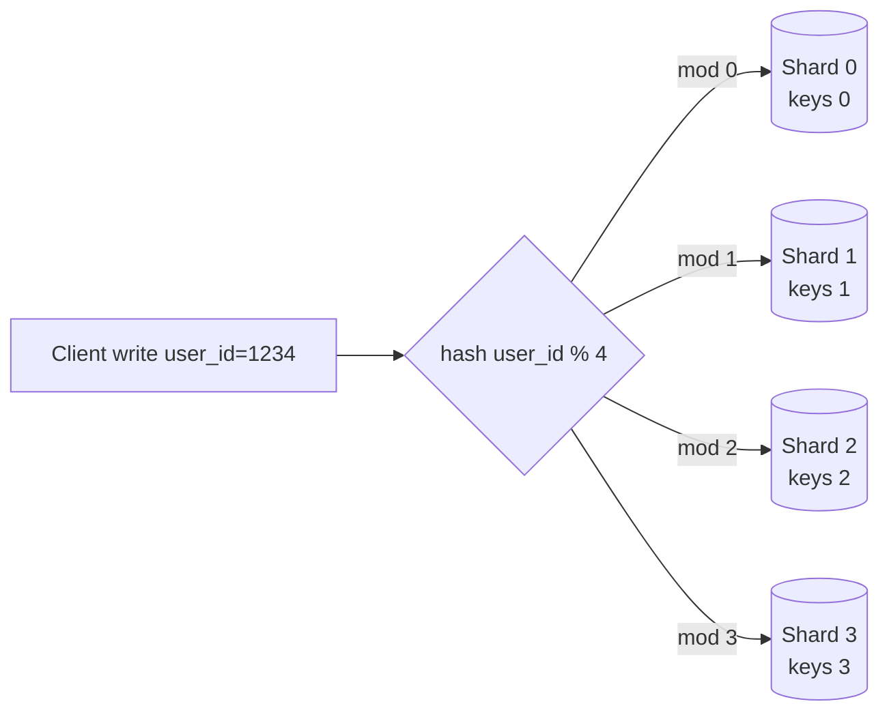

# T38: Design de Sistemas - Escala, Bancos, Sharding

Um único servidor pequeno aguenta mais tráfego do que a maioria pensa. Mas em algum momento o único servidor sua, o único banco engasga e você precisa dividir trabalho entre máquinas. Escalar é a arte de dividir - primeiro adicionando cópias (réplicas), depois dividindo os próprios dados (shards). O truque é fazer isso só quando os números forçarem.
{: .lesson-intro }

## Vertical vs Horizontal

Escala **vertical** = compre uma máquina maior. Mais CPU, mais RAM. Muito simples, funciona até não funcionar, tem teto. Escala **horizontal** = adicione mais máquinas e compartilhe carga. Mais complexo, sem teto, é como produtos de verdade sobrevivem ao tráfego.

```
# Vertical: one strong server
[ 8 vCPU | 32 GB RAM ]  ->  [ 32 vCPU | 256 GB RAM ]

# Horizontal: many modest servers behind a load balancer
Client -> LB -> [ app1 ] [ app2 ] [ app3 ] ... [ appN ]
```

Regra prática: escale vertical primeiro. É mais barato e simples. Escale horizontal quando o vertical bater o limite ou quando precisar de redundância.

## SQL vs NoSQL: Escolha Pelo Formato dos Dados

**SQL** (Postgres, MySQL) é certo quando seus dados têm formato e relações conhecidos e você precisa de transações. **NoSQL** cobre muitos formatos: document stores (MongoDB) para objetos aninhados, key-value (Redis, DynamoDB) para lookups rápidos por id, wide-column (Cassandra) para streams gigantes de eventos. Escolha NoSQL por um motivo específico, não "por causa de escala".

```
// Orders, invoices, bookings     -> SQL
// User sessions, short-lived KV  -> Redis
// Logs, clicks, time series      -> Cassandra / Clickhouse
// Nested catalog documents       -> MongoDB
// Full-text search               -> Elasticsearch / Meilisearch
```

## Replicação: Cópias para Escala de Leitura e Segurança

A maioria dos apps lê 10-100x mais do que escreve. Solução: uma **primary** cuida das escritas, várias **réplicas** servem leituras. Réplicas também sobrevivem a falha da primary.

```
Writes --> [Primary]
              |--> [Replica 1] --> Reads
              |--> [Replica 2] --> Reads
              |--> [Replica 3] --> Reads
```

Pega: replicação é assíncrona por padrão. Uma leitura numa réplica logo após uma escrita pode retornar dados desatualizados. Se precisar de read-your-writes, direcione essa leitura para a primary.

## Sharding: Quando Um Banco Não É Suficiente

Sharding divide linhas entre vários bancos. Cada banco segura uma fatia. Você escolhe uma **shard key** e faz hash para rotear as linhas.



Sharding tem um custo alto: qualquer query que cruza shards precisa ser scatter-gather. Escolha uma shard key que combine com as suas queries mais comuns. Num app tipo Twitter, fazer shard por `user_id` para que a timeline de um usuário viva num só shard.

## Consistent Hashing: Crescer Sem Dor

Hash-mod simples quebra quando você adiciona um shard: `hash % 4` vira `hash % 5` e quase toda chave muda de casa. **Consistent hashing** coloca shards num anel. Cada chave cai num ponto do anel e rola no sentido horário até o shard mais próximo. Adicionar ou remover um shard só move os vizinhos.

```
                 Shard A
                    *
      *                      *
  Shard D                  Shard B
      *                      *
                    *
                 Shard C

Key hashes to a point on the ring -> served by next shard clockwise.
Add Shard E between B and C -> only keys between B and E move.
```

## Teorema CAP: Escolha Dois (Na Real, Um de Dois)

Num sistema distribuído você pode ter Consistência, Disponibilidade (Availability) ou Tolerância a Partição. Redes particionam queira você ou não, então a escolha real é entre consistência e disponibilidade durante uma partição.

- **Sistemas CP** (bancos, estoque, pagamentos): recusam escritas em vez de divergirem. Usuários podem ver "tente de novo".
- **Sistemas AP** (feeds sociais, DMs, caches): aceitam escritas dos dois lados, reconciliam depois. Usuários veem dados levemente desatualizados.

<div class="takeaways">
<h2>Pontos-chave</h2>
<ul>
<li>Escale vertical primeiro, horizontal depois. Uma máquina moderna é mais poderosa do que você pensa</li>
<li>Escolha SQL a não ser que tenha um motivo específico para um formato específico de NoSQL. "Escala" sozinho não é motivo</li>
<li>Replicação dá escala de leitura e failover. Aceite breve desatualização nas réplicas ou direcione leituras críticas para a primary</li>
<li>Sharding é o último recurso. Escolha shard key que case com suas queries comuns, e espere a dor de scatter-gather para o resto</li>
<li>Consistent hashing barateia mudanças de shard. Use sempre que o número de shards possa mudar</li>
<li>CAP força escolha durante partições de rede: recusar escritas (CP) ou aceitar leituras desatualizadas (AP). Saiba qual seu sistema precisa</li>
</ul>
</div>
