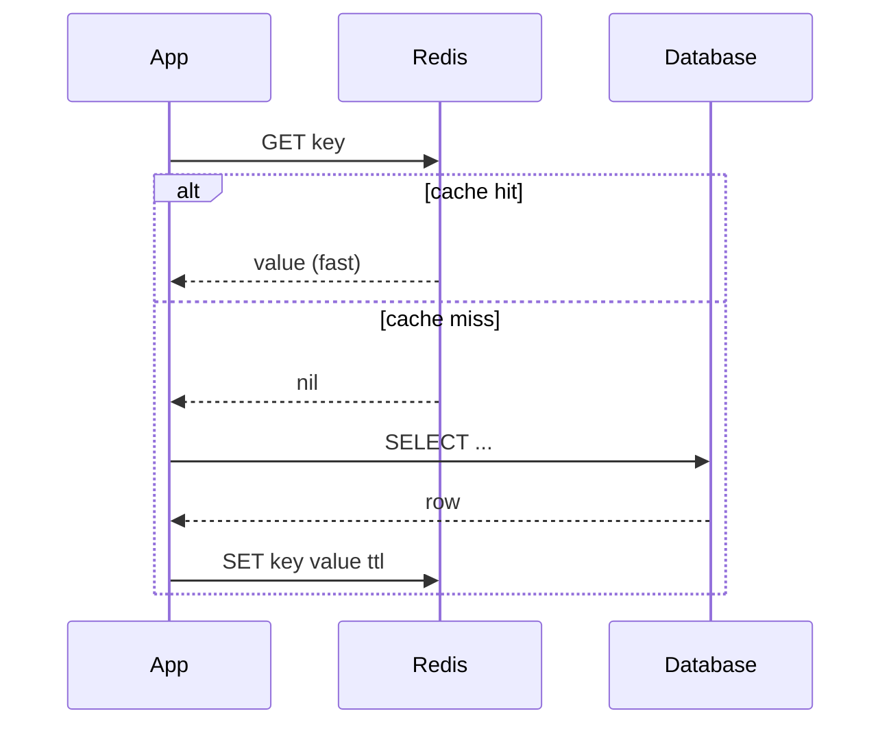
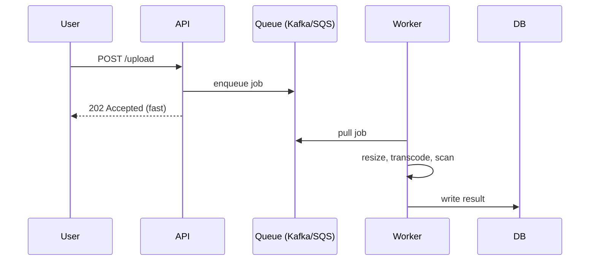

# T39: システム設計 - キャッシュ、キュー、パターン

キャッシュは高価な読み取りを先に刻んでおく。キューはユーザーリクエストから遅い仕事を切り離す。CDNは全ユーザーの近くにコピーを置く。ロードバランサとレプリケーションが障害を吸収する。システム設計の深掘りは、レイテンシとスループットの数字が合うまでこれらを縫い合わせる作業。
{: .lesson-intro }

## キャッシング: あなたとDBの間の高速メモリ

キャッシュは遅いまたは高価な操作の結果を高速メモリに保存する。王道パターンは **cache-aside**: アプリがキャッシュを確認し、ミスならDBを読みキャッシュを埋める。ヒットならDBを完全にスキップ。



```
// Node.jsでのcache-aside
async function getUser(id) {
    const cached = await redis.get(`user:${id}`);
    if (cached) return JSON.parse(cached);

    const row = await db.query("SELECT * FROM users WHERE id = $1", [id]);
    await redis.set(`user:${id}`, JSON.stringify(row), "EX", 300);
    return row;
}
```

キャッシングの2つの難問は **無効化**(古いデータをいつ捨てるか)と **スタンピード**(多数のリクエストが同時にミスしてDBを叩く)。TTL、ライトスルー更新、ミス時のシングルフライトロックで対処。

## どこにキャッシュを置くか

- **ブラウザキャッシュ** - ユーザーに最も近い。`Cache-Control` ヘッダーで制御
- **CDN(エッジキャッシュ)** - 静的アセット、公開APIレスポンス。グローバル、安い、速い
- **アプリキャッシュ** - インプロセスメモリまたはRedis。ユーザー別データやホット行に良い
- **DBキャッシュ** - DB自身のバッファプール。無料で既に調整済み

## メッセージキュー: 遅い仕事を切り離す

数百ミリ秒を超える操作はユーザーをブロックすべきではない。キューがあれば、アプリはジョブを受け取ってすぐ返せる。**ワーカー**がキューを読んで遅い仕事を後でやる。



キューはトラフィックスパイクも吸収する。ワーカーが1000/秒処理できてスパイクが10,000/秒押し寄せた時、キューがカーブを平らにしリクエストを落とさない。Kafka、RabbitMQ、SQSは順序、耐久性、リプレイ周りでそれぞれ違うトレードオフをする。

## ロードバランサと冗長化

ロードバランサは同一のアプリサーバーの前に立ち、リクエストを分散する。3つの仕事: 負荷分散、死んだサーバーの検出(ヘルスチェック)、TLSの終端。ロードバランサ、アプリ、DBレプリカ、どれも最低2台動かす - 単一障害が吸収されるように。

```
Client -> DNS -> LB (primary) --> app1
                    LB (standby)   app2
                                   app3
```

## CDN: 各ユーザーの近くにコピー

Content Delivery Networkは静的アセット(時にはAPIレスポンス)を世界中の数百のエッジロケーションにキャッシュする。東京の最初のユーザーはバージニアのオリジンまでの全旅程を払う。次の1万人の東京ユーザーは10msで東京エッジにヒットする。

```
// CDNに置くもの
- 画像、動画、フォント、JS/CSSバンドル
- Cache-Control付きでめったに変わらないAPIレスポンス
- ログアウト状態のページのHTML
```

## モノリス対マイクロサービス

マイクロサービスで始めるな。分割のたびにネットワークホップ、デプロイ対象、障害モードが増える。

- **モノリス**: 1つのコードベース、1つのデプロイ。反復が速く、デバッグが簡単。~50人のエンジニアまたは明らかなボトルネックで限界。
- **マイクロサービス**: 別々のコードベース、別々のデプロイ、間にAPIまたはキュー。各チームが1サービスを所有。スケールで報われるが、初期コストが大きい。モノリスが明らかに痛くなった時だけ抽出。

## 押さえておく数字

- L1キャッシュ: ~1 ns。メモリ: ~100 ns。SSD: ~100 us。同リージョンのネットワーク往復: ~1 ms。クロスリージョン: ~100 ms。
- 現代のCPUサーバーはシンプルなJSONで ~10k-100k req/秒をさばく。
- Postgresはチューニング前で ~10k 書き込み/秒 / ~50k 読み取り/秒。
- Redisは ~100k-1M 操作/秒。
- 1億イベント/日 = ~1,160/秒 平均、~10k/秒 ピーク。

<div class="takeaways">
<h2>まとめ</h2>
<ul>
<li>Cache-asideがデフォルト: キャッシュ確認、ミス -&gt; DBヒット -&gt; キャッシュを埋める。スタンピードと無効化に注意</li>
<li>キューはワーカーに遅い仕事を渡してAPIを高速に応答させる。スパイクも平らにする</li>
<li>ロードバランサの後ろに全てを2台ずつ動かす。単一障害でシステムが落ちないように</li>
<li>CDNはグローバルレイテンシを安く買える。全ての静的アセットとキャッシュ可能なレスポンスをエッジにプッシュ</li>
<li>モノリス優先、マイクロサービスはモノリスが明らかに痛い時だけ。抽出は非抽出より安い</li>
<li>概算の数字表を頭に持っておく: ns、us、msのレイテンシとコンポーネント別スループット</li>
</ul>
</div>
