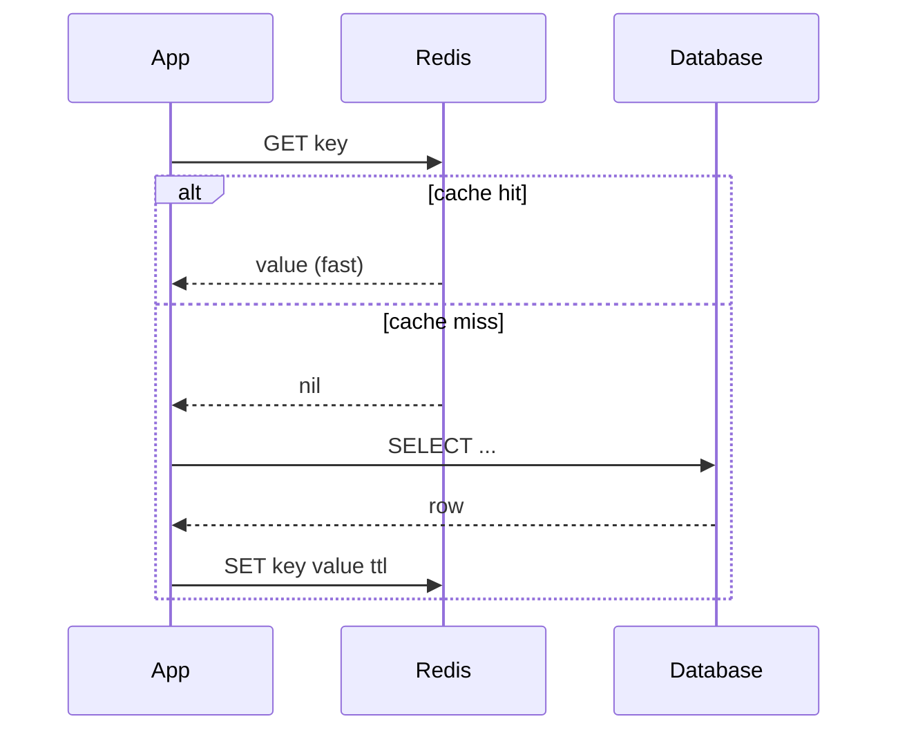
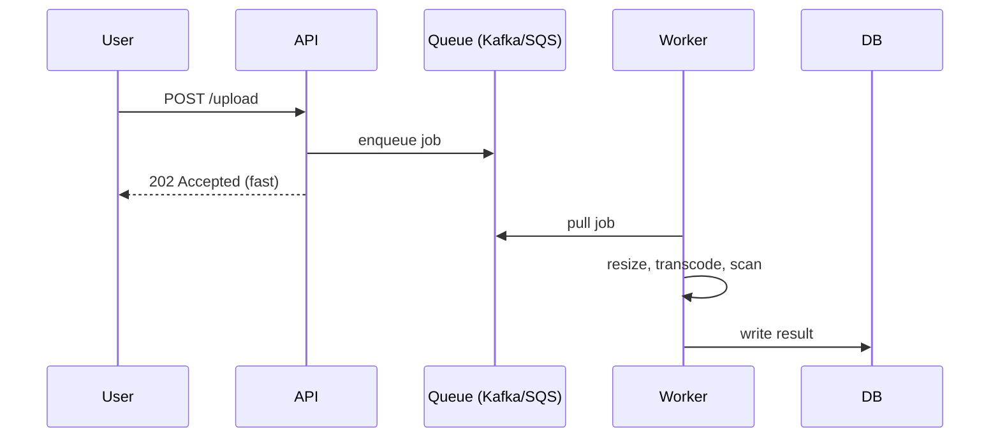

# T39: システム設計 - キャッシング、キュー、パターン

全ての読み込みをDBで処理するシェフは、注文のたびに玉ねぎを切るようなもの。キャッシュは事前に切っておきます。キューはウェイターとキッチンを分離し、お互いを待たせません。CDNは全ての大陸にミニキッチンを置きます。システム設計のディープダイブは通常、非機能数字が収まるまでこの3つを縫い合わせる作業です。
{: .lesson-intro }

## キャッシング: データベースとあなたの間の高速メモリ

キャッシュは遅い/高価な操作の結果を高速メモリに保存します。王道パターンは**cache-aside**: アプリがキャッシュを確認、ミスならDB読みキャッシュに詰める、ヒットならDBをスキップ。



```
// Cache-aside in Node.js
async function getUser(id) {
    const cached = await redis.get(`user:${id}`);
    if (cached) return JSON.parse(cached);

    const row = await db.query("SELECT * FROM users WHERE id = $1", [id]);
    await redis.set(`user:${id}`, JSON.stringify(row), "EX", 300);
    return row;
}
```

キャッシングの2つの難問は**無効化**(古いデータをいつ捨てるか)と**スタンピード**(多数のリクエストが同時にミスしてDBを殴る)。TTL、write-through更新、ミス時のsingle-flightロックで対処。

## どこにキャッシュするか

- **ブラウザキャッシュ** - ユーザーに最も近い。`Cache-Control`ヘッダで制御
- **CDN(エッジキャッシュ)** - 静的アセット、公開APIレスポンス。グローバル、安い、速い
- **アプリケーションキャッシュ** - プロセス内メモリまたはRedis。ユーザーごとデータやホットな行に良い
- **データベースキャッシュ** - DB自身のバッファプール。無料、既にチューニング済み

## メッセージキュー: 遅い作業を分離

数百ms以上かかる操作はユーザーをブロックすべきではありません。キューはアプリにジョブを受け取って即返させ、**ワーカー**がキューを読んで後で遅い作業をします。



キューはトラフィックのスパイクも吸収します。ワーカーが1000/秒処理でき、スパイクで10,000/秒押し寄せても、キューがカーブを平らにしてリクエストを落としません。Kafka、RabbitMQ、SQSはそれぞれ順序、耐久性、リプレイの面で異なるトレードオフ。

## ロードバランサと冗長性

ロードバランサは同一のアプリサーバーの前に立ちリクエストを分散。3つの仕事: 負荷分散、死んだサーバー検出(ヘルスチェック)、TLS終端。全てを最低2つ動かす - LB、アプリ、DBレプリカ - 単一障害を吸収するため。

```
Client -> DNS -> LB (primary) --> app1
                    LB (standby)   app2
                                   app3
```

## CDN: 全ユーザーの近くにコピー

CDN(Content Delivery Network)は静的アセット(時にはAPIレスポンスも)を世界中の数百のエッジロケーションにキャッシュします。東京の最初のユーザーはバージニアのオリジンまで全往復の代金を払う。その後の東京の10,000ユーザーは東京エッジに10msでヒット。

```
// What to put on the CDN
- images, videos, fonts, JS/CSS bundles
- rarely-changing API responses with Cache-Control
- HTML for logged-out pages
```

## モノリス vs マイクロサービス

マイクロサービスから始めてはいけません。分割のたびにネットワークホップ、デプロイ対象、障害モードが増えます。モノリスで始め、チームサイズやスケールがモノリスを痛くした時のみサービスを抽出。

- **モノリス**: 1コードベース、1デプロイ。イテレーション速く、デバッグ簡単。約50エンジニアや明らかなボトルネックで限界。
- **マイクロサービス**: コードベース分離、デプロイ分離、APIやキューで間を繋ぐ。各チームが1サービスを所有。スケール時に報われるが、初期コスト大。

## 暗記価値のある大雑把な数字

- L1キャッシュ: 約1ns。メモリ: 約100ns。SSD: 約100us。同一リージョン内ネットワーク往復: 約1ms。クロスリージョン: 約100ms。
- 現代のCPUサーバーはシンプルJSONで約10k-100kリクエスト/秒。
- Postgresはチューニング前で約10k書き込み/秒 / 約50k読み込み/秒。
- Redisは約100k-1M op/秒。
- 1日1億イベント = 平均約1,160/秒、ピーク約10k/秒。

<div class="takeaways">
<h2>まとめ</h2>
<ul>
<li>cache-asideがデフォルト: キャッシュ確認、ミスならDB、キャッシュに詰める。スタンピードと無効化に注意</li>
<li>キューは遅い作業をワーカーに渡してAPIを即応答にする。トラフィックスパイクも平らにする</li>
<li>ロードバランサの後ろに全てを2つ動かし、単一障害でシステムが落ちないようにする</li>
<li>CDNは小銭でグローバル低遅延を買える。静的アセットとキャッシュ可能レスポンスは全てエッジへ</li>
<li>まずモノリス、マイクロサービスはモノリスが目に見えて痛くなった時のみ。抽出は逆抽出より安い</li>
<li>大雑把な数字表を頭に入れる: ns、us、msの遅延とコンポーネントごとのスループット</li>
</ul>
</div>
