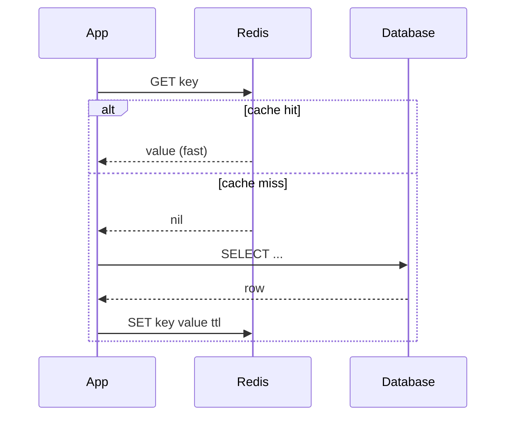
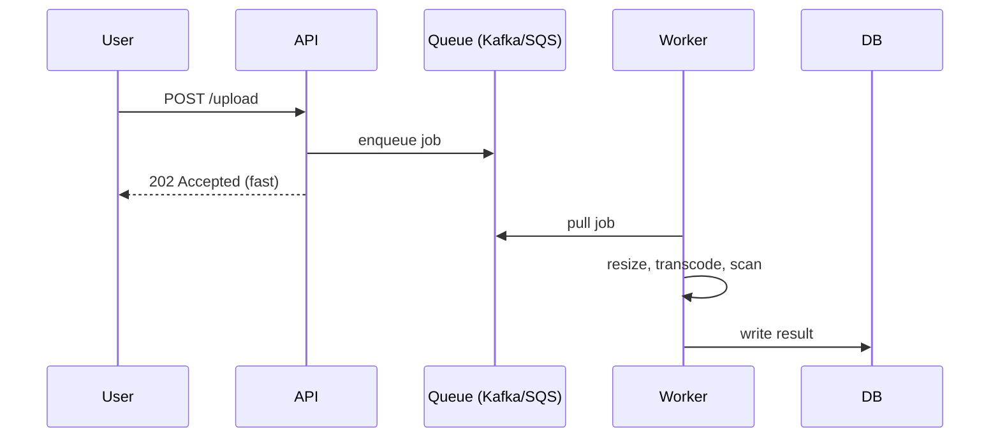

# T39: System Design - Caching, Queues & Patterns

A database that does every read is like a chef who chops onions for every order. Caches pre-chop. Queues decouple the waiter from the kitchen so neither waits for the other. CDNs put a mini-kitchen on every continent. The deep dive of a system design is usually stitching these three together until the non-functional numbers fall into place.
{: .lesson-intro }

## Caching: Fast Memory Between You and The Database

A cache stores the result of a slow or expensive operation in fast memory. The canonical pattern is **cache-aside**: app checks cache; on miss, reads DB and fills cache; on hit, skips DB entirely.



```
// Cache-aside in Node.js
async function getUser(id) {
    const cached = await redis.get(`user:${id}`);
    if (cached) return JSON.parse(cached);

    const row = await db.query("SELECT * FROM users WHERE id = $1", [id]);
    await redis.set(`user:${id}`, JSON.stringify(row), "EX", 300);
    return row;
}
```

The two hard problems of caching are **invalidation** (when do you throw stale data out) and **stampede** (when many requests miss at once and hammer the DB). Fix with TTLs, write-through updates, and single-flight locks on misses.

## Where to Cache

- **Browser cache** - closest to user, controlled by `Cache-Control` headers
- **CDN (edge cache)** - static assets, public API responses. Global, cheap, fast
- **Application cache** - in-process memory or Redis. Good for per-user data and hot rows
- **Database cache** - the DB's own buffer pool. Free, already tuned

## Message Queues: Decouple Slow Work

Any operation that takes more than a few hundred milliseconds should not block the user. Queues let the app accept the job and return immediately; a **worker** reads the queue and does the slow work later.



Queues also absorb traffic spikes. If the worker can process 1000/sec and a spike pushes 10,000/sec, the queue flattens the curve instead of dropping requests. Kafka, RabbitMQ, and SQS each make different trade-offs around ordering, durability, and replay.

## Load Balancers and Redundancy

A load balancer sits in front of identical app servers and spreads requests. Three jobs: distribute load, detect dead servers (health checks), terminate TLS. Run at least two of everything - load balancer, app, database replica - so any single failure is absorbed.

```
Client -> DNS -> LB (primary) --> app1
                    LB (standby)   app2
                                   app3
```

## CDNs: A Copy Near Every User

A Content Delivery Network caches your static assets (and sometimes API responses) at hundreds of edge locations around the globe. First user in Tokyo pays the full trip to your origin in Virginia. Next 10,000 users in Tokyo hit the Tokyo edge in 10ms.

```
// What to put on the CDN
- images, videos, fonts, JS/CSS bundles
- rarely-changing API responses with Cache-Control
- HTML for logged-out pages
```

## Monolith vs Microservices

Do not start with microservices. Every split adds a network hop, a deploy target, and a failure mode. Start monolith, extract services only when team size or scale makes the monolith painful.

- **Monolith**: one codebase, one deploy. Fast to iterate, simple to debug. Breaks down at ~50 engineers or obvious bottleneck components.
- **Microservices**: separate codebases, separate deploys, API or queue between. Each team owns a service. Pays off at scale, costs a lot up front.

## Back-of-Envelope Numbers Worth Memorizing

- L1 cache: ~1 ns. Memory: ~100 ns. SSD: ~100 us. Network round trip same region: ~1 ms. Cross-region: ~100 ms.
- A modern CPU server handles ~10k-100k req/sec for simple JSON.
- Postgres handles ~10k writes/sec / ~50k reads/sec before tuning.
- Redis handles ~100k-1M ops/sec.
- 100M events/day = ~1,160/sec average, ~10k/sec at peak.

<div class="takeaways">
<h2>Key Takeaways</h2>
<ul>
<li>Cache-aside is the default: check cache, miss -&gt; hit DB -&gt; fill cache. Watch for stampedes and invalidation</li>
<li>Queues make the API respond fast by handing slow work to workers. They also flatten traffic spikes</li>
<li>Run two of everything behind a load balancer so no single failure takes the system down</li>
<li>CDNs buy global latency for pennies. Push every static asset and cacheable response to the edge</li>
<li>Monolith first, microservices only when the monolith is visibly painful. Extraction is cheaper than un-extraction</li>
<li>Keep a rough numbers table in your head: ns, us, ms latencies and per-component throughput</li>
</ul>
</div>
