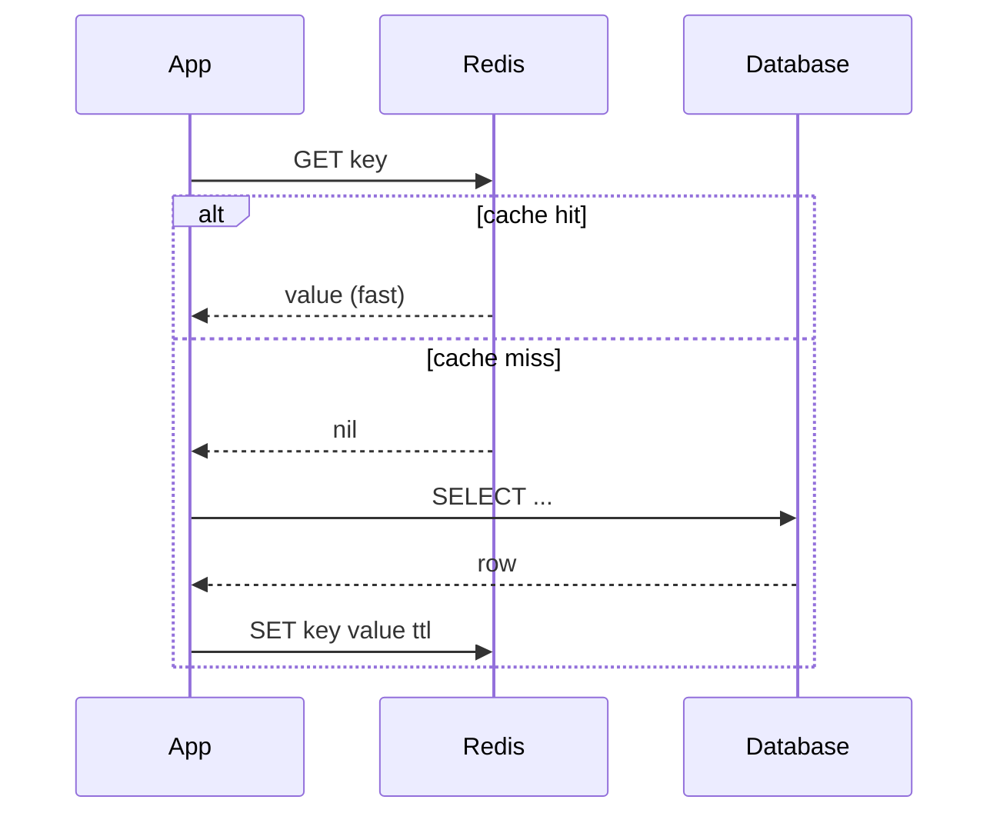
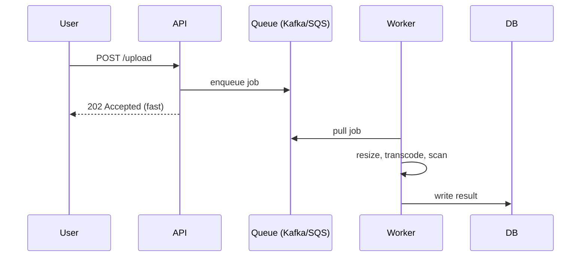

# T39: Design de Sistemas - Caching, Filas e Padrões

Um banco que faz toda leitura é como um chef que corta cebola a cada pedido. Caches pré-cortam. Filas desacoplam o garçom da cozinha para nenhum esperar o outro. CDNs colocam uma mini cozinha em cada continente. O deep dive de um design de sistemas geralmente é costurar esses três até os números não funcionais caírem no lugar.
{: .lesson-intro }

## Caching: Memória Rápida Entre Você e o Banco

Um cache guarda o resultado de uma operação lenta ou cara em memória rápida. O padrão canônico é o **cache-aside**: app consulta o cache; em miss, lê o DB e preenche o cache; em hit, pula o DB de vez.



```
// Cache-aside in Node.js
async function getUser(id) {
    const cached = await redis.get(`user:${id}`);
    if (cached) return JSON.parse(cached);

    const row = await db.query("SELECT * FROM users WHERE id = $1", [id]);
    await redis.set(`user:${id}`, JSON.stringify(row), "EX", 300);
    return row;
}
```

Os dois problemas difíceis de caching são **invalidação** (quando jogar dados desatualizados fora) e **stampede** (quando muitas requisições dão miss ao mesmo tempo e martelam o DB). Corrija com TTLs, atualizações write-through e locks single-flight em misses.

## Onde Cachear

- **Cache do navegador** - mais perto do usuário, controlado pelos headers `Cache-Control`
- **CDN (cache de borda)** - assets estáticos, respostas de API públicas. Global, barato, rápido
- **Cache da aplicação** - memória dentro do processo ou Redis. Bom para dados por usuário e linhas quentes
- **Cache do banco** - o buffer pool do próprio DB. De graça, já ajustado

## Filas de Mensagens: Desacoplar Trabalho Lento

Qualquer operação que leva mais que algumas centenas de milissegundos não deve bloquear o usuário. Filas deixam a app aceitar o job e responder na hora; um **worker** lê a fila e faz o trabalho lento depois.



Filas também absorvem picos de tráfego. Se o worker processa 1000/seg e um pico joga 10.000/seg, a fila achata a curva em vez de derrubar requisições. Kafka, RabbitMQ e SQS fazem trade-offs diferentes em ordenação, durabilidade e replay.

## Load Balancers e Redundância

Um load balancer fica na frente de servidores de app idênticos e espalha requisições. Três trabalhos: distribuir carga, detectar servidores mortos (health checks), terminar TLS. Rode pelo menos dois de tudo - load balancer, app, réplica de banco - para que qualquer falha isolada seja absorvida.

```
Client -> DNS -> LB (primary) --> app1
                    LB (standby)   app2
                                   app3
```

## CDNs: Uma Cópia Perto de Todo Usuário

Uma CDN (Content Delivery Network) cacheia seus assets estáticos (e às vezes respostas de API) em centenas de pontos de borda pelo mundo. O primeiro usuário em Tóquio paga a viagem completa até a origem na Virgínia. Os próximos 10.000 usuários em Tóquio batem na borda de Tóquio em 10ms.

```
// What to put on the CDN
- images, videos, fonts, JS/CSS bundles
- rarely-changing API responses with Cache-Control
- HTML for logged-out pages
```

## Monolito vs Microservices

Não comece com microservices. Cada divisão adiciona um hop de rede, um alvo de deploy e um modo de falha. Comece monolito, extraia services só quando tamanho de time ou escala tornarem o monolito doloroso.

- **Monolito**: um codebase, um deploy. Rápido de iterar, simples de debugar. Quebra em ~50 engenheiros ou em componentes claramente gargalo.
- **Microservices**: codebases separados, deploys separados, API ou fila entre eles. Cada time é dono de um service. Compensa em escala, custa caro no começo.

## Números de Cabeça Que Valem Decorar

- Cache L1: ~1 ns. Memória: ~100 ns. SSD: ~100 us. Round trip de rede mesma região: ~1 ms. Cross-region: ~100 ms.
- Um servidor CPU moderno aguenta ~10k-100k req/seg para JSON simples.
- Postgres aguenta ~10k writes/seg / ~50k reads/seg antes de tuning.
- Redis aguenta ~100k-1M ops/seg.
- 100M eventos/dia = ~1.160/seg em média, ~10k/seg no pico.

<div class="takeaways">
<h2>Pontos-chave</h2>
<ul>
<li>Cache-aside é o default: checa cache, miss -&gt; bate no DB -&gt; preenche cache. Cuidado com stampedes e invalidação</li>
<li>Filas fazem a API responder rápido entregando trabalho lento aos workers. Também achatam picos de tráfego</li>
<li>Rode dois de tudo atrás de um load balancer para que nenhuma falha isolada derrube o sistema</li>
<li>CDNs compram latência global por trocado. Empurre todo asset estático e resposta cacheável para a borda</li>
<li>Monolito primeiro, microservices só quando o monolito estiver visivelmente doendo. Extrair é mais barato que desextrair</li>
<li>Mantenha uma tabela aproximada de números na cabeça: latências em ns, us, ms e throughput por componente</li>
</ul>
</div>
