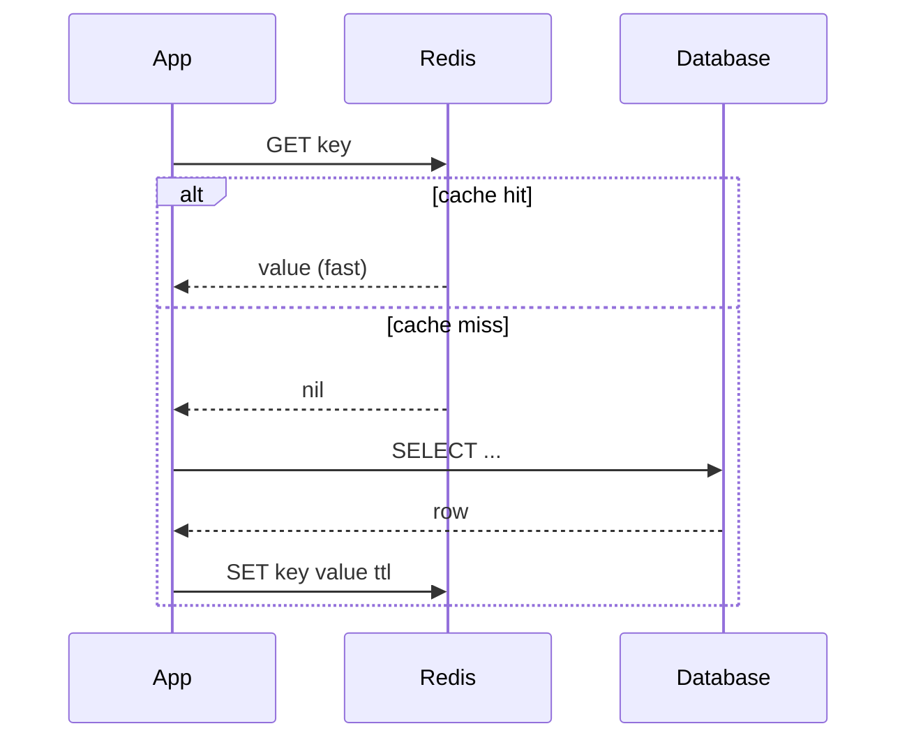
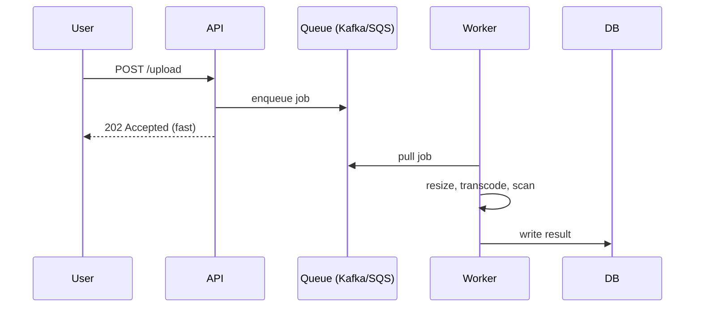

# T39: Design de Sistemas - Cache, Filas e Padrões

Caches pré-processam leituras caras. Filas desacoplam trabalho lento da requisição do usuário. CDNs põem uma cópia perto de cada usuário. Load balancers e replicação absorvem falhas. Um deep-dive de design de sistemas é costurar essas coisas até que latência e throughput batam.
{: .lesson-intro }

## Cache: Memória Rápida Entre Você e o Banco

Um cache guarda o resultado de uma operação lenta ou cara em memória rápida. O padrão canônico é **cache-aside**: app checa o cache; miss lê do banco e preenche o cache; hit pula o banco por completo.



```
// Cache-aside em Node.js
async function getUser(id) {
    const cached = await redis.get(`user:${id}`);
    if (cached) return JSON.parse(cached);

    const row = await db.query("SELECT * FROM users WHERE id = $1", [id]);
    await redis.set(`user:${id}`, JSON.stringify(row), "EX", 300);
    return row;
}
```

Os dois problemas difíceis de cache são **invalidação** (quando jogar dado velho fora) e **stampede** (muitos requests falham ao mesmo tempo e martelam o banco). TTLs, updates write-through e locks single-flight em miss resolvem.

## Onde Colocar o Cache

- **Cache do navegador** - mais perto do usuário, controlado por headers `Cache-Control`
- **CDN (cache de borda)** - assets estáticos, respostas públicas de API. Global, barato, rápido
- **Cache da aplicação** - memória in-process ou Redis. Bom para dados por usuário e rows quentes
- **Cache do banco** - o buffer pool do próprio banco. Grátis, já afinado

## Filas de Mensagens: Desacoplar Trabalho Lento

Qualquer operação que leva mais que algumas centenas de ms não deve bloquear o usuário. Filas deixam o app aceitar o job e retornar imediatamente; um **worker** lê a fila e faz o trabalho lento depois.



Filas também absorvem picos de tráfego. Se o worker processa 1000/s e um pico empurra 10.000/s, a fila achata a curva em vez de derrubar requests. Kafka, RabbitMQ e SQS fazem trade-offs diferentes de ordenação, durabilidade e replay.

## Load Balancers e Redundância

Um load balancer fica na frente de servidores de aplicação idênticos e distribui requests. Três trabalhos: distribuir carga, detectar servidor morto (health check), terminar TLS. Rode pelo menos dois de tudo - load balancer, app, réplica de banco - para que qualquer falha solo seja absorvida.

```
Client -> DNS -> LB (primary) --> app1
                    LB (standby)   app2
                                   app3
```

## CDN: Uma Cópia Perto de Cada Usuário

Um Content Delivery Network cacheia seus assets estáticos (e às vezes respostas de API) em centenas de pontos de borda pelo mundo. O primeiro usuário em Tóquio paga a viagem inteira até sua origem na Virgínia. Os próximos 10.000 usuários em Tóquio pegam a borda de Tóquio em 10ms.

```
// O que colocar no CDN
- imagens, vídeos, fontes, bundles JS/CSS
- respostas de API que mudam pouco com Cache-Control
- HTML de páginas sem login
```

## Monolito vs Microsserviços

Não comece com microsserviços. Cada divisão adiciona um hop de rede, um alvo de deploy e um modo de falha.

- **Monolito**: um repo, um deploy. Itera rápido, debug simples. Quebra em ~50 engenheiros ou em componentes de gargalo óbvios.
- **Microsserviços**: repos separados, deploys separados, API ou fila entre. Cada time dono de um serviço. Vale em escala, custa caro no começo. Extraia só quando o monolito estiver visivelmente doendo.

## Números para Ter na Manga

- Cache L1: ~1 ns. Memória: ~100 ns. SSD: ~100 us. Rede round trip na mesma região: ~1 ms. Cross-region: ~100 ms.
- Um servidor CPU moderno aguenta ~10k-100k req/s em JSON simples.
- Postgres aguenta ~10k writes/s / ~50k reads/s antes de tuning.
- Redis aguenta ~100k-1M ops/s.
- 100M eventos/dia = ~1.160/s média, ~10k/s no pico.

<div class="takeaways">
<h2>Pontos-chave</h2>
<ul>
<li>Cache-aside é o padrão: checa cache, miss -&gt; bate no banco -&gt; preenche cache. Atenção a stampede e invalidação</li>
<li>Filas deixam a API responder rápido passando trabalho lento para workers. Também achatam picos</li>
<li>Rode dois de tudo atrás de um load balancer para que nenhuma falha sozinha derrube o sistema</li>
<li>CDNs compram latência global por centavos. Empurre todo asset estático e resposta cacheável para a borda</li>
<li>Monolito primeiro, microsserviços só quando o monolito estiver visivelmente doendo. Extração é mais barata que un-extração</li>
<li>Mantenha uma tabela aproximada de números na cabeça: latências ns, us, ms e throughput por componente</li>
</ul>
</div>
