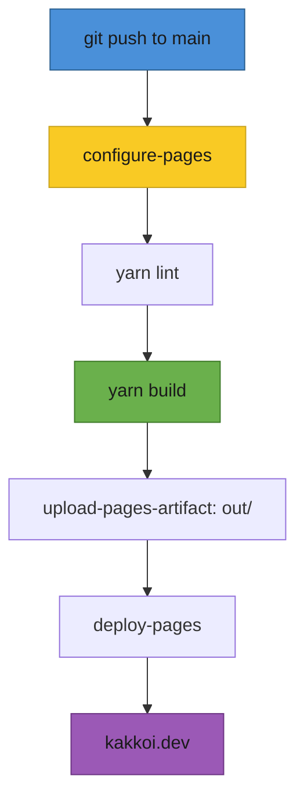
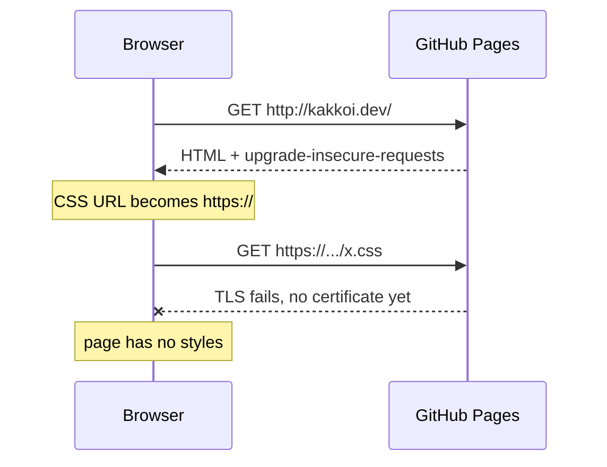
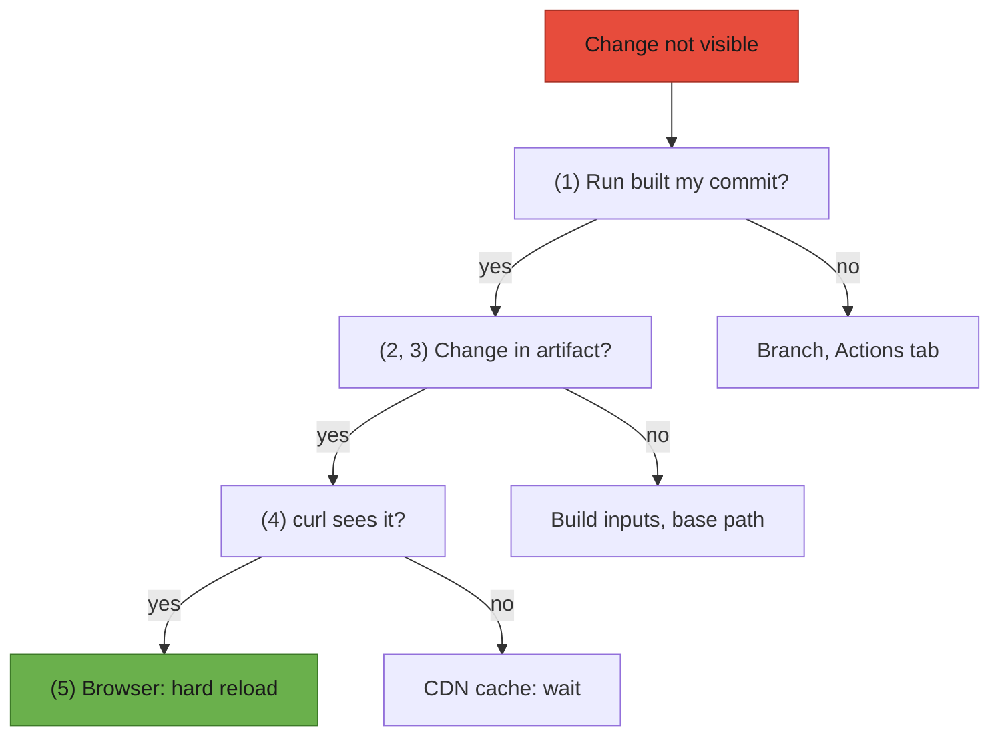

# T40: ケーススタディ - kakkoi.dev のリリース

T31 と T32 では、紙の上のレストランを構築しました。このレッスンでは、開店準備中の実際のレストランを訪れます。kakkoi.dev は、KakkoiSchool を運営する Cyril Antoni (KakkoiDev) の個人サイトです。これは、英語と日本語に対応した小さな Next.js サイトで、GitHub Pages で無料でホストされています。そのソースコードは [github.com/KakkoiDev/website](https://github.com/KakkoiDev/website) で公開されており、以下のすべての抜粋はこのリポジトリからの実際のコードです。最も役立つ部分は、最初からうまくいったコードではありません。「自分のマシンではビルドできる」から「ライブ公開されている」までの間に何が壊れたのか、そしてそれぞれがどのように見つけ出されたのか、という点です。
{: .lesson-intro }

## サイト概要

同じ構造を持つ2つのページ: 英語は `/`、日本語は `/ja/`。ヘッダー、回転する CSS キューブの上の名前、Cyril が何をしているかについての2行、連絡先リンク、フッター。データベース、ログイン、フォームなし。重要なファイルは次のとおりです。

```
app/
  (en)/layout.tsx          root layout, <html lang="en">
  (en)/page.tsx            "/"
  (ja)/layout.tsx          root layout, <html lang="ja">
  (ja)/ja/page.tsx         "/ja/"
  global-not-found.tsx     the 404, in both languages
  sitemap.ts, robots.ts    written to files at build time
components/Home.tsx        one server component renders both pages
data/dictionary.ts         every visible string, in en and ja
lib/csp.ts                 the Content-Security-Policy
lib/metadata.ts            canonical, hreflang, Open Graph
public/CNAME               the custom domain: kakkoi.dev
.github/workflows/pages.yml  build and deploy
```

## 静的エクスポートを選択した理由

デフォルトでは、`next build` はリクエストに応じてページをレンダリングする Node.js サーバーを準備します。`output: "export"` を使用すると、Next.js はビルド時にすべてのサーバーコンポーネントを一度実行し、プレーンな HTML、CSS、および JS を `out/` に書き込みます。どの静的ファイルホストでもそのフォルダを提供できます。お弁当屋さんを考えてみてください。すべては朝一度調理され、詰められ、一日中シェフなしで配られます。

```
// next.config.mjs
const nextConfig = {
  // Static export for GitHub Pages: `next build` writes the site to out/.
  // Pages cannot send custom headers, so the CSP lives in lib/csp.ts.
  output: "export",
  // Emit ja/index.html rather than ja.html next to a ja/ folder of RSC
  // payloads: Pages answers /ja with /ja/ and needs an index.html there.
  trailingSlash: true,
  // Where Pages serves the site: "/website" at kakkoidev.github.io/website/,
  // "" once the custom domain is set. The workflow reads it from Pages.
  basePath: process.env.PAGES_BASE_PATH ?? "",
  experimental: {
    // app/global-not-found.tsx: the 404 for an app with one root layout per language
    globalNotFound: true,
  },
};
```

個人サイトに適している理由:

- **訪問者ごとに何も変わらない。** 誰もが同じページを取得するため、すべてのリクエストでレンダリングするのは無駄な作業です。
- **パッチを適用するサーバーがない。** サイトの2026年10月の監査で、古い Next.js 14 に画像オプティマイザーに公開されたリモートコード実行の欠陥があることが判明しました。HTML ファイルのフォルダには画像オプティマイザーも API もないため、この種の問題全体がなくなります。
- **無料で高速なホスティング。** GitHub Pages は、CDN からフォルダを無料で提供します。

失うもの、そして kakkoi.dev がそれぞれについてどのように対処したか:

- **API ルート (T32)** - ビルド時に一度だけ実行できる `GET` ハンドラーのみが残ります。サイトは連絡先フォームと、その背後にあるメール API を削除しました。`sitemap.ts` と `robots.ts` は `dynamic = "force-static"` を宣言するため、プレーンなファイルになります。
- **設定内の `headers()`** - 無視されます。CSP は `<meta>` タグに移動しました（下記参照）。
- **「今」計算される値** - ビルド時にフリーズされます。サイトはフッターの年ごとに毎年1月1日に再ビルドされます。

最後のものは微妙な点です。`Home.tsx` は `new Date().getFullYear()` で年を出力します。サーバー上では、これはすべてのリクエストで実行されます。静的エクスポートでは一度だけ実行され、HTML は次のビルドまでその番号を保持します。したがって、ワークフローもスケジュールに基づいて実行されます。

```
# .github/workflows/pages.yml
on:
  push:
    branches: [main]
  workflow_dispatch:
  # The footer year is rendered at build time; rebuild when it changes.
  schedule:
    - cron: "5 0 1 1 *"
```

`5 0 1 1 *` は1月1日00:05 UTCです。静的サイトはライブカメラではなく写真です。それ自体で変更されるべきものは、新しい写真が必要です。

## 適切な2言語対応

ほとんどのバイリンガルサイトでは、テキストを翻訳してそれだけで終わります。残りはブラウザ、スクリーンリーダー、検索エンジンが読み取るものです。kakkoi.dev は4つのことを行います。

### 1. 言語ごとのルートレイアウト

ルートレイアウトは `<html>` 要素をレンダリングし、`<html lang>` はページがどの言語であるかをブラウザに伝えます。スクリーンリーダーはそれから音声を選択し、ブラウザはそれからフォントを選択し（同じ Unicode 文字は日本語と中国語のフォントで異なって描画されます）、翻訳ツールは翻訳を提供するかどうかを決定します。単一の共有レイアウトでは、日本語ページに `lang="en"` が送られてしまいます。

Next.js のルートグループはこれを解決します。括弧内のフォルダ名は URL に表示されずにファイルを整理し、各グループは独自のルートレイアウトを持つことができます。

```
app/(en)/layout.tsx   ->  <html lang="en">  for  /
app/(ja)/layout.tsx   ->  <html lang="ja">  for  /ja/
```

```
// app/(ja)/layout.tsx
export const metadata = localeMetadata("ja");

export default function RootLayout({
  children,
}: Readonly<{
  children: React.ReactNode;
}>) {
  return (
    <html lang="ja" className={fontVariables}>
      <head>
        <meta httpEquiv="Content-Security-Policy" content={contentSecurityPolicy} />
      </head>
      <body className="font-jp">{children}</body>
    </html>
  );
}
```

代償として、2つのルートレイアウトがある場合、存在しない URL にはレンダリングするレイアウトがありません。なぜなら、それがどの言語であるかを何も示していないからです。`app/global-not-found.tsx`（上記の設定で `experimental.globalNotFound` によって有効になります）は独自の `<html>` をレンダリングし、両方の言語を話します。ページ内の混合言語テキストも独自の `lang` を持ちます。日本語ページでは、日本語の名前の下にラテン文字の名前が、`lang={other}` とマークされた要素に表示されます。

### 2. すべての文字列を辞書に

コンポーネントには文は含まれていません。表示されるすべてのものは、1つの型付けされたファイルに格納されています。

```
// data/dictionary.ts
type Dictionary = {
  meta: { title: string; description: string };
  nav: { logo: string; switchLabel: string; switchHref: string };
  hero: { name: string; altName: string; title: Phrases };
  about: { heading: string; items: Phrases[] };
  contact: { heading: string };
  footer: (year: number) => string;
};

const en: Dictionary = {
  // ...
  nav: { logo: "KakkoiDev", switchLabel: "日本語", switchHref: "/ja/" },
  hero: {
    name: "Cyril Antoni",
    altName: "キリル アントニ",
    title: "Software engineer · AI",
  },
  // ...
  footer: (year) => `© ${year} Cyril Antoni`,
};

export const dictionary: Record<Locale, Dictionary> = { en, ja };
```

`en` と `ja` の両方が同じ `Dictionary` 型を満たす必要があるため、英語で追加されて日本語で忘れられた文字列は、訪問者が見つけるバグではなく、ビルド時の TypeScript エラーになります。`footer` は関数なので、各言語で文法的に適切な位置に年を配置できます。名前の順序もここにあります。英語の文脈では名が先（Cyril Antoni）、日本語の文脈では姓が先（アントニ キリル）です。

### 3. hreflang と canonical

検索エンジンは、異なる言語で同じコンテンツを持つ2つのページを認識します。それらの関係を説明する2種類のタグがあります。`canonical` は「この URL がこのページのオリジナルである」と述べ、`hreflang` の alternate は「ここに他の言語の同じページがある」と述べます。サイトは1つの関数から両方を構築します。

```
// lib/metadata.ts
const SITE_URL = "https://kakkoi.dev";
const PATHS: Record<Locale, string> = { en: "/", ja: "/ja/" };

export function localeMetadata(locale: Locale): Metadata {
  // ...
  return {
    metadataBase: new URL(SITE_URL),
    title,
    description,
    alternates: {
      canonical: PATHS[locale],
      languages: { en: PATHS.en, ja: PATHS.ja, "x-default": PATHS.en },
    },
    // ...Open Graph and Twitter cards
  };
}
```

ビルドされた `out/ja/index.html` に含まれるもの:

```
<link rel="canonical" href="https://kakkoi.dev/ja/"/>
<link rel="alternate" hrefLang="en" href="https://kakkoi.dev/"/>
<link rel="alternate" hrefLang="ja" href="https://kakkoi.dev/ja/"/>
<link rel="alternate" hrefLang="x-default" href="https://kakkoi.dev/"/>
```

`x-default` はそれ以外のすべての訪問者向けのページです。どちらの言語でもない訪問者は英語のページが表示されます。サイトマップ（`app/sitemap.ts`）は同じペアを繰り返し、言語切り替えリンクは `lang` と `hrefLang` を持つため、スクリーンリーダーは「日本語」を日本語の音声で発音します。

### 4. 両言語で同じタイポグラフィースケール

最初のバージョンでは、`/ja` が主に電話で開かれるため、日本語には独自のよりタイトなサイズが与えられていました。公開後、オーナーは1つのスケールを選択しました。つまり、両言語ですべての要素が同じサイズと間隔になりました。コードは「同じ」をデフォルトとし、違いを明示的にします。

```
// components/Home.tsx
const shared = {
  header: "h-16",
  hero: "pt-[128px] pb-[136px] gap-10",
  title: "text-[16px] font-medium",
  section: "py-9",
  items: "gap-[18px]",
  // ...
};

const styles = {
  en: {
    ...shared,
    name: "font-display font-normal text-[clamp(56px,9vw,80px)] leading-[0.9] tracking-[0.01em]",
    h2: "mb-4 font-display font-normal text-[28px] tracking-[0.02em]",
    item: "text-[20px] font-semibold leading-[1.4]",
  },
  ja: {
    ...shared,
    name: "font-jp font-bold text-[clamp(34px,5vw,44px)] leading-[1.25] tracking-[0.06em]",
    h2: "mb-4 font-jp font-bold text-[20px]",
    item: "text-[20px] font-bold leading-[1.6]",
  },
};
```

`shared` から展開されたものはすべて同一です。言語ごとに残るのはフォントとそれに依存するものです。凝縮された Bebas Neue は、Noto Sans JP と同じサイズで読めるようにするにはより多くのピクセルが必要であり、Bebas Neue には日本語のグリフはまったくありません。レビューアは、わずか数十行で2つのページ間のすべての違いを確認できます。

## フレーズごとの日本語の改行

英語はスペースで改行します。日本語にはスペースがないため、ブラウザはほぼ任意の2文字の間で改行する可能性があります。17文字分のスペースがある場合、「人が問題をもっとうまく解決できるよう手助けします。」という文は次のように折り返すことがあります。

```
人が問題をもっとうまく解決できるよ
う手助けします。
```

「う」がフレーズから切り離され、2行目を単独で開始しています。日本人読者は、ハイフンなしで単語が半分に分割されているのを見るのと同じように、これを見ます。解決策はデータにあります。

```
// data/dictionary.ts
// Japanese text is split into phrases. Each phrase renders as an inline-block,
// so a line only breaks between phrases and never strands a lone character.
export type Phrases = string | string[];

  about: {
    heading: "できること",
    items: [
      ["問題を解決します。"],
      ["人が問題を", "もっとうまく", "解決できるよう", "手助けします。"],
    ],
  },
```

```
// components/Home.tsx
function Text({ phrases }: { phrases: Phrases }) {
  if (typeof phrases === "string") return phrases;
  return phrases.map((phrase) => (
    <span key={phrase} className="ph">
      {phrase}
    </span>
  ));
}
```

```
/* app/globals.css */
/* A Japanese phrase that must not be split across lines. */
.ph {
  display: inline-block;
}
```

インラインブロックは1つのボックスとしてレイアウトされるため、ブラウザはボックス間でしか折り返すことができません。同じ文は現在、次のように折り返されます。

```
人が問題をもっとうまく
解決できるよう手助けします。
```

英語の文字列はプレーンな文字列のままで、通常どおり折り返されます。2つの注意点があります。画面よりも広いフレーズは折り返されずにオーバーフローするため、フレーズを短く保つこと。そして、ネイティブスピーカーが一時停止するであろう場所、通常は「が」や「を」のような助詞の後に分割することです。ブラウザはこれらを独自に行うようになり始めていますが（Chromium の `word-break: auto-phrase`）、まだサポートは普遍的ではなく、`<span>` はどこでも機能します。

## GitHub Actions を使用して GitHub Pages にデプロイする

Pages はブランチをそのまま公開することも、サイトをビルドして結果をアップロードするワークフローを実行することもできます。kakkoi.dev はワークフローを使用しているため（Settings > Pages > Source: GitHub Actions）、`out/` はコミットされません。



```
# .github/workflows/pages.yml (the "on:" block is shown above)
permissions:
  contents: read
  pages: write
  id-token: write

# One deployment at a time; let an in-progress one finish.
concurrency:
  group: pages
  cancel-in-progress: false

jobs:
  build:
    runs-on: ubuntu-latest
    steps:
      - uses: actions/checkout@v7
      - uses: actions/setup-node@v7
        with:
          node-version: 22
          cache: yarn
      # Reports where Pages serves the site, so the build can prefix its paths.
      - id: pages
        uses: actions/configure-pages@v6
      - run: yarn install --frozen-lockfile
      - run: yarn lint
      - run: yarn build
        env:
          PAGES_BASE_PATH: ${{ steps.pages.outputs.base_path }}
      - uses: actions/upload-pages-artifact@v5
        with:
          path: out

  deploy:
    needs: build
    runs-on: ubuntu-latest
    environment:
      name: github-pages
      url: ${{ steps.deployment.outputs.page_url }}
    steps:
      - id: deployment
        uses: actions/deploy-pages@v5
```

`id-token: write` は `deploy-pages` が保存されたシークレットの代わりに短命のトークンで自身の認証を行うことを可能にします。`yarn lint` はビルドの前に実行されるため、Lint エラーが発生するとデプロイが停止し、そのまま公開されることはありません。

### ベースパスの落とし穴

リポジトリの Pages サイトは2種類のいずれかのアドレスに存在し、同じビルドで両方を処理することはできません。

- **プロジェクトサイト:** `kakkoidev.github.io/website/` - サイトはホストのサブフォルダ内にあります。
- **カスタムドメイン:** `kakkoi.dev/` - サイトはホスト全体です。

Next.js はホストのルートからのパスを書き込みます。ビルドされた `index.html` からの実際の行:

```
<link rel="stylesheet" href="/_next/static/chunks/3suzm1vgxclso.css" data-precedence="next"/>
```

`kakkoidev.github.io/website/` では、先頭の `/` は `kakkoidev.github.io/_next/...` を意味し、これはプロジェクトの外部です。CSS は404を返し、ページはスタイルなしのテキストとしてレンダリングされ、`/ja/` への言語切り替えは存在しないページに到達します。

解決策は `basePath` です。`actions/configure-pages` は Pages がサイトを提供する場所を `base_path` として報告します。プロジェクトサイトの場合は `/website`、カスタムドメインが設定されると空になります。ワークフローはこれを `PAGES_BASE_PATH` としてビルドに渡し、`next.config.mjs` がこれを読み取り、Next.js は書き込むすべてのパスにプレフィックスを付けます（`/website/_next/static/...`）。これで同じコードが両方のアドレスで機能します。同じ変更から2つのフォローアップがあります。

- `basePath` は Next.js がビルドするリンクにのみ到達します。プレーンな `<a href="/ja/">` はそのまま書き込まれますが、`next/link` からの `<Link>` にはプレフィックスが付きます。

```
{/* Link, not <a>, so the href picks up the base path. */}
<Link href={t.nav.switchHref} lang={other} hrefLang={other} className={...}>
  {t.nav.switchLabel}
</Link>
```

- `public/` 内のファイルは手付かずでコピーされるため、`/jp` リダイレクト（言語コードではなく国コードを入力する人向け）は、どちらのアドレスでも機能する相対 URL を使用します。

```
<!-- public/jp/index.html -->
<meta name="robots" content="noindex">
<link rel="canonical" href="https://kakkoi.dev/ja/">
<meta http-equiv="refresh" content="0; url=../ja/">
```

そして落とし穴の中の落とし穴: ベースパスはビルド時に焼き付けられます。カスタムドメインが有効になると、ワークフローが再度実行されるまで、ライブファイルは依然として `/website/` と表示されます。リポジトリの README には、「ドメインを変更したら、ワークフローを再実行してください」と一行で書かれています。

### trailingSlash: /ja にフォルダが必要な理由

`trailingSlash` がないと、エクスポートは `ja/` ペイロードファイルのフォルダの隣に `ja.html` を書き込みます。Pages は `/ja` に `/ja/` で応答し、`ja/index.html` を探しますが、それは存在しません。`trailingSlash: true` を指定すると、すべてのページは内部に `index.html` を持つフォルダになります。

```
out/
  index.html
  ja/index.html
  ja/index.txt, ja/__next._tree.txt, ...   (payloads for client navigation)
  jp/index.html                            (the redirect from public/)
  404.html
  CNAME, robots.txt, sitemap.xml
```

これは通常よりも重要でした。Cyril の名刺に印刷された QR コードは、スラッシュなしの `https://kakkoi.dev/ja` を開きます。印刷された URL は後で修正できないため、サーバー側でそれを受け入れる必要があります。

## サーバーヘッダーなしの CSP

Content-Security-Policy は、ページがスクリプト、スタイル、画像、フォントをどこからロードできるかをブラウザに伝えます。他の場所から注入されたものはすべて拒否されます。通常は HTTP 応答ヘッダーであり、Pages への移行前はサイトは `next.config.mjs` の `headers()` から送信していました。Pages では応答ヘッダーを設定できないため、ポリシーは現在、各ルートレイアウトによって `<head>` 内にレンダリングされる `<meta http-equiv>` タグとして提供されます（上記参照）。

```
// lib/csp.ts
const isDev = process.env.NODE_ENV !== "production";

// GitHub Pages cannot send custom response headers, so the policy ships as a
// <meta http-equiv> tag in each root layout. A meta policy cannot carry
// frame-ancestors; everything else applies as it would from a header. There is
// no upgrade-insecure-requests: Pages' Enforce HTTPS already serves everything
// over HTTPS, and before its certificate exists the directive breaks every
// asset of a page opened over http.
// Next.js inlines its bootstrap scripts, hence 'unsafe-inline'. Fonts are
// self-hosted by next/font, so nothing loads from another origin.
export const contentSecurityPolicy = [
  "default-src 'self'",
  `script-src 'self' 'unsafe-inline'${isDev ? " 'unsafe-eval'" : ""}`,
  "style-src 'self' 'unsafe-inline'",
  "img-src 'self' data:",
  "font-src 'self'",
  `connect-src 'self'${isDev ? " ws:" : ""}`,
  "object-src 'none'",
  "base-uri 'self'",
  "form-action 'self'",
].join("; ");
```

メタバージョンの制限を理解する:

- **一部のディレクティブは無視される。** `frame-ancestors`（他のサイトがあなたのサイトをフレームに表示するのを防ぐ）、`report-uri`、`sandbox` はヘッダーとしてのみ機能します。
- **それ以降の内容のみをカバーする。** メタポリシーは、ブラウザがそれを読み込んだ時点から適用されます。kakkoi.dev のビルドされた HTML では、Next.js は独自のスタイルシートとスクリプトタグを CSP タグの上に配置するため、ポリシーが存在する前にそれらがフェッチされます。それらは訪問者からではなくビルドから来るため、リスクは小さいですが、ヘッダーがある方が強いというもう1つの理由です。
- **`'unsafe-inline'` は静的の代償。** Next.js は小さなブートストラップスクリプトをインライン化します。より厳密な代替策である nonce は、リクエストごとに新しいランダムな値であり、サーバーが必要です。

### upgrade-insecure-requests が CSS を壊した理由

最初の Pages デプロイには、本番環境で `upgrade-insecure-requests` が含まれていました。このディレクティブはブラウザに「このページがロードするすべての `http://` URL を `https://` に書き換えなさい」と指示します。常に HTTPS を使用するサイトでは、これは無害なセーフティネットです。

しかし、カスタムドメインを Pages にポイントした後、Pages がそれに対する HTTPS 証明書を発行するまでの期間があります。その期間中は `http://kakkoi.dev` のみが機能します。



ページはロードされましたが、すべてのスタイルシートが失敗しました。修正（プルリクエスト #6）は、ディレクティブを削除することでした。HTTPS が機能するようになると何も追加されません。なぜなら、HTTPS の強制がオンになっていると、Pages 自体がすべての `http://` リクエストを `https://` にリダイレクトするからです。`lib/csp.ts` のコメントにはその理由が記録されているため、誰も「改善」として追加し直すことはありません。一般的な教訓: セキュリティ設定はインフラストラクチャの状態に依存する可能性があります。最初のデプロイは `https://` だけでなく、プレーンな `http://` でも開いてみてください。

## 古いデプロイのデバッグ

「プッシュしたのに、実行は成功したのに、サイトはまだ古いバージョンを表示している。」推測してはいけません。コミットから外側に向かって作業し、次のレイヤーに進む前に各レイヤーが正しいことを証明してください。



**1. どのコミットがビルドされたか？** 実行のコミットと自分のコミットを比較します。

```
git rev-parse HEAD
gh run list --workflow=pages.yml --limit 3 --json headSha,conclusion,createdAt
```

**2. ビルドは何を認識したか？** ログには各ステップの環境が出力されるため、ベースパスは推測ではなく事実です。カスタムドメインの場合は空の値が正しいです。ドメイン設定後に `/website` が表示される場合、ビルドが切り替えよりも古いことを意味します。

```
gh run view <run-id> --log | grep "PAGES_BASE_PATH"
```

**3. 何がアップロードされたか？** デプロイされたファイルは、実行の `github-pages` アーティファクトとして保持されます。ダウンロードして検索します。

```
gh run download <run-id> --name github-pages --dir built
tar -xf built/artifact.tar -C built
grep -o 'href="[^"]*_next/static[^"]*\.css"' built/index.html
```

**4. CDN は何を配信しているか？** `curl` はブラウザのキャッシュを完全にスキップします。

```
curl -sI https://kakkoi.dev/ | grep -iE "^(cache-control|age|last-modified):"
curl -s "https://kakkoi.dev/ja/?v=$(date +%s)" | grep -c "upgrade-insecure-requests"
```

Pages は CDN とブラウザにページを数分間保持させ（執筆時点では `cache-control: max-age=600`）、`age` は取得したコピーがキャッシュされてからの時間を示します。これまで見たことのないクエリ文字列は通常、新しいコピーをフェッチします。2番目のコマンドは、修正がライブであることを証明する方法です。`0` はデプロイされた CSP にディレクティブがなくなったことを意味します。

**5. その後、ようやくブラウザ。** `_next/static/` 以下のファイル名にはコンテンツのハッシュ（`3suzm1vgxclso.css`）が含まれるため、デプロイごとに新しい名前が出荷され、古いファイルはなくなります。デプロイ前にブラウザがキャッシュした HTML ページは依然として古い名前を指しているため、壊れたビルドとまったく同じように、数分間スタイルなしのページが表示されます。ハードリロード、または「キャッシュを無効にする」にチェックを入れた DevTools で解決します。

ビルド時の値も忘れないでください。ベースパスとフッターの年は、ビルドが実行されたときにのみ変更されます。先週の成功した実行は、今日変更したことの証拠にはなりません。

<div class="takeaways">
<h2>主なポイント</h2>
<ul>
<li>静的エクスポートはビルド時にサーバーコンポーネントを一度実行します。訪問者ごとに何も変わらず、パッチを適用するサーバーがない場合に理想的ですが、「今」は次のビルドまで固定されます</li>
<li>言語ごとのルートレイアウト（ルートグループ）は各ページに正しい &lt;html lang&gt; を与え、型付き辞書は翻訳漏れをビルドエラーにします</li>
<li>canonical と hreflang の alternate（x-default を含む）は、検索エンジンにページが互いの翻訳であることを伝えます</li>
<li>日本語は任意の2文字間で改行できますが、`display: inline-block` を持つフレーズ `<span>` はフレーズ間でのみ改行させます</li>
<li>GitHub Pages では、`configure-pages` の `base_path` を `basePath` に渡し、内部リンクには `next/link` を使用し、`/ja` が `ja/index.html` を提供するように `trailingSlash` をオンにします</li>
<li>サーバーヘッダーなしの場合、CSP をメタタグとして提供し、カバーできないものを理解し、HTTPS が存在しないとすべてのアセットを破壊する `upgrade-insecure-requests` は除外します</li>
<li>古いデプロイのデバッグはレイヤーごとに実行します: コミット、ビルドログ、アーティファクト、curl、そして最後にブラウザ</li>
</ul>
</div>

## 演習: 独自の2言語対応ページをデプロイしてみよう

英語と選択した第二言語（以下 `xx`）で2ページのサイトを構築し、`<your-user>.github.io/<repo>/` にデプロイしてください。

1. `npx create-next-app@latest` でアプリを作成します。`next.config.mjs` で `output: "export"`、`trailingSlash: true`、`basePath: process.env.PAGES_BASE_PATH ?? ""` を設定します。
2. `app/layout.tsx` を削除します。`app/(en)/layout.tsx` と `app/(xx)/layout.tsx` を作成し、それぞれ独自の `<html lang>` を返し、ホームページを `app/(en)/page.tsx` と `app/(xx)/xx/page.tsx` に移動させます。表示されるすべての文字列を1つの型付き辞書に入れます。
3. 両方のレイアウトに `alternates` メタデータを与えます: canonical URL と `en`、`xx`、`x-default` を持つ `languages` です。
4. 上記のワークフローをコピーし、Settings > Pages > Source を GitHub Actions に設定してプッシュします。
5. 意図的に壊してみます: `yarn build` の下の2つの `env:` 行を削除し、プッシュしてサイトを開きます。DevTools > Network で、失敗する CSS リクエストを見つけて、試行された URL を書き留めます。実行ログで `PAGES_BASE_PATH` を見つけます。行を元に戻し、修正を確認します。
6. `lib/csp.ts` のようなメタ CSP を追加し、その後、別のウェブサイトから `` を追加して、コンソールで違反を読み取ります。

プロジェクト URL で両方のページがスタイル付きでロードされ、View Source が各ページで正しい `<html lang>` と3つの `<link rel="alternate">` タグを表示し、Actions ログからライブビルドが使用したベースパスを言えるようになったら完了です。
