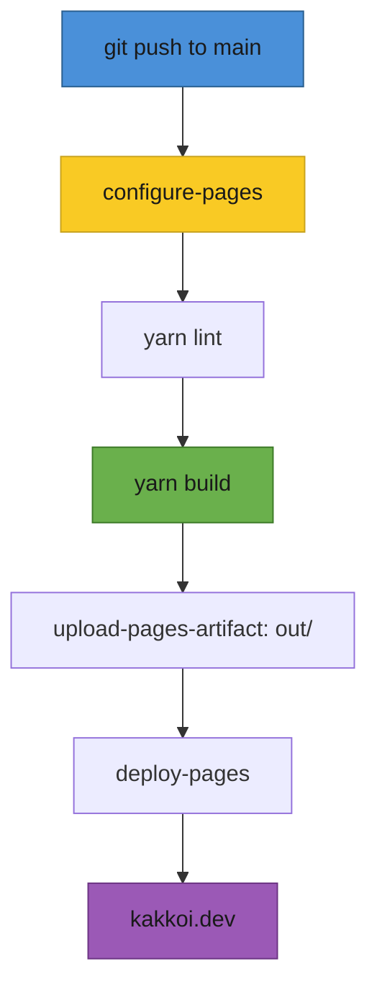
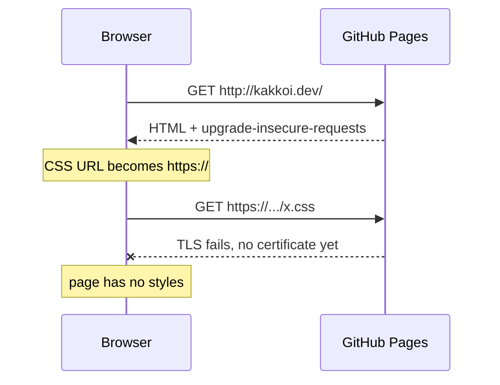
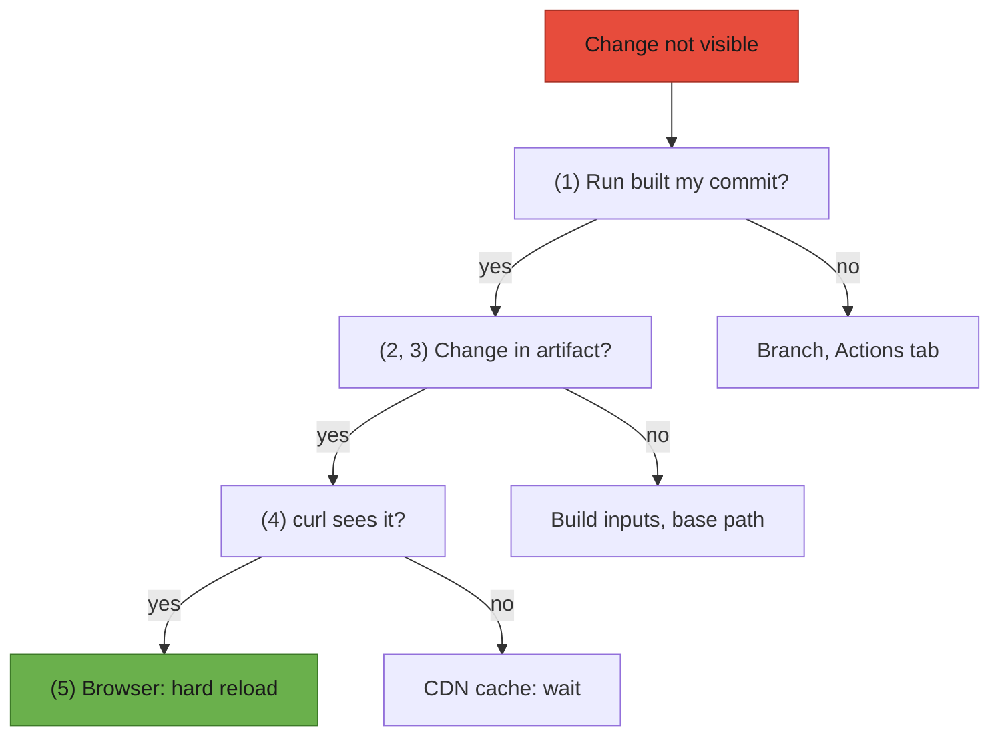

# T40: Case Study - Shipping kakkoi.dev

T31 and T32 built a restaurant on paper. This lesson visits a real one on opening night. kakkoi.dev is the personal site of Cyril Antoni (KakkoiDev), who runs KakkoiSchool: a small Next.js site in English and Japanese, hosted for free on GitHub Pages. Its source is public at [github.com/KakkoiDev/website](https://github.com/KakkoiDev/website), and every excerpt below is real code from that repo. The most useful part is not the code that worked first time. It is the things that broke between "it builds on my machine" and "it is live", and how each one was found.
{: .lesson-intro }

## The Site at a Glance

Two pages with the same structure: English at `/` and Japanese at `/ja/`. A header, a name over a spinning CSS cube, two lines about what Cyril does, contact links, a footer. No database, no login, no form. The files that matter:

```
app/
  (en)/layout.tsx          root layout, <html lang="en">
  (en)/page.tsx            "/"
  (ja)/layout.tsx          root layout, <html lang="ja">
  (ja)/ja/page.tsx         "/ja/"
  global-not-found.tsx     the 404, in both languages
  sitemap.ts, robots.ts    written to files at build time
components/Home.tsx        one server component renders both pages
data/dictionary.ts         every visible string, in en and ja
lib/csp.ts                 the Content-Security-Policy
lib/metadata.ts            canonical, hreflang, Open Graph
public/CNAME               the custom domain: kakkoi.dev
.github/workflows/pages.yml  build and deploy
```

## Why a Static Export

By default `next build` prepares a Node.js server that renders pages on request. With `output: "export"`, Next.js runs every server component once, at build time, and writes plain HTML, CSS and JS into `out/`. Any static file host can serve that folder. Think of a bento shop: everything is cooked once in the morning, packed, and handed out all day with no chef on duty.

```
// next.config.mjs
const nextConfig = {
  // Static export for GitHub Pages: `next build` writes the site to out/.
  // Pages cannot send custom headers, so the CSP lives in lib/csp.ts.
  output: "export",
  // Emit ja/index.html rather than ja.html next to a ja/ folder of RSC
  // payloads: Pages answers /ja with /ja/ and needs an index.html there.
  trailingSlash: true,
  // Where Pages serves the site: "/website" at kakkoidev.github.io/website/,
  // "" once the custom domain is set. The workflow reads it from Pages.
  basePath: process.env.PAGES_BASE_PATH ?? "",
  experimental: {
    // app/global-not-found.tsx: the 404 for an app with one root layout per language
    globalNotFound: true,
  },
};
```

Why it fits a personal site:

- **Nothing changes per visitor.** Everyone gets the same page, so rendering it on every request is wasted work.
- **No server to patch.** The site's October 2026 audit found that its old Next.js 14 had a published remote code execution flaw in the image optimizer. A folder of HTML files has no image optimizer and no API, so that whole class of problem disappears.
- **Free, fast hosting.** GitHub Pages serves the folder from a CDN at no cost.

What you give up, and what kakkoi.dev did about each:

- **API routes (T32)** - only `GET` handlers that can run once at build time survive. The site removed its contact form and the email API behind it. `sitemap.ts` and `robots.ts` declare `dynamic = "force-static"`, so they become plain files.
- **`headers()` in the config** - ignored. The CSP moved into a `<meta>` tag (see below).
- **Values computed "now"** - frozen at build time. The site rebuilds every 1 January for the footer year.

That last one is the subtle one. `Home.tsx` prints the year with `new Date().getFullYear()`. On a server, that runs on every request. In a static export it runs once, and the HTML keeps that number until the next build. So the workflow also runs on a schedule:

```
# .github/workflows/pages.yml
on:
  push:
    branches: [main]
  workflow_dispatch:
  # The footer year is rendered at build time; rebuild when it changes.
  schedule:
    - cron: "5 0 1 1 *"
```

`5 0 1 1 *` is 00:05 UTC on 1 January. A static site is a photograph, not a live camera: anything that should change on its own needs a new photograph.

## Two Languages Done Properly

Most bilingual sites translate the text and stop there. The rest is what browsers, screen readers and search engines read. kakkoi.dev does four things.

### 1. One root layout per language

The root layout renders the `<html>` element, and `<html lang>` tells the browser which language the page is in. Screen readers choose a voice from it, browsers choose fonts from it (the same Unicode character is drawn differently in Japanese and Chinese fonts), and translation tools decide whether to offer a translation. A single shared layout would ship `lang="en"` on the Japanese page.

Next.js route groups fix this. A folder name in parentheses organizes files without appearing in the URL, and each group can have its own root layout:

```
app/(en)/layout.tsx   ->  <html lang="en">  for  /
app/(ja)/layout.tsx   ->  <html lang="ja">  for  /ja/
```

```
// app/(ja)/layout.tsx
export const metadata = localeMetadata("ja");

export default function RootLayout({
  children,
}: Readonly<{
  children: React.ReactNode;
}>) {
  return (
    <html lang="ja" className={fontVariables}>
      <head>
        <meta httpEquiv="Content-Security-Policy" content={contentSecurityPolicy} />
      </head>
      <body className="font-jp">{children}</body>
    </html>
  );
}
```

The price: with two root layouts, a URL that does not exist has no layout to render in, because nothing says which language it is. `app/global-not-found.tsx` (switched on by `experimental.globalNotFound` in the config above) renders its own `<html>` and speaks both languages. Mixed-language text inside a page gets its own `lang` too: the Japanese page shows the name in Latin letters under the Japanese one, in an element marked `lang={other}`.

### 2. Every string in a dictionary

No component contains a sentence. Everything visible lives in one typed file:

```
// data/dictionary.ts
type Dictionary = {
  meta: { title: string; description: string };
  nav: { logo: string; switchLabel: string; switchHref: string };
  hero: { name: string; altName: string; title: Phrases };
  about: { heading: string; items: Phrases[] };
  contact: { heading: string };
  footer: (year: number) => string;
};

const en: Dictionary = {
  // ...
  nav: { logo: "KakkoiDev", switchLabel: "日本語", switchHref: "/ja/" },
  hero: {
    name: "Cyril Antoni",
    altName: "キリル アントニ",
    title: "Software engineer · AI",
  },
  // ...
  footer: (year) => `© ${year} Cyril Antoni`,
};

export const dictionary: Record<Locale, Dictionary> = { en, ja };
```

Both `en` and `ja` must satisfy the same `Dictionary` type, so a string added in English and forgotten in Japanese is a TypeScript error at build time, not a bug a visitor finds. `footer` is a function so each language can put the year where its grammar wants it. Even name order lives here: given name first in English contexts (Cyril Antoni), family name first in Japanese ones (アントニ キリル).

### 3. hreflang and canonical

A search engine sees two pages with the same content in different languages. Two kinds of tag explain how they relate: `canonical` says "this URL is the original of this page", and the `hreflang` alternates say "here is the same page in other languages". The site builds both from one function:

```
// lib/metadata.ts
const SITE_URL = "https://kakkoi.dev";
const PATHS: Record<Locale, string> = { en: "/", ja: "/ja/" };

export function localeMetadata(locale: Locale): Metadata {
  // ...
  return {
    metadataBase: new URL(SITE_URL),
    title,
    description,
    alternates: {
      canonical: PATHS[locale],
      languages: { en: PATHS.en, ja: PATHS.ja, "x-default": PATHS.en },
    },
    // ...Open Graph and Twitter cards
  };
}
```

What lands in the built `out/ja/index.html`:

```
<link rel="canonical" href="https://kakkoi.dev/ja/"/>
<link rel="alternate" hrefLang="en" href="https://kakkoi.dev/"/>
<link rel="alternate" hrefLang="ja" href="https://kakkoi.dev/ja/"/>
<link rel="alternate" hrefLang="x-default" href="https://kakkoi.dev/"/>
```

`x-default` is the page for everyone else: a visitor whose language is neither gets English. The sitemap (`app/sitemap.ts`) repeats the same pairs, and the language switch link carries `lang` and `hrefLang`, so a screen reader pronounces "日本語" with a Japanese voice.

### 4. One type scale for both languages

The first version gave Japanese its own, tighter sizes, because `/ja` is mostly opened on a phone. After launch the owner chose one scale: every element the same size and spacing in both languages. The code makes "the same" the default and the differences explicit:

```
// components/Home.tsx
const shared = {
  header: "h-16",
  hero: "pt-[128px] pb-[136px] gap-10",
  title: "text-[16px] font-medium",
  section: "py-9",
  items: "gap-[18px]",
  // ...
};

const styles = {
  en: {
    ...shared,
    name: "font-display font-normal text-[clamp(56px,9vw,80px)] leading-[0.9] tracking-[0.01em]",
    h2: "mb-4 font-display font-normal text-[28px] tracking-[0.02em]",
    item: "text-[20px] font-semibold leading-[1.4]",
  },
  ja: {
    ...shared,
    name: "font-jp font-bold text-[clamp(34px,5vw,44px)] leading-[1.25] tracking-[0.06em]",
    h2: "mb-4 font-jp font-bold text-[20px]",
    item: "text-[20px] font-bold leading-[1.6]",
  },
};
```

Everything spread from `shared` is identical. What is left per language is the font and what depends on it: condensed Bebas Neue needs more pixels than Noto Sans JP to read as the same size, and Bebas Neue has no Japanese glyphs at all. A reviewer can see every difference between the two pages in a dozen lines.

## Japanese Line Breaks by Phrase

English breaks lines at spaces. Japanese has no spaces, so the browser may break between almost any two characters. With room for 17 characters, the sentence 人が問題をもっとうまく解決できるよう手助けします。 can wrap like this:

```
人が問題をもっとうまく解決できるよ
う手助けします。
```

The う is torn from its phrase and starts the second line alone. A Japanese reader sees that the way you would see a word split in half with no hyphen. The fix is in the data:

```
// data/dictionary.ts
// Japanese text is split into phrases. Each phrase renders as an inline-block,
// so a line only breaks between phrases and never strands a lone character.
export type Phrases = string | string[];

  about: {
    heading: "できること",
    items: [
      ["問題を解決します。"],
      ["人が問題を", "もっとうまく", "解決できるよう", "手助けします。"],
    ],
  },
```

```
// components/Home.tsx
function Text({ phrases }: { phrases: Phrases }) {
  if (typeof phrases === "string") return phrases;
  return phrases.map((phrase) => (
    <span key={phrase} className="ph">
      {phrase}
    </span>
  ));
}
```

```
/* app/globals.css */
/* A Japanese phrase that must not be split across lines. */
.ph {
  display: inline-block;
}
```

An inline-block is laid out as one box, so the browser can only wrap between boxes. The same sentence now wraps as:

```
人が問題をもっとうまく
解決できるよう手助けします。
```

English strings stay plain strings and wrap normally. Two cautions: a phrase wider than the screen overflows instead of wrapping, so keep phrases short; and split where a native speaker would pause, usually after particles such as が and を. Browsers are starting to do this on their own (`word-break: auto-phrase` in Chromium), but support is not universal yet, and spans work everywhere.

## Deploying to GitHub Pages with Actions

Pages can publish a branch as it is, or run a workflow that builds the site and uploads the result. kakkoi.dev uses the workflow (Settings > Pages > Source: GitHub Actions), so `out/` is never committed.



```
# .github/workflows/pages.yml (the "on:" block is shown above)
permissions:
  contents: read
  pages: write
  id-token: write

# One deployment at a time; let an in-progress one finish.
concurrency:
  group: pages
  cancel-in-progress: false

jobs:
  build:
    runs-on: ubuntu-latest
    steps:
      - uses: actions/checkout@v7
      - uses: actions/setup-node@v7
        with:
          node-version: 22
          cache: yarn
      # Reports where Pages serves the site, so the build can prefix its paths.
      - id: pages
        uses: actions/configure-pages@v6
      - run: yarn install --frozen-lockfile
      - run: yarn lint
      - run: yarn build
        env:
          PAGES_BASE_PATH: ${{ steps.pages.outputs.base_path }}
      - uses: actions/upload-pages-artifact@v5
        with:
          path: out

  deploy:
    needs: build
    runs-on: ubuntu-latest
    environment:
      name: github-pages
      url: ${{ steps.deployment.outputs.page_url }}
    steps:
      - id: deployment
        uses: actions/deploy-pages@v5
```

`id-token: write` lets `deploy-pages` prove who it is with a short-lived token instead of a stored secret. `yarn lint` runs before the build, so a lint error stops the deploy instead of shipping.

### The base-path trap

A repository's Pages site lives at one of two kinds of address, and the same build cannot serve both:

- **Project site:** `kakkoidev.github.io/website/` - the site is in a subfolder of the host.
- **Custom domain:** `kakkoi.dev/` - the site is the whole host.

Next.js writes paths from the root of the host. A real line from the built `index.html`:

```
<link rel="stylesheet" href="/_next/static/chunks/3suzm1vgxclso.css" data-precedence="next"/>
```

At `kakkoidev.github.io/website/`, that leading `/` means `kakkoidev.github.io/_next/...`, which is outside the project. The CSS returns 404, the page renders as unstyled text, and the language switch to `/ja/` lands on a page that does not exist.

The fix is `basePath`. `actions/configure-pages` reports where Pages will serve the site as `base_path`: `/website` for the project site, empty once a custom domain is set. The workflow passes it to the build as `PAGES_BASE_PATH`, `next.config.mjs` reads it, and Next.js prefixes every path it writes (`/website/_next/static/...`). The same code now works at both addresses. Two follow-ups from the same change:

- `basePath` only reaches links that Next.js builds. A plain `<a href="/ja/">` is written as is; `<Link>` from `next/link` gets the prefix:

```
{/* Link, not <a>, so the href picks up the base path. */}
<Link href={t.nav.switchHref} lang={other} hrefLang={other} className={...}>
  {t.nav.switchLabel}
</Link>
```

- Files in `public/` are copied untouched, so the `/jp` redirect (for people who type the country code instead of the language code) uses a relative URL that works at either address:

```
<!-- public/jp/index.html -->
<meta name="robots" content="noindex">
<link rel="canonical" href="https://kakkoi.dev/ja/">
<meta http-equiv="refresh" content="0; url=../ja/">
```

And the trap inside the trap: the base path is baked in at build time. When the custom domain is switched on, the live files still say `/website/` until the workflow runs again. The repo's README says so in one line: after changing the domain, rerun the workflow.

### trailingSlash: why /ja needs a folder

Without `trailingSlash`, the export writes `ja.html` next to a `ja/` folder of payload files. Pages answers `/ja` with `/ja/` and then looks for `ja/index.html`, which is not there. With `trailingSlash: true`, every page is a folder with an `index.html` inside:

```
out/
  index.html
  ja/index.html
  ja/index.txt, ja/__next._tree.txt, ...   (payloads for client navigation)
  jp/index.html                            (the redirect from public/)
  404.html
  CNAME, robots.txt, sitemap.xml
```

This mattered more than usual: the QR code on Cyril's printed business card opens `https://kakkoi.dev/ja`, with no slash. A printed URL cannot be fixed after the fact, so the server side has to accept it.

## A CSP Without Server Headers

A Content-Security-Policy tells the browser which origins a page may load scripts, styles, images and fonts from. Anything injected from elsewhere is refused. It is normally an HTTP response header, and before the move to Pages the site sent it from `headers()` in `next.config.mjs`. Pages does not let you set response headers, so the policy now ships as a `<meta http-equiv>` tag, rendered in `<head>` by each root layout (shown above):

```
// lib/csp.ts
const isDev = process.env.NODE_ENV !== "production";

// GitHub Pages cannot send custom response headers, so the policy ships as a
// <meta http-equiv> tag in each root layout. A meta policy cannot carry
// frame-ancestors; everything else applies as it would from a header. There is
// no upgrade-insecure-requests: Pages' Enforce HTTPS already serves everything
// over HTTPS, and before its certificate exists the directive breaks every
// asset of a page opened over http.
// Next.js inlines its bootstrap scripts, hence 'unsafe-inline'. Fonts are
// self-hosted by next/font, so nothing loads from another origin.
export const contentSecurityPolicy = [
  "default-src 'self'",
  `script-src 'self' 'unsafe-inline'${isDev ? " 'unsafe-eval'" : ""}`,
  "style-src 'self' 'unsafe-inline'",
  "img-src 'self' data:",
  "font-src 'self'",
  `connect-src 'self'${isDev ? " ws:" : ""}`,
  "object-src 'none'",
  "base-uri 'self'",
  "form-action 'self'",
].join("; ");
```

Know the limits of the meta version:

- **Some directives are ignored.** `frame-ancestors` (which stops other sites from framing yours), `report-uri` and `sandbox` only work as headers.
- **It only covers what comes after it.** A meta policy applies from the point the browser reads it. In kakkoi.dev's built HTML, Next.js places its own stylesheet and script tags above the CSP tag, so those are fetched before the policy exists. They come from the build, not from a visitor, so the risk is small, but it is one more reason a header is stronger when you can have one.
- **`'unsafe-inline'` is the price of static.** Next.js inlines small bootstrap scripts. The stricter alternative, a nonce, is a fresh random value per request, which needs a server.

### Why upgrade-insecure-requests broke the CSS

The first Pages deploy included `upgrade-insecure-requests` in production. That directive tells the browser: rewrite every `http://` URL this page loads to `https://`. On a site that always has HTTPS, it is a harmless safety net.

But after you point a custom domain at Pages, there is a window before Pages has issued the HTTPS certificate for it. During that window only `http://kakkoi.dev` works:



The page loaded, and every stylesheet failed. The fix (pull request #6) was to delete the directive. It adds nothing once HTTPS works, because with Enforce HTTPS on, Pages itself redirects every `http://` request to `https://`. The comment in `lib/csp.ts` records why, so nobody adds it back as an "improvement". The general lesson: a security setting can depend on the state of the infrastructure. Open the first deploy over plain `http://` too, not only `https://`.

## Debugging a Stale Deploy

"I pushed, the run is green, and the site still shows the old version." Do not guess. Work from your commit outward and prove each layer before moving to the next:



**1. Which commit was built?** Compare the run's commit with yours:

```
git rev-parse HEAD
gh run list --workflow=pages.yml --limit 3 --json headSha,conclusion,createdAt
```

**2. What did the build see?** The log prints each step's environment, so the base path is a fact, not a guess. An empty value is right for the custom domain. `/website` after the domain was set means the build predates the switch:

```
gh run view <run-id> --log | grep "PAGES_BASE_PATH"
```

**3. What was uploaded?** The deployed files are kept as the run's `github-pages` artifact. Download it and search it:

```
gh run download <run-id> --name github-pages --dir built
tar -xf built/artifact.tar -C built
grep -o 'href="[^"]*_next/static[^"]*\.css"' built/index.html
```

**4. What does the CDN serve?** `curl` skips your browser's cache entirely:

```
curl -sI https://kakkoi.dev/ | grep -iE "^(cache-control|age|last-modified):"
curl -s "https://kakkoi.dev/ja/?v=$(date +%s)" | grep -c "upgrade-insecure-requests"
```

Pages lets the CDN and browsers keep a page for a few minutes (`cache-control: max-age=600` at the time of writing), and `age` shows how long the copy you got has been cached. A never-seen query string usually fetches a fresh copy. The second command is how you prove a fix is live: `0` means the deployed CSP no longer has the directive.

**5. Only then, the browser.** File names under `_next/static/` contain a hash of their content (`3suzm1vgxclso.css`), so every deploy ships new names and the old files are gone. An HTML page your browser cached before the deploy still points at the old names: you get an unstyled page for a few minutes that looks exactly like a broken build. A hard reload, or DevTools with "Disable cache" ticked, settles it.

Remember the build-time values too: the base path and the footer year only change when a build runs. A green run from last week is not proof of anything you changed today.

<div class="takeaways">
<h2>Key Takeaways</h2>
<ul>
<li>A static export runs server components once at build time: ideal when nothing changes per visitor, no server to patch, but "now" is frozen until the next build</li>
<li>One root layout per language (route groups) gives each page the right &lt;html lang&gt;; a typed dictionary makes a missing translation a build error</li>
<li>canonical plus hreflang alternates (with x-default) tell search engines the pages are translations of each other</li>
<li>Japanese can wrap between any two characters; phrase spans with display: inline-block make lines break only between phrases</li>
<li>On GitHub Pages, feed configure-pages' base_path into basePath, use next/link for internal links, and turn on trailingSlash so /ja serves ja/index.html</li>
<li>Without server headers, ship the CSP as a meta tag, know what it cannot cover, and leave out upgrade-insecure-requests, which breaks every asset before HTTPS exists</li>
<li>Debug a stale deploy layer by layer: the commit, the build log, the artifact, curl, and only then the browser</li>
</ul>
</div>

## Exercise: Ship Your Own Two-Language Page

Build a two-page site in English plus a second language of your choice (`xx` below), and deploy it to `<your-user>.github.io/<repo>/`.

1. Create the app with `npx create-next-app@latest`. In `next.config.mjs` set `output: "export"`, `trailingSlash: true` and `basePath: process.env.PAGES_BASE_PATH ?? ""`.
2. Delete `app/layout.tsx`. Create `app/(en)/layout.tsx` and `app/(xx)/layout.tsx`, each returning its own `<html lang>`, and move the home page to `app/(en)/page.tsx` and `app/(xx)/xx/page.tsx`. Put every visible string in one typed dictionary.
3. Give both layouts `alternates` metadata: a canonical URL and `languages` with `en`, `xx` and `x-default`.
4. Copy the workflow above, set Settings > Pages > Source to GitHub Actions, and push.
5. Break it on purpose: delete the two `env:` lines under `yarn build`, push, and open the site. In DevTools > Network, find the CSS request that fails and write down the URL it tried. Find `PAGES_BASE_PATH` in the run log. Put the lines back and confirm the fix.
6. Add a meta CSP like `lib/csp.ts`, then add an `` from another website and read the violation in the console.

You are done when both pages load with styles at the project URL, View Source shows the right `<html lang>` and three `<link rel="alternate">` tags on each page, and you can say from the Actions log which base path your live build used.
