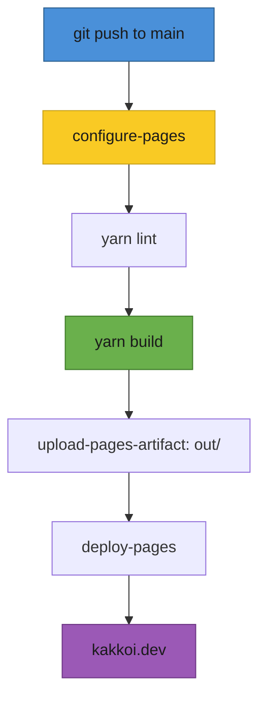
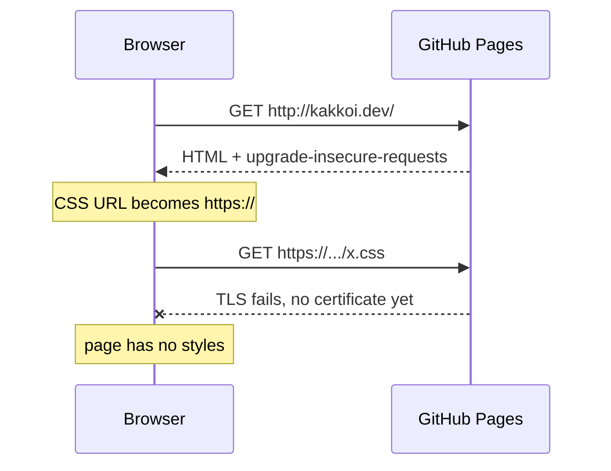
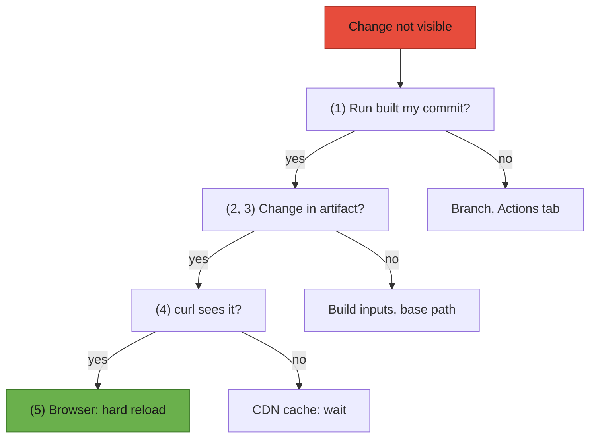

# T40: Estudo de Caso - Publicando kakkoi.dev

T31 e T32 construíram um restaurante no papel. Esta lição visita um real na noite de abertura. kakkoi.dev é o site pessoal de Cyril Antoni (KakkoiDev), que dirige a KakkoiSchool: um pequeno site Next.js em inglês e japonês, hospedado gratuitamente no GitHub Pages. Sua fonte é pública em [github.com/KakkoiDev/website](https://github.com/KakkoiDev/website), e cada trecho abaixo é código real desse repositório. A parte mais útil não é o código que funcionou na primeira vez. São as coisas que quebraram entre "funciona na minha máquina" e "está no ar", e como cada uma foi encontrada.
{: .lesson-intro }

## O Site em Resumo

Duas páginas com a mesma estrutura: inglês em `/` e japonês em `/ja/`. Um cabeçalho, um nome sobre um cubo CSS giratório, duas linhas sobre o que Cyril faz, links de contato, um rodapé. Sem banco de dados, sem login, sem formulário. Os arquivos que importam:

```
app/
  (en)/layout.tsx          root layout, <html lang="en">
  (en)/page.tsx            "/"
  (ja)/layout.tsx          root layout, <html lang="ja">
  (ja)/ja/page.tsx         "/ja/"
  global-not-found.tsx     the 404, in both languages
  sitemap.ts, robots.ts    written to files at build time
components/Home.tsx        one server component renders both pages
data/dictionary.ts         every visible string, in en and ja
lib/csp.ts                 the Content-Security-Policy
lib/metadata.ts            canonical, hreflang, Open Graph
public/CNAME               the custom domain: kakkoi.dev
.github/workflows/pages.yml  build and deploy
```

## Por que uma Exportação Estática

Por padrão, `next build` prepara um servidor Node.js que renderiza páginas sob demanda. Com `output: "export"`, o Next.js executa cada componente de servidor uma vez, no tempo de build, e escreve HTML, CSS e JS puros em `out/`. Qualquer host de arquivo estático pode servir essa pasta. Pense em uma loja de bentô: tudo é cozinhado uma vez pela manhã, embalado e entregue durante todo o dia sem chef de plantão.

```
// next.config.mjs
const nextConfig = {
  // Static export for GitHub Pages: `next build` writes the site to out/.
  // Pages cannot send custom headers, so the CSP lives in lib/csp.ts.
  output: "export",
  // Emit ja/index.html rather than ja.html next to a ja/ folder of RSC
  // payloads: Pages answers /ja with /ja/ and needs an index.html there.
  trailingSlash: true,
  // Where Pages serves the site: "/website" at kakkoidev.github.io/website/,
  // "" once the custom domain is set. The workflow reads it from Pages.
  basePath: process.env.PAGES_BASE_PATH ?? "",
  experimental: {
    // app/global-not-found.tsx: the 404 for an app with one root layout per language
    globalNotFound: true,
  },
};
```

Por que isso se encaixa em um site pessoal:

- **Nada muda por visitante.** Todos recebem a mesma página, então renderizá-la a cada requisição é trabalho desperdiçado.
- **Nenhum servidor para corrigir.** A auditoria de outubro de 2026 do site descobriu que seu antigo Next.js 14 tinha uma falha de execução remota de código publicada no otimizador de imagens. Uma pasta de arquivos HTML não tem otimizador de imagens e nenhuma API, então toda essa classe de problemas desaparece.
- **Hospedagem gratuita e rápida.** O GitHub Pages serve a pasta de uma CDN sem custo.

O que você abre mão, e o que kakkoi.dev fez sobre cada um:

- **Rotas de API (T32)** - apenas manipuladores `GET` que podem ser executados uma vez no tempo de build sobrevivem. O site removeu seu formulário de contato e a API de e-mail por trás dele. `sitemap.ts` e `robots.ts` declaram `dynamic = "force-static"`, então eles se tornam arquivos simples.
- **`headers()` na configuração** - ignorados. O CSP moveu-se para uma tag `<meta>` (veja abaixo).
- **Valores calculados "agora"** - congelados no tempo de build. O site é reconstruído todo 1º de janeiro para o ano do rodapé.

Esse último é o sutil. `Home.tsx` imprime o ano com `new Date().getFullYear()`. Em um servidor, isso é executado em cada requisição. Em uma exportação estática, é executado uma vez, e o HTML mantém esse número até o próximo build. Então o workflow também é executado em uma programação:

```
# .github/workflows/pages.yml
on:
  push:
    branches: [main]
  workflow_dispatch:
  # The footer year is rendered at build time; rebuild when it changes.
  schedule:
    - cron: "5 0 1 1 *"
```

`5 0 1 1 *` é 00:05 UTC em 1º de janeiro. Um site estático é uma fotografia, não uma câmera ao vivo: qualquer coisa que deva mudar por conta própria precisa de uma nova fotografia.

## Dois Idiomas Feitos Corretamente

A maioria dos sites bilíngues traduz o texto e para por aí. O resto é o que navegadores, leitores de tela e mecanismos de busca leem. kakkoi.dev faz quatro coisas.

### 1. Um layout raiz por idioma

O layout raiz renderiza o elemento `<html>`, e `<html lang>` informa ao navegador em que idioma a página está. Leitores de tela escolhem uma voz a partir dele, navegadores escolhem fontes a partir dele (o mesmo caractere Unicode é desenhado de forma diferente em fontes japonesas e chinesas), e ferramentas de tradução decidem se oferecem uma tradução. Um único layout compartilhado enviaria `lang="en"` na página japonesa.

Grupos de rotas do Next.js corrigem isso. Um nome de pasta entre parênteses organiza arquivos sem aparecer na URL, e cada grupo pode ter seu próprio layout raiz:

```
app/(en)/layout.tsx   ->  <html lang="en">  for  /
app/(ja)/layout.tsx   ->  <html lang="ja">  for  /ja/
```

```
// app/(ja)/layout.tsx
export const metadata = localeMetadata("ja");

export default function RootLayout({
  children,
}: Readonly<{
  children: React.ReactNode;
}>) {
  return (
    <html lang="ja" className={fontVariables}>
      <head>
        <meta httpEquiv="Content-Security-Policy" content={contentSecurityPolicy} />
      </head>
      <body className="font-jp">{children}</body>
    </html>
  );
}
```

O preço: com dois layouts raiz, uma URL que não existe não tem layout para renderizar, porque nada diz em que idioma ela está. `app/global-not-found.tsx` (ativado por `experimental.globalNotFound` na configuração acima) renderiza seu próprio `<html>` e fala ambos os idiomas. Texto em idiomas mistos dentro de uma página também recebe seu próprio `lang`: a página japonesa mostra o nome em letras latinas sob o japonês, em um elemento marcado `lang={other}`.

### 2. Cada string em um dicionário

Nenhum componente contém uma frase. Tudo o que é visível vive em um arquivo tipado:

```
// data/dictionary.ts
type Dictionary = {
  meta: { title: string; description: string };
  nav: { logo: string; switchLabel: string; switchHref: string };
  hero: { name: string; altName: string; title: Phrases };
  about: { heading: string; items: Phrases[] };
  contact: { heading: string };
  footer: (year: number) => string;
};

const en: Dictionary = {
  // ...
  nav: { logo: "KakkoiDev", switchLabel: "日本語", switchHref: "/ja/" },
  hero: {
    name: "Cyril Antoni",
    altName: "キリル アントニ",
    title: "Software engineer · AI",
  },
  // ...
  footer: (year) => `© ${year} Cyril Antoni`,
};

export const dictionary: Record<Locale, Dictionary> = { en, ja };
```

Ambos `en` e `ja` devem satisfazer o mesmo tipo `Dictionary`, então uma string adicionada em inglês e esquecida em japonês é um erro do TypeScript no tempo de build, não um bug que um visitante encontra. `footer` é uma função para que cada idioma possa colocar o ano onde sua gramática desejar. Até a ordem do nome vive aqui: nome próprio primeiro em contextos em inglês (Cyril Antoni), sobrenome primeiro em contextos japoneses (アントニ キリル).

### 3. hreflang e canonical

Um mecanismo de busca vê duas páginas com o mesmo conteúdo em idiomas diferentes. Dois tipos de tag explicam como elas se relacionam: `canonical` diz "esta URL é a original desta página", e os alternados `hreflang` dizem "aqui está a mesma página em outros idiomas". O site constrói ambos a partir de uma função:

```
// lib/metadata.ts
const SITE_URL = "https://kakkoi.dev";
const PATHS: Record<Locale, string> = { en: "/", ja: "/ja/" };

export function localeMetadata(locale: Locale): Metadata {
  // ...
  return {
    metadataBase: new URL(SITE_URL),
    title,
    description,
    alternates: {
      canonical: PATHS[locale],
      languages: { en: PATHS.en, ja: PATHS.ja, "x-default": PATHS.en },
    },
    // ...Open Graph and Twitter cards
  };
}
```

O que chega no `out/ja/index.html` construído:

```
<link rel="canonical" href="https://kakkoi.dev/ja/"/>
<link rel="alternate" hrefLang="en" href="https://kakkoi.dev/"/>
<link rel="alternate" hrefLang="ja" href="https://kakkoi.dev/ja/"/>
<link rel="alternate" hrefLang="x-default" href="https://kakkoi.dev/"/>
```

`x-default` é a página para todos os outros: um visitante cujo idioma não é nenhum dos dois recebe inglês. O sitemap (`app/sitemap.ts`) repete os mesmos pares, e o link de troca de idioma carrega `lang` e `hrefLang`, para que um leitor de tela pronuncie "日本語" com uma voz japonesa.

### 4. Uma escala de tipagem para ambos os idiomas

A primeira versão deu ao japonês seus próprios tamanhos, mais compactos, porque `/ja` é principalmente aberto em um telefone. Após o lançamento, o proprietário escolheu uma escala: cada elemento com o mesmo tamanho e espaçamento em ambos os idiomas. O código torna "o mesmo" o padrão e as diferenças explícitas:

```
// components/Home.tsx
const shared = {
  header: "h-16",
  hero: "pt-[128px] pb-[136px] gap-10",
  title: "text-[16px] font-medium",
  section: "py-9",
  items: "gap-[18px]",
  // ...
};

const styles = {
  en: {
    ...shared,
    name: "font-display font-normal text-[clamp(56px,9vw,80px)] leading-[0.9] tracking-[0.01em]",
    h2: "mb-4 font-display font-normal text-[28px] tracking-[0.02em]",
    item: "text-[20px] font-semibold leading-[1.4]",
  },
  ja: {
    ...shared,
    name: "font-jp font-bold text-[clamp(34px,5vw,44px)] leading-[1.25] tracking-[0.06em]",
    h2: "mb-4 font-jp font-bold text-[20px]",
    item: "text-[20px] font-bold leading-[1.6]",
  },
};
```

Tudo o que se espalha de `shared` é idêntico. O que resta por idioma é a fonte e o que depende dela: o Bebas Neue condensado precisa de mais pixels do que o Noto Sans JP para ser lido com o mesmo tamanho, e o Bebas Neue não tem glifos japoneses. Um revisor pode ver todas as diferenças entre as duas páginas em uma dezena de linhas.

## Quebras de Linha Japonesas por Frase

O inglês quebra linhas em espaços. O japonês não tem espaços, então o navegador pode quebrar entre quase quaisquer dois caracteres. Com espaço para 17 caracteres, a frase 人が問題をもっとうまく解決できるよう手助けします。 pode quebrar assim:

```
人が問題をもっとうまく解決できるよ
う手助けします。
```

O う é separado de sua frase e começa a segunda linha sozinho. Um leitor japonês vê isso da mesma forma que você veria uma palavra dividida ao meio sem um hífen. A correção está nos dados:

```
// data/dictionary.ts
// Japanese text is split into phrases. Each phrase renders as an inline-block,
// so a line only breaks between phrases and never strands a lone character.
export type Phrases = string | string[];

  about: {
    heading: "できること",
    items: [
      ["問題を解決します。"],
      ["人が問題を", "もっとうまく", "解決できるよう", "手助けします。"],
    ],
  },
```

```
// components/Home.tsx
function Text({ phrases }: { phrases: Phrases }) {
  if (typeof phrases === "string") return phrases;
  return phrases.map((phrase) => (
    <span key={phrase} className="ph">
      {phrase}
    </span>
  ));
}
```

```
/* app/globals.css */
/* A Japanese phrase that must not be split across lines. */
.ph {
  display: inline-block;
}
```

Um inline-block é disposto como uma caixa, então o navegador só pode quebrar entre caixas. A mesma frase agora quebra assim:

```
人が問題をもっとうまく
解決できるよう手助けします。
```

Strings em inglês permanecem strings simples e quebram normalmente. Duas ressalvas: uma frase mais larga que a tela transborda em vez de quebrar, então mantenha as frases curtas; e quebre onde um falante nativo faria uma pausa, geralmente após partículas como が e を. Os navegadores estão começando a fazer isso por conta própria (`word-break: auto-phrase` no Chromium), mas o suporte ainda não é universal, e os `spans` funcionam em qualquer lugar.

## Publicando no GitHub Pages com Actions

O Pages pode publicar um branch como está, ou executar um workflow que constrói o site e faz upload do resultado. kakkoi.dev usa o workflow (Settings > Pages > Source: GitHub Actions), então `out/` nunca é commitado.



```
# .github/workflows/pages.yml (the "on:" block is shown above)
permissions:
  contents: read
  pages: write
  id-token: write

# One deployment at a time; let an in-progress one finish.
concurrency:
  group: pages
  cancel-in-progress: false

jobs:
  build:
    runs-on: ubuntu-latest
    steps:
      - uses: actions/checkout@v7
      - uses: actions/setup-node@v7
        with:
          node-version: 22
          cache: yarn
      # Reports where Pages serves the site, so the build can prefix its paths.
      - id: pages
        uses: actions/configure-pages@v6
      - run: yarn install --frozen-lockfile
      - run: yarn lint
      - run: yarn build
        env:
          PAGES_BASE_PATH: ${{ steps.pages.outputs.base_path }}
      - uses: actions/upload-pages-artifact@v5
        with:
          path: out

  deploy:
    needs: build
    runs-on: ubuntu-latest
    environment:
      name: github-pages
      url: ${{ steps.deployment.outputs.page_url }}
    steps:
      - id: deployment
        uses: actions/deploy-pages@v5
```

`id-token: write` permite que `deploy-pages` prove quem ele é com um token de curta duração em vez de um segredo armazenado. `yarn lint` é executado antes do build, então um erro de lint impede o deploy em vez de enviá-lo.

### A armadilha do base-path

Um site de Pages de um repositório reside em um de dois tipos de endereço, e o mesmo build não pode servir ambos:

- **Site de projeto:** `kakkoidev.github.io/website/` - o site está em uma subpasta do host.
- **Domínio personalizado:** `kakkoi.dev/` - o site é o host inteiro.

O Next.js escreve caminhos a partir da raiz do host. Uma linha real do `index.html` construído:

```
<link rel="stylesheet" href="/_next/static/chunks/3suzm1vgxclso.css" data-precedence="next"/>
```

Em `kakkoidev.github.io/website/`, essa barra inicial `/` significa `kakkoidev.github.io/_next/...`, que está fora do projeto. O CSS retorna 404, a página é renderizada como texto sem estilo, e a troca de idioma para `/ja/` chega a uma página que não existe.

A correção é `basePath`. `actions/configure-pages` informa onde o Pages servirá o site como `base_path`: `/website` para o site do projeto, vazio uma vez que um domínio personalizado é configurado. O workflow o passa para o build como `PAGES_BASE_PATH`, `next.config.mjs` o lê, e o Next.js prefixa cada caminho que ele escreve (`/website/_next/static/...`). O mesmo código agora funciona em ambos os endereços. Duas consequências da mesma mudança:

- `basePath` só alcança links que o Next.js constrói. Um `<a href="/ja/">` simples é escrito como está; `<Link>` de `next/link` recebe o prefixo:

```
{/* Link, not <a>, so the href picks up the base path. */}
<Link href={t.nav.switchHref} lang={other} hrefLang={other} className={...}>
  {t.nav.switchLabel}
</Link>
```

- Arquivos em `public/` são copiados intocados, então o redirecionamento `/jp` (para pessoas que digitam o código do país em vez do código do idioma) usa uma URL relativa que funciona em ambos os endereços:

```
<!-- public/jp/index.html -->
<meta name="robots" content="noindex">
<link rel="canonical" href="https://kakkoi.dev/ja/">
<meta http-equiv="refresh" content="0; url=../ja/">
```

E a armadilha dentro da armadilha: o base path é "assado" no tempo de build. Quando o domínio personalizado é ativado, os arquivos ativos ainda dizem `/website/` até que o workflow seja executado novamente. O README do repositório diz isso em uma linha: após alterar o domínio, execute o workflow novamente.

### trailingSlash: por que /ja precisa de uma pasta

Sem `trailingSlash`, a exportação escreve `ja.html` ao lado de uma pasta `ja/` de arquivos de payload. O Pages responde a `/ja` com `/ja/` e então procura por `ja/index.html`, que não está lá. Com `trailingSlash: true`, cada página é uma pasta com um `index.html` dentro:

```
out/
  index.html
  ja/index.html
  ja/index.txt, ja/__next._tree.txt, ...   (payloads for client navigation)
  jp/index.html                            (the redirect from public/)
  404.html
  CNAME, robots.txt, sitemap.xml
```

Isso importava mais do que o normal: o código QR no cartão de visitas impresso de Cyril abre `https://kakkoi.dev/ja`, sem barra. Uma URL impressa não pode ser corrigida depois do fato, então o lado do servidor precisa aceitá-la.

## Um CSP Sem Cabeçalhos de Servidor

Uma Content-Security-Policy (CSP) informa ao navegador quais origens uma página pode carregar scripts, estilos, imagens e fontes. Qualquer coisa injetada de outro lugar é recusada. Normalmente é um cabeçalho de resposta HTTP, e antes da mudança para o Pages o site o enviava de `headers()` em `next.config.mjs`. O Pages não permite definir cabeçalhos de resposta, então a política agora é enviada como uma tag `<meta http-equiv>`, renderizada em `<head>` por cada layout raiz (mostrado acima):

```
// lib/csp.ts
const isDev = process.env.NODE_ENV !== "production";

// GitHub Pages cannot send custom response headers, so the policy ships as a
// <meta http-equiv> tag in each root layout. A meta policy cannot carry
// frame-ancestors; everything else applies as it would from a header. There is
// no upgrade-insecure-requests: Pages' Enforce HTTPS already serves everything
// over HTTPS, and before its certificate exists the directive breaks every
// asset of a page opened over http.
// Next.js inlines its bootstrap scripts, hence 'unsafe-inline'. Fonts are
// self-hosted by next/font, so nothing loads from another origin.
export const contentSecurityPolicy = [
  "default-src 'self'",
  `script-src 'self' 'unsafe-inline'${isDev ? " 'unsafe-eval'" : ""}`,
  "style-src 'self' 'unsafe-inline'",
  "img-src 'self' data:",
  "font-src 'self'",
  `connect-src 'self'${isDev ? " ws:" : ""}`,
  "object-src 'none'",
  "base-uri 'self'",
  "form-action 'self'",
].join("; ");
```

Conheça os limites da versão meta:

- **Algumas diretivas são ignoradas.** `frame-ancestors` (que impede que outros sites enquadrem o seu), `report-uri` e `sandbox` só funcionam como cabeçalhos.
- **Ele só cobre o que vem depois.** Uma política meta se aplica a partir do ponto em que o navegador a lê. No HTML construído de kakkoi.dev, o Next.js coloca suas próprias tags de stylesheet e script acima da tag CSP, então elas são buscadas antes que a política exista. Elas vêm do build, não de um visitante, então o risco é pequeno, mas é mais uma razão pela qual um cabeçalho é mais forte quando você pode tê-lo.
- **`'unsafe-inline'` é o preço do estático.** O Next.js incorpora pequenos scripts de bootstrap. A alternativa mais rigorosa, um nonce, é um valor aleatório novo por requisição, o que requer um servidor.

### Por que upgrade-insecure-requests quebrou o CSS

O primeiro deploy do Pages incluiu `upgrade-insecure-requests` em produção. Essa diretiva diz ao navegador: reescreva cada URL `http://` que esta página carrega para `https://`. Em um site que sempre tem HTTPS, é uma rede de segurança inofensiva.

Mas depois que você aponta um domínio personalizado para o Pages, há uma janela antes que o Pages tenha emitido o certificado HTTPS para ele. Durante essa janela, apenas `http://kakkoi.dev` funciona:



A página carregou, e cada stylesheet falhou. A correção (pull request #6) foi deletar a diretiva. Ela não adiciona nada uma vez que o HTTPS funciona, porque com o Enforce HTTPS ativado, o próprio Pages redireciona toda requisição `http://` para `https://`. O comentário em `lib/csp.ts` registra o porquê, para que ninguém a adicione novamente como uma "melhoria". A lição geral: uma configuração de segurança pode depender do estado da infraestrutura. Abra o primeiro deploy também via `http://` simples, não apenas `https://`.

## Depurando um Deploy Defasado

"Eu fiz push, a execução está verde, e o site ainda mostra a versão antiga." Não adivinhe. Trabalhe do seu commit para fora e prove cada camada antes de passar para a próxima:



**1. Qual commit foi construído?** Compare o commit da execução com o seu:

```
git rev-parse HEAD
gh run list --workflow=pages.yml --limit 3 --json headSha,conclusion,createdAt
```

**2. O que o build viu?** O log imprime o ambiente de cada etapa, então o base path é um fato, não um palpite. Um valor vazio é correto para o domínio personalizado. `/website` depois que o domínio foi definido significa que o build é anterior à mudança:

```
gh run view <run-id> --log | grep "PAGES_BASE_PATH"
```

**3. O que foi enviado?** Os arquivos deployados são mantidos como o artefato `github-pages` da execução. Baixe-o e pesquise nele:

```
gh run download <run-id> --name github-pages --dir built
tar -xf built/artifact.tar -C built
grep -o 'href="[^"]*_next/static[^"]*\.css"' built/index.html
```

**4. O que a CDN serve?** `curl` ignora completamente o cache do seu navegador:

```
curl -sI https://kakkoi.dev/ | grep -iE "^(cache-control|age|last-modified):"
curl -s "https://kakkoi.dev/ja/?v=$(date +%s)" | grep -c "upgrade-insecure-requests"
```

O Pages permite que a CDN e os navegadores mantenham uma página por alguns minutos (`cache-control: max-age=600` no momento da escrita), e `age` mostra há quanto tempo a cópia que você obteve foi armazenada em cache. Uma string de consulta nunca vista geralmente busca uma cópia nova. O segundo comando é como você prova que uma correção está ativa: `0` significa que o CSP deployado não tem mais a diretiva.

**5. Só então, o navegador.** Nomes de arquivo em `_next/static/` contêm um hash de seu conteúdo (`3suzm1vgxclso.css`), então cada deploy envia novos nomes e os arquivos antigos são removidos. Uma página HTML que seu navegador armazenou em cache antes do deploy ainda aponta para os nomes antigos: você obtém uma página sem estilo por alguns minutos que se parece exatamente com um build quebrado. Um hard reload, ou o DevTools com "Disable cache" marcado, resolve isso.

Lembre-se também dos valores de tempo de build: o base path e o ano do rodapé só mudam quando um build é executado. Uma execução verde da semana passada não é prova de nada que você mudou hoje.

<div class="takeaways">
<h2>Principais Pontos</h2>
<ul>
<li>Uma exportação estática executa componentes de servidor uma vez no tempo de build: ideal quando nada muda por visitante, nenhum servidor para corrigir, mas "agora" é congelado até o próximo build</li>
<li>Um layout raiz por idioma (grupos de rotas) dá a cada página o &lt;html lang&gt; correto; um dicionário tipado torna uma tradução ausente um erro de build</li>
<li>canonical mais alternativas hreflang (com x-default) informam aos mecanismos de busca que as páginas são traduções umas das outras</li>
<li>O japonês pode quebrar entre quaisquer dois caracteres; `spans` de frase com `display: inline-block` fazem as quebras de linha ocorrerem apenas entre frases</li>
<li>No GitHub Pages, alimente o `base_path` do `configure-pages` no `basePath`, use `next/link` para links internos e ative `trailingSlash` para que `/ja` sirva `ja/index.html`</li>
<li>Sem cabeçalhos de servidor, envie o CSP como uma meta tag, saiba o que ele não pode cobrir e omita `upgrade-insecure-requests`, que quebra todos os assets antes que o HTTPS exista</li>
<li>Depure um deploy defasado camada por camada: o commit, o log de build, o artefato, `curl`, e só então o navegador</li>
</ul>
</div>

## Exercício: Publique Sua Própria Página Bilíngue

Construa um site de duas páginas em inglês mais um segundo idioma de sua escolha (`xx` abaixo), e faça deploy para `<seu-usuário>.github.io/<repositório>/`.

1. Crie o aplicativo com `npx create-next-app@latest`. Em `next.config.mjs`, defina `output: "export"`, `trailingSlash: true` e `basePath: process.env.PAGES_BASE_PATH ?? ""`.
2. Exclua `app/layout.tsx`. Crie `app/(en)/layout.tsx` e `app/(xx)/layout.tsx`, cada um retornando seu próprio `<html lang>`, e mova a página inicial para `app/(en)/page.tsx` e `app/(xx)/xx/page.tsx`. Coloque cada string visível em um dicionário tipado.
3. Dê a ambos os layouts metadados `alternates`: uma URL canônica e `languages` com `en`, `xx` e `x-default`.
4. Copie o workflow acima, defina Settings > Pages > Source para GitHub Actions e faça push.
5. Quebre-o de propósito: exclua as duas linhas `env:` sob `yarn build`, faça push e abra o site. Em DevTools > Network, encontre a requisição CSS que falha e anote a URL que ela tentou. Encontre `PAGES_BASE_PATH` no log da execução. Recoloque as linhas e confirme a correção.
6. Adicione um CSP meta como `lib/csp.ts`, então adicione um `` de outro site e leia a violação no console.

Você estará pronto quando ambas as páginas carregarem com estilos na URL do projeto, o View Source mostrar o `<html lang>` correto e três tags `<link rel="alternate">` em cada página, e você puder dizer a partir do log do Actions qual base path seu build ativo usou.
