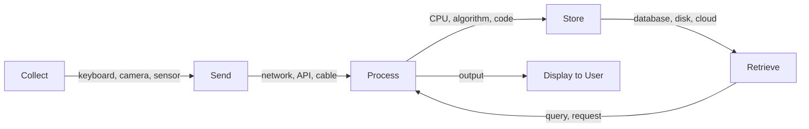

# R01: ITとは何か

情報技術は4つのアクションで成り立ちます: 情報を集める、どこかに送る、有用なものに加工する、後で使うために保存する。あなたが使う全てのアプリ、Webサイト、システムはこの4つの組み合わせです。電卓からSNSまで全て同じです。
{: .lesson-intro }

## 4つの柱

**収集:** キーボード、カメラ、センサー、フォーム。世界から情報を取り込むもの全て。

**送信:** ネットワーク、Wi-Fi、ケーブル、API。情報をAからBに移動すること。

**処理:** CPU、アルゴリズム、コード。生データを有用な出力に変換すること。

**保存:** ハードドライブ、データベース、クラウドストレージ。将来の使用のために情報を保持すること。

## 実例

SNSに写真を投稿する時: スマホのカメラが画像を収集し、ネットワークがサーバーに送信し、サーバーが処理(リサイズ、圧縮)し、データベースが保存します。4つの柱全てが動いています。

<h2>まとめ</h2>
<ul>
<li>ITは4つのアクションに集約されます: 収集、送信、処理、保存</li>
<li>全てのアプリケーションはこの4つの操作の組み合わせです</li>
<li>これらの柱を理解すると、どんなシステムでも全体像が見えます</li>
<li>Web開発は4つ全てに関わります: フォームが収集、HTTPが送信、サーバーが処理、DBが保存</li>
</ul>

