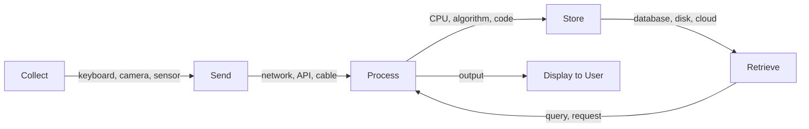

# R01: What is IT?

Information Technology is about four actions: collecting information, sending it somewhere, processing it into something useful, and storing it for later. Every app, website, and system you use is just doing some combination of these four things - from a calculator to a social network.
{: .lesson-intro }

## The Four Pillars

**Collect:** Keyboards, cameras, sensors, forms - anything that captures information from the world.

**Send:** Networks, Wi-Fi, cables, APIs - moving information from point A to point B.

**Process:** CPUs, algorithms, code - transforming raw data into useful output.

**Store:** Hard drives, databases, cloud storage - keeping information for future use.

## Real-World Example

When you post a photo on social media: your phone camera collects the image, the network sends it to a server, the server processes it (resizes, compresses), and the database stores it. All four pillars at work.

<h2>Key Takeaways</h2>
<ul>
<li>IT boils down to four actions: collect, send, process, store</li>
<li>Every application is a combination of these four operations</li>
<li>Understanding these pillars helps you see the big picture in any system</li>
<li>Web development touches all four: forms collect, HTTP sends, servers process, databases store</li>
</ul>

