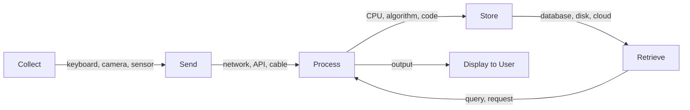

# R01: O que é TI?

Tecnologia da Informação trata de quatro ações: coletar informação, enviá-la para algum lugar, processá-la em algo útil e armazená-la para depois. Cada app, site e sistema que você usa é apenas alguma combinação dessas quatro coisas - de uma calculadora a uma rede social.
{: .lesson-intro }

## Os Quatro Pilares

**Coletar:** Teclados, câmeras, sensores, formulários - qualquer coisa que capture informação do mundo.

**Enviar:** Redes, Wi-Fi, cabos, APIs - movendo informação do ponto A ao ponto B.

**Processar:** CPUs, algoritmos, código - transformando dados brutos em saída útil.

**Armazenar:** HDs, bancos de dados, nuvem - guardando informação para uso futuro.

## Exemplo do Mundo Real

Quando você posta uma foto numa rede social: a câmera do celular coleta a imagem, a rede a envia a um servidor, o servidor a processa (redimensiona, comprime) e o banco de dados a armazena. Os quatro pilares em ação.

<h2>Key Takeaways</h2>
<ul>
<li>TI se resume a quatro ações: coletar, enviar, processar, armazenar</li>
<li>Toda aplicação é uma combinação dessas quatro operações</li>
<li>Entender esses pilares ajuda a enxergar o quadro geral em qualquer sistema</li>
<li>Desenvolvimento web toca os quatro: formulários coletam, HTTP envia, servidores processam, bancos de dados armazenam</li>
</ul>

