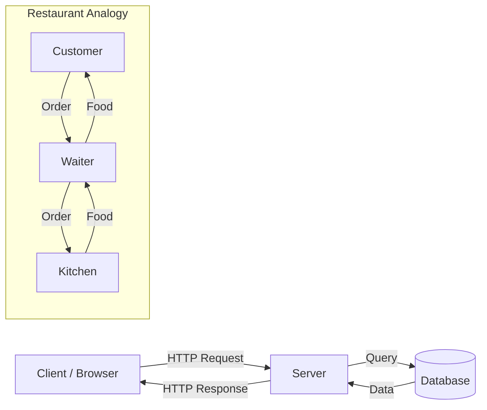

# R02: Webアーキテクチャ

Webはレストランのように動きます。クライアント(ブラウザ)はテーブルに座る客です。サーバーはキッチンです。HTTPは注文を運ぶウェイターです。客はキッチンに入らず、キッチンはテーブルに座りません。それぞれ明確な役割があります。 {.lesson-intro}

## クライアント-サーバーモデル

クライアントはリクエストを送りレスポンスを表示します。サーバーはリクエストを受け取り、処理し、データを返します。この関心の分離はWebアーキテクチャの基本です。

## Webリクエストの仕組み

URLを入力すると: ブラウザがサーバーのアドレスを検索し(DNS)、接続を開き(TCP)、リクエストを送信し(HTTP)、サーバーがHTML、CSS、JS、またはデータで応答します。

```
Client: "GET /menu please"
Server: "Here is the menu page (200 OK)"

Client: "POST /order with {item: 'pasta'}"
Server: "Order received (201 Created)"
```

## シンプルなページを超えて

モダンWebアプリは層を追加します。CDNがユーザーに近い場所でコンテンツをキャッシュし、ロードバランサーが複数サーバーにトラフィックを分散し、データベースがデータを永続化します。



<div class="takeaways">
<h2>まとめ</h2>
<ul>
<li>Webは明確な役割分離を持つクライアント-サーバーモデルに従います</li>
<li>HTTPはクライアントとサーバーの通信方法を定義するプロトコルです</li>
<li>ブラウザは表示を担当し、サーバーはロジックとデータを担当します</li>
<li>DNSはドメイン名をサーバーのIPアドレスに変換します</li>
</ul>
</div>
