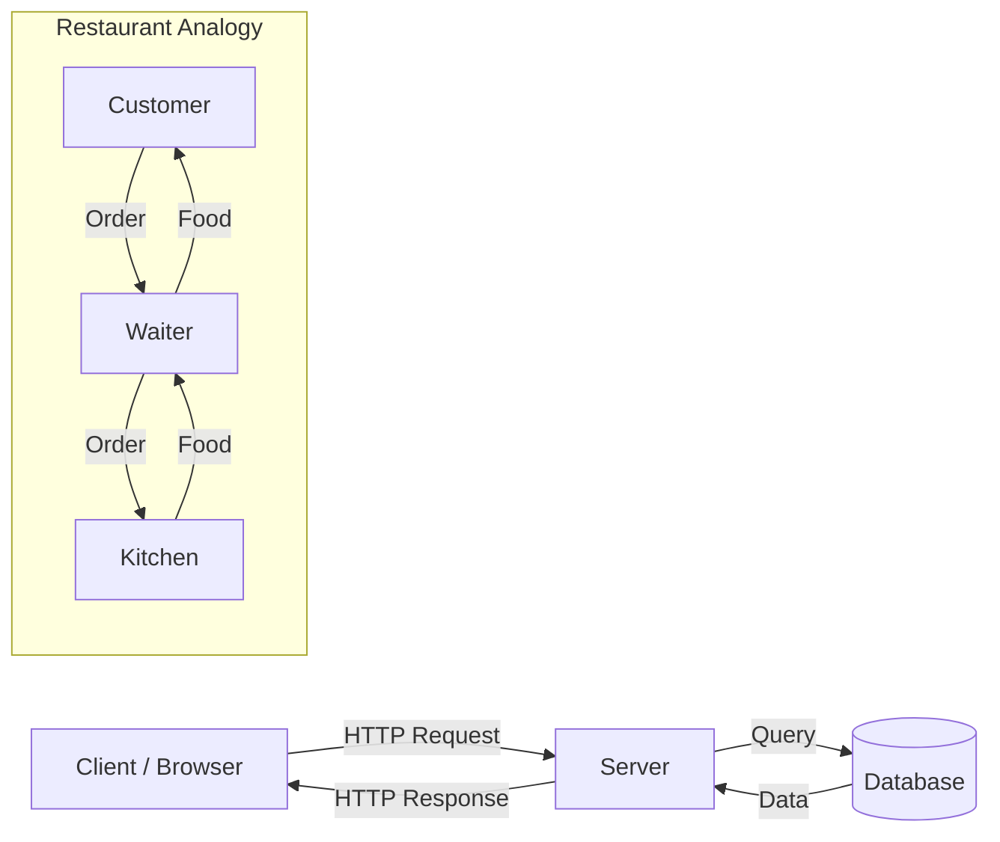

# R02: Web Architecture

The web works like a restaurant. The client (your browser) is the customer sitting at a table. The server is the kitchen. HTTP is the waiter carrying orders back and forth. The customer never enters the kitchen, and the kitchen never sits at the table. Each has a clear role. {.lesson-intro}

## Client-Server Model

The client makes requests and displays responses. The server receives requests, processes them, and sends back data. This separation of concerns is fundamental to web architecture.

## How a Web Request Works

When you type a URL: the browser looks up the server's address (DNS), opens a connection (TCP), sends a request (HTTP), and the server responds with HTML, CSS, JS, or data.

```
Client: "GET /menu please"
Server: "Here is the menu page (200 OK)"

Client: "POST /order with {item: 'pasta'}"
Server: "Order received (201 Created)"
```

## Beyond Simple Pages

Modern web apps add layers: CDNs cache content closer to users, load balancers distribute traffic across multiple servers, and databases persist the data.



<div class="takeaways">
<h2>Key Takeaways</h2>
<ul>
<li>The web follows a client-server model with clear separation of roles</li>
<li>HTTP is the protocol that defines how clients and servers communicate</li>
<li>The browser handles display, the server handles logic and data</li>
<li>DNS translates domain names into server IP addresses</li>
</ul>
</div>
