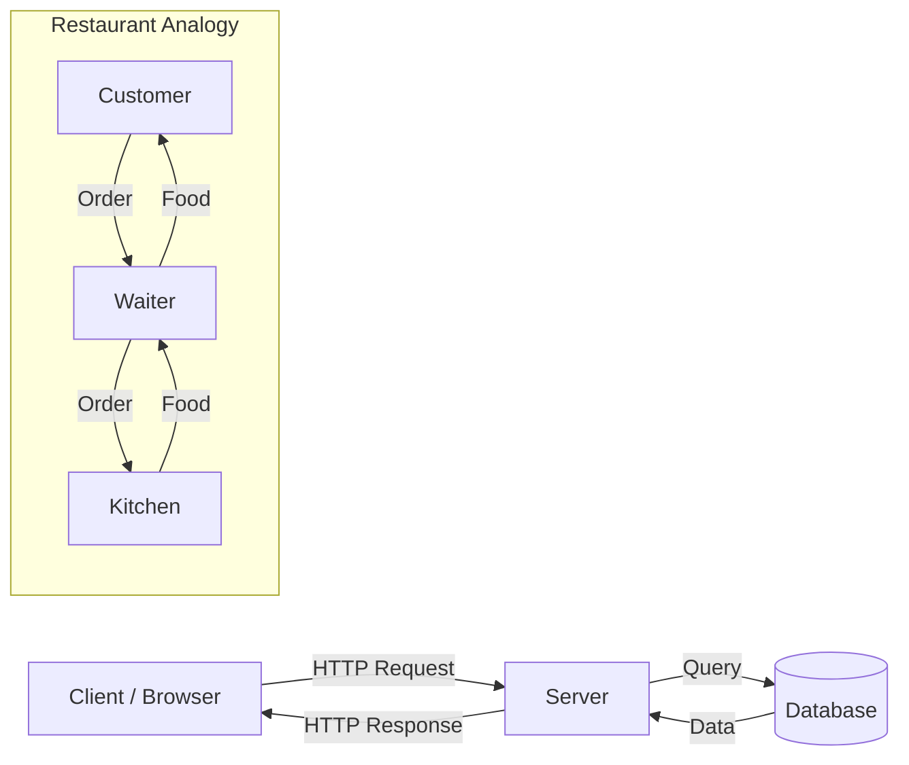

# R02: Arquitetura Web

A web funciona como um restaurante. O cliente (seu navegador) é o freguês sentado à mesa. O servidor é a cozinha. HTTP é o garçom que leva pedidos e respostas para lá e para cá. O cliente nunca entra na cozinha, e a cozinha nunca se senta à mesa. Cada um tem um papel claro.
{: .lesson-intro }

## Modelo Cliente-Servidor

O cliente faz requisições e exibe respostas. O servidor recebe requisições, as processa e devolve dados. Essa separação de responsabilidades é fundamental na arquitetura web.

## Como Funciona uma Requisição Web

Quando você digita uma URL: o navegador descobre o endereço do servidor (DNS), abre uma conexão (TCP), envia uma requisição (HTTP) e o servidor responde com HTML, CSS, JS ou dados.

```
Client: "GET /menu please"
Server: "Here is the menu page (200 OK)"

Client: "POST /order with {item: 'pasta'}"
Server: "Order received (201 Created)"
```

## Além de Páginas Simples

Apps web modernos adicionam camadas: CDNs cacheiam conteúdo mais perto dos usuários, load balancers distribuem tráfego entre vários servidores, e bancos de dados persistem os dados.



<div class="takeaways">
<h2>Key Takeaways</h2>
<ul>
<li>A web segue o modelo cliente-servidor com separação clara de papéis</li>
<li>HTTP é o protocolo que define como clientes e servidores se comunicam</li>
<li>O navegador cuida da exibição, o servidor cuida da lógica e dos dados</li>
<li>DNS traduz nomes de domínio em endereços IP de servidores</li>
</ul>
</div>
