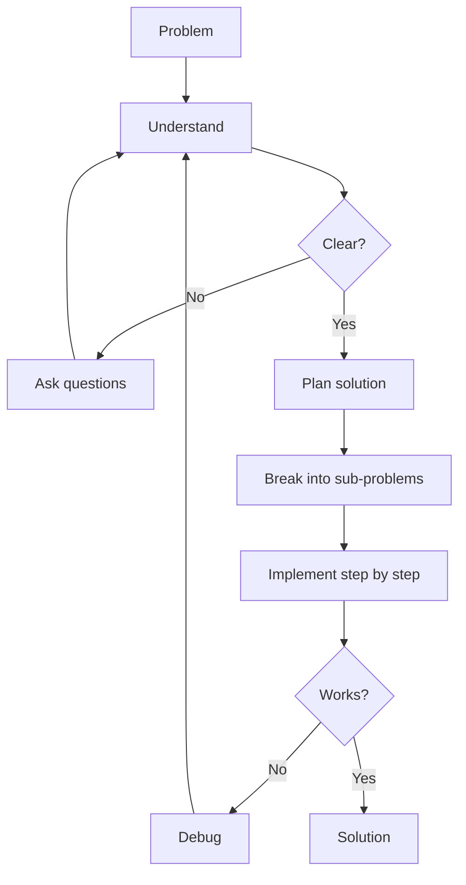

# R03: 問題解決

プログラミングはキーボードを使った問題解決です。コードを書く前に、問題を理解し、解決戦略を見つけ、段階的に実装する必要があります。いきなりコードを書くのは設計図なしに家を建てるようなもので、時間と材料を無駄にします。 {.lesson-intro}

## ステップ1: 理解する

問題を自分の言葉で言い換えます。入力、期待される出力、制約を特定します。何を求められているか確信できるまで質問しましょう。

## ステップ2: 計画する (コードの前に仕様を)

問題をより小さなサブ問題に分解します。擬似コードを書くか図を描きます。プロの現場ではこれは仕様書を書くことを意味します。UIのワイヤーフレーム、データベースのスキーマ、APIの契約。最初にシステムを適切に設計することで、後の数ヶ月分のやり直しを防げます。

```
// Problem: Find the most frequent word in a text
// Plan:
// 1. Split text into words
// 2. Count occurrences of each word
// 3. Find the word with highest count
// 4. Return that word
```

## ステップ3: 実装する

各サブ問題のコードを一つずつ書きます。次に進む前に各部分をテストします。行き詰まったらステップ1に戻りましょう。おそらく問題を完全に理解していません。

## コーディングよりアーキテクチャ

良いHTML構造はメンテナンス可能なアプリケーションの基盤です。あらゆるシステムでも同じです。コードを書く前に適切なアーキテクチャを選ぶことで、後の大規模な再構築を防げます。常にワイヤーフレームを作り、計画し、構築前に設計を他の人と検証しましょう。



<div class="takeaways">
<h2>まとめ</h2>
<ul>
<li>コードを書く前に問題を完全に理解しましょう</li>
<li>実装前に仕様書とワイヤーフレームを書く。コーディングよりアーキテクチャ</li>
<li>複雑な問題をより小さく管理しやすいサブ問題に分解しましょう</li>
<li>行き詰まったら理解を見直しましょう。バグは仮定の中にあることが多いです</li>
</ul>
</div>
