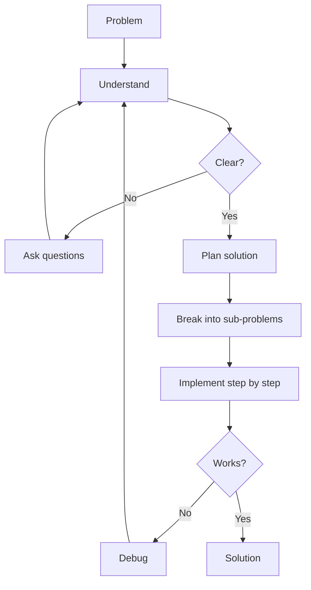

# R03: 問題解決

プログラミングとは、キーボードでの問題解決です。コードを書く前に、問題を理解し、解決戦略を見つけ、段階的に実装する。いきなりコードに飛び込むのは、設計図なしで家を建てるようなもの。
{: .lesson-intro }

## ステップ1: 理解する

問題を自分の言葉で言い直す。入力、期待される出力、制約を特定する。何を求められているか確信が持てるまで質問する。

## ステップ2: 計画する

問題を小さなサブ問題に分解する。擬似コードを書くか、図を描く。プロの現場では「コードより先に仕様」を意味する: UIにはワイヤーフレーム、データベースにはスキーマ、APIには契約。事前の設計が後の数ヶ月の手戻りを救う。

```
// 問題: テキスト中で最も頻出する単語を見つける
// 1. テキストを単語に分割する
// 2. 各単語の出現回数を数える
// 3. 最多の単語を返す
```

## ステップ3: 実装する

各サブ問題のコードを一つずつ書く。次に進む前に各部分をテストする。詰まったらステップ1に戻る。おそらく問題を完全に理解していない。



<div class="takeaways">
<h2>まとめ</h2>
<ul>
<li>コードを書く前に問題を完全に理解する</li>
<li>実装の前に仕様とワイヤーフレームを書く</li>
<li>複雑な問題を小さく管理しやすいサブ問題に分解する</li>
<li>詰まったら理解に立ち戻る。バグはしばしば自分の仮定の中にある</li>
</ul>
</div>
