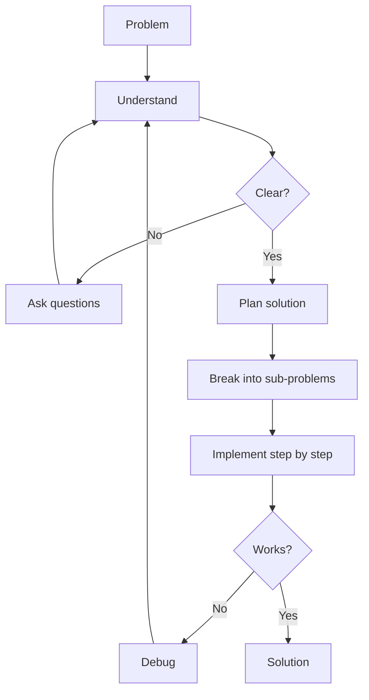

# R03: Problem Solving

Programming is problem solving with a keyboard. Before writing any code, you must understand the problem, find a solution strategy, and then implement it step by step. Jumping straight to code is like building a house without a blueprint - you will waste time and materials. {.lesson-intro}

## Step 1: Understand

Restate the problem in your own words. Identify the inputs, the expected outputs, and the constraints. Ask questions until you are certain you understand what is being asked.

## Step 2: Plan (Specs Before Code)

Break the problem into smaller sub-problems. Write pseudocode or draw a diagram. In professional settings, this means writing specifications before touching the code. A wireframe for the UI, a schema for the database, an API contract. Designing the system properly upfront saves months of rework later.

```
// Problem: Find the most frequent word in a text
// Plan:
// 1. Split text into words
// 2. Count occurrences of each word
// 3. Find the word with highest count
// 4. Return that word
```

## Step 3: Implement

Write code for each sub-problem one at a time. Test each piece before moving on. When stuck, go back to Step 1 - you probably do not fully understand the problem yet.

## Architecture Over Coding

Good HTML structure is the foundation of a maintainable application. The same is true for any system. Choosing the right architecture before writing code prevents major restructuring later. Always wireframe, always plan, always validate your design with others before building.



<div class="takeaways">
<h2>Key Takeaways</h2>
<ul>
<li>Understand the problem completely before writing any code</li>
<li>Write specs and wireframes before implementation. Architecture over coding</li>
<li>Break complex problems into smaller, manageable sub-problems</li>
<li>When stuck, revisit your understanding - the bug is often in your assumptions</li>
</ul>
</div>
