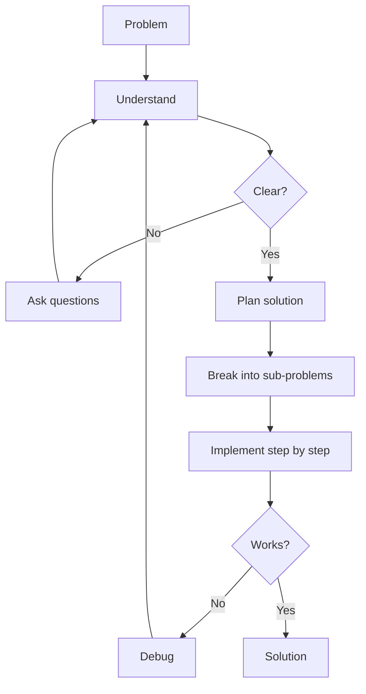

# R03: Problem Solving

Programming is problem solving with a keyboard. Before writing code, understand the problem, find a solution strategy, and implement it step by step. Jumping straight to code is building a house without a blueprint.
{: .lesson-intro }

## Step 1: Understand

Restate the problem in your own words. Identify inputs, expected outputs, and constraints. Ask questions until you are certain you know what is being asked.

## Step 2: Plan

Break the problem into smaller sub-problems. Write pseudocode or draw a diagram. In professional settings this means specs before code: wireframes for UI, schemas for databases, API contracts. Designing upfront saves months of rework.

```
// Problem: Find the most frequent word in a text
// 1. Split text into words
// 2. Count occurrences of each
// 3. Return the word with highest count
```

## Step 3: Implement

Write code for each sub-problem one at a time. Test each piece before moving on. When stuck, go back to Step 1 - you probably do not fully understand the problem yet.



<div class="takeaways">
<h2>Key Takeaways</h2>
<ul>
<li>Understand the problem completely before writing any code</li>
<li>Write specs and wireframes before implementation</li>
<li>Break complex problems into smaller, manageable sub-problems</li>
<li>When stuck, revisit your understanding - the bug is often in your assumptions</li>
</ul>
</div>
