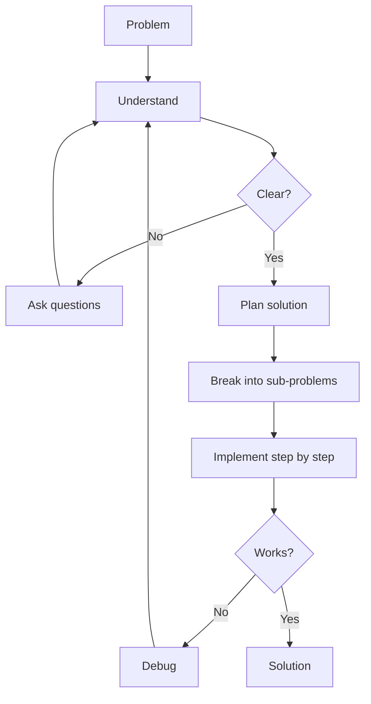

# R03: Resolução de Problemas

Programação é resolução de problemas com um teclado. Antes de escrever qualquer código, você precisa entender o problema, encontrar uma estratégia de solução e então implementá-la passo a passo. Pular direto para o código é como construir uma casa sem planta - você vai desperdiçar tempo e material.
{: .lesson-intro }

## Passo 1: Entender

Reformule o problema com suas próprias palavras. Identifique as entradas, as saídas esperadas e as restrições. Faça perguntas até ter certeza de que entendeu o que está sendo pedido.

## Passo 2: Planejar (Specs Antes do Código)

Quebre o problema em subproblemas menores. Escreva pseudocódigo ou desenhe um diagrama. No ambiente profissional, isso significa escrever especificações antes de tocar no código. Um wireframe para a UI, um schema para o banco, um contrato de API. Projetar o sistema direito no começo poupa meses de retrabalho depois.

```
// Problem: Find the most frequent word in a text
// Plan:
// 1. Split text into words
// 2. Count occurrences of each word
// 3. Find the word with highest count
// 4. Return that word
```

## Passo 3: Implementar

Escreva código para um subproblema de cada vez. Teste cada pedaço antes de seguir. Quando travar, volte ao Passo 1 - provavelmente você ainda não entendeu o problema completamente.

## Arquitetura Acima de Código

Uma boa estrutura HTML é a base de uma aplicação que se mantém saudável. O mesmo vale para qualquer sistema. Escolher a arquitetura certa antes de escrever código previne grandes reestruturações depois. Sempre faça wireframe, sempre planeje, sempre valide seu design com outras pessoas antes de construir.



<div class="takeaways">
<h2>Pontos-chave</h2>
<ul>
<li>Entenda o problema completamente antes de escrever qualquer código</li>
<li>Escreva specs e wireframes antes da implementação. Arquitetura acima de código</li>
<li>Quebre problemas complexos em subproblemas menores e gerenciáveis</li>
<li>Quando travar, revisite seu entendimento - o bug geralmente está nas suas premissas</li>
</ul>
</div>
