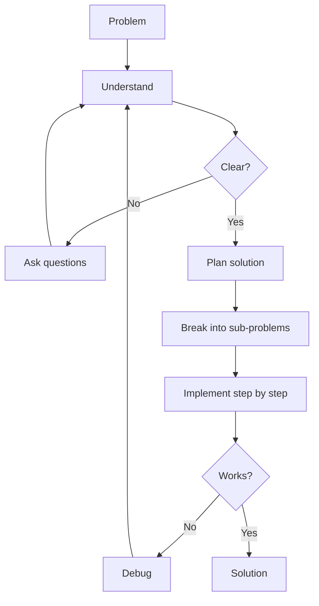

# R03: Resolução de Problemas

Programar é resolver problemas com um teclado. Antes de escrever código, entenda o problema, ache uma estratégia e implemente em etapas. Pular direto para o código é construir uma casa sem planta.
{: .lesson-intro }

## Etapa 1: Entender

Reformule o problema com suas palavras. Identifique entradas, saídas esperadas e restrições. Pergunte até ter certeza do que está sendo pedido.

## Etapa 2: Planejar

Quebre o problema em subproblemas menores. Escreva pseudocódigo ou desenhe um diagrama. Em ambiente profissional, isso significa especificação antes de código: wireframes para UI, schemas para banco, contratos de API. Projetar antes evita meses de retrabalho.

```
// Problema: Achar a palavra mais frequente num texto
// 1. Quebre o texto em palavras
// 2. Conte ocorrências de cada uma
// 3. Retorne a palavra com maior contagem
```

## Etapa 3: Implementar

Escreva o código de cada subproblema um por vez. Teste cada peça antes de ir adiante. Quando empacar, volte à Etapa 1 - provavelmente você não entendeu o problema por inteiro.



<div class="takeaways">
<h2>Pontos-chave</h2>
<ul>
<li>Entenda o problema por completo antes de escrever código</li>
<li>Escreva specs e wireframes antes da implementação</li>
<li>Quebre problemas complexos em subproblemas menores e gerenciáveis</li>
<li>Quando empacar, revisite seu entendimento - o bug costuma estar nas suas suposições</li>
</ul>
</div>
