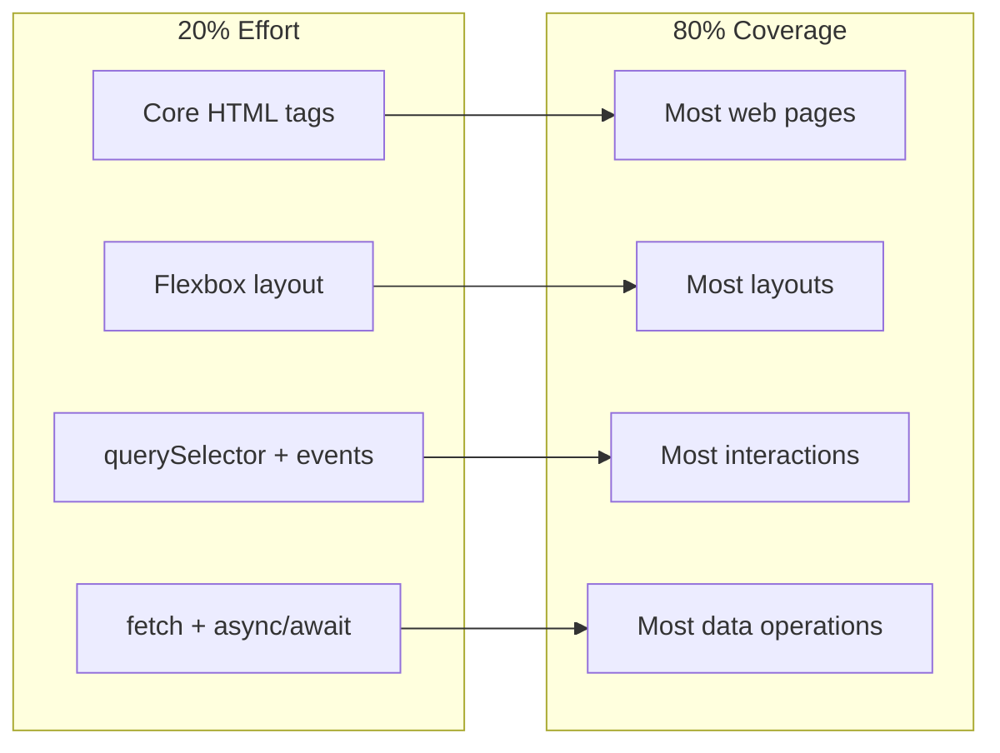

# R04: 20/80の法則

パレートの法則は、結果の約80%が努力の20%から生まれると述べています。プログラミングでは、機能の20%が価値の80%を提供します。その重要な20%を見極めて集中できるかが、生産的な開発者と忙しいだけの開発者の違いです。 {.lesson-intro}

## 学習への20/80適用

全てのCSSプロパティをマスターしたり、全てのJavaScriptメソッドを知る必要はありません。実際のコードの80%に登場するコアコンセプトに集中しましょう。グリッドアニメーションの前にflexboxをマスター。Shadow DOMの前にquerySelectorをマスター。

## 構築への20/80適用

プロダクトを作る時は、まずコア機能をリリースします。メッセージが送れないカスタムテーマ付きチャットアプリより、メッセージが送れるシンプルなチャットアプリの方が価値があります。最小限の実用機能を特定して提供しましょう。

## 重要な20%の特定

自問しましょう: 「20%しか残せないなら、どの部分が最も価値を提供するか?」これを学習、機能構築、デバッグに適用します。

<h2>まとめ</h2>
<ul>
<li>結果の80%は努力の20%から生まれます。高インパクトな作業に集中しましょう</li>
<li>高度なトピックを追う前に基礎をマスターしましょう</li>
<li>コア機能を先にリリースし、改良は後からしましょう</li>
<li>定期的に問いかけましょう: 「これは重要な20%か、任意の80%か?」</li>
</ul>

