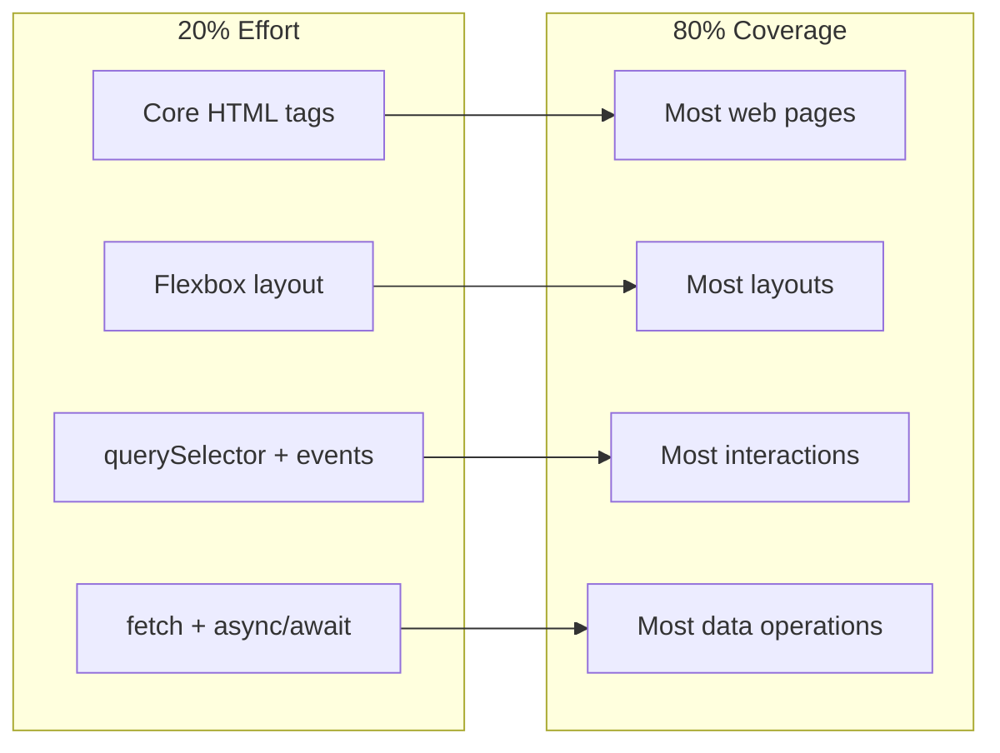

# R04: The 20/80 Rule

The Pareto Principle says that roughly 80% of results come from 20% of efforts. In programming, 20% of the features deliver 80% of the value. Learning to identify and focus on that critical 20% is the difference between productive developers and busy developers.
{: .lesson-intro }

## Applying 20/80 to Learning

You do not need to master every CSS property or know every JavaScript method. Focus on the core concepts that appear in 80% of real-world code. Master flexbox before learning grid animations. Master querySelector before learning about the Shadow DOM.

## Applying 20/80 to Building

When building a product, ship the core feature first. A chat app that sends messages is more valuable than a chat app with custom themes but no messages. Identify the minimum viable functionality and deliver that.

## Identifying the Critical 20%

Ask yourself: "If I could only keep 20% of this, which parts would deliver the most value?" Apply this to studying, building features, and debugging.

<h2>Key Takeaways</h2>
<ul>
<li>80% of results come from 20% of efforts - focus on high-impact work</li>
<li>Master the fundamentals before chasing advanced topics</li>
<li>Ship core features first, polish later</li>
<li>Regularly ask: "Is this in the critical 20% or the optional 80%?"</li>
</ul>

