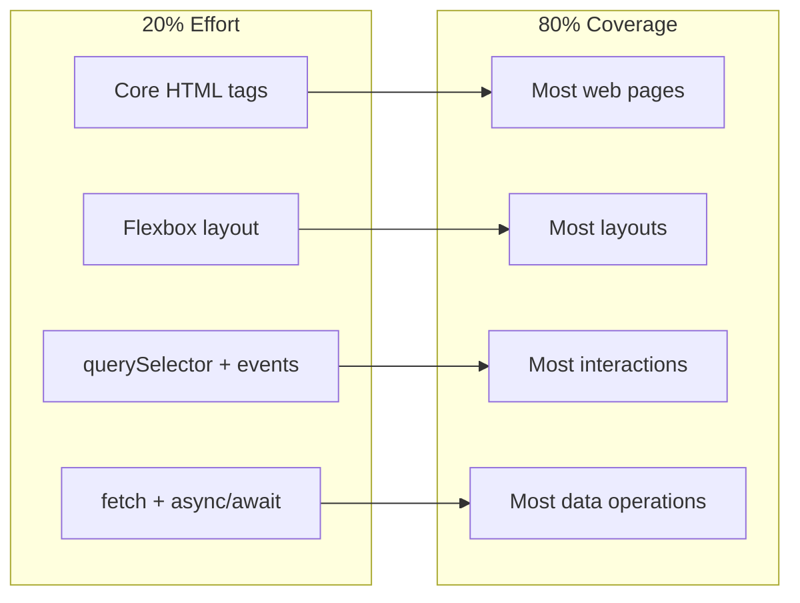

# R04: A Regra 20/80

O Princípio de Pareto diz que cerca de 80% dos resultados vêm de 20% dos esforços. Em programação, 20% das features entregam 80% do valor. Aprender a identificar e focar nesses 20% críticos é a diferença entre desenvolvedores produtivos e desenvolvedores ocupados.
{: .lesson-intro }

## Aplicando 20/80 ao Aprendizado

Você não precisa dominar cada propriedade de CSS nem conhecer cada método de JavaScript. Foque nos conceitos centrais que aparecem em 80% do código do mundo real. Domine flexbox antes de aprender animações com grid. Domine querySelector antes de aprender sobre Shadow DOM.

## Aplicando 20/80 à Construção

Quando estiver construindo um produto, entregue a feature central primeiro. Um app de chat que envia mensagens vale mais que um app de chat com temas personalizados mas sem mensagens. Identifique a funcionalidade mínima viável e entregue-a.

## Identificando os 20% Críticos

Pergunte-se: "Se eu só pudesse manter 20% disso, quais partes entregariam mais valor?" Aplique isso aos estudos, às features e ao debug.

<h2>Pontos-chave</h2>
<ul>
<li>80% dos resultados vêm de 20% dos esforços - foque no trabalho de alto impacto</li>
<li>Domine os fundamentos antes de correr atrás de tópicos avançados</li>
<li>Entregue features centrais primeiro, poli depois</li>
<li>Pergunte sempre: "Isso está nos 20% críticos ou nos 80% opcionais?"</li>
</ul>

