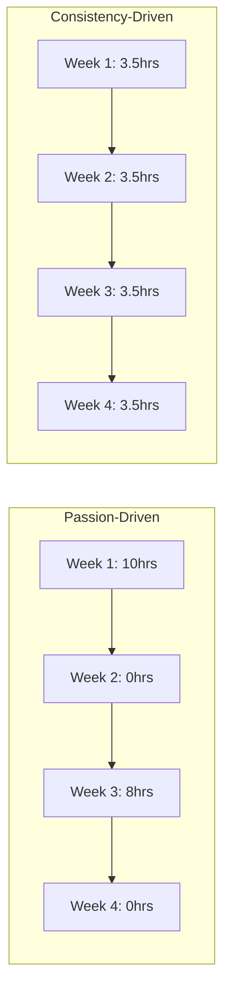

# R05: 継続は情熱に勝る

モチベーションは始めるきっかけですが、継続が目的地に連れて行きます。毎日30分コードを書く開発者は、月に一度10時間マラソンする人を追い越します。スキルは反復と毎日の練習で構築され、時折のエネルギー爆発では得られません。 {.lesson-intro}

## 複利効果

小さな日々の改善は時間とともに指数的に積み上がります。1日1%の改善で1年後には37倍になります。しかし1%の低下はほぼゼロに近づきます。日々の習慣の数学は強力です。

## 練習の習慣を作る

小さく始めましょう。4時間ではなく1日20分にコミットします。コーディングを既存の習慣に結びつけます(朝のコーヒーの後、夕食の前)。連続記録を追跡しましょう。途切れさせたくないという気持ちがモチベーションになります。

## モチベーションが消えた時

情熱は変動します。システムは持続します。モチベーションに頼らないでください。代わりにシステムを構築します: 同じ時間、同じ場所、同じ最低限のコミットメント。調子の悪い日でも、とりあえず座って1行のコードを書きましょう。それで十分です。

<h2>まとめ</h2>
<ul>
<li>毎日の練習は時折のマラソンセッションに勝ります</li>
<li>小さな一貫した改善が時間とともに大きな成果に複利します</li>
<li>目標ではなくシステムを作りましょう。同じ時間、同じ場所、最低限のコミットメント</li>
<li>調子の悪い日でもとりあえず座りましょう。1行のコードでもカウントされます</li>
</ul>

