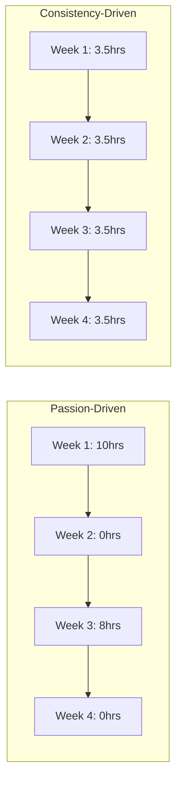

# R05: Consistency Beats Passion

Motivation gets you started, but consistency gets you there. A developer who codes 30 minutes every day will outpace one who does 10-hour marathons once a month. Skill builds through repetition and daily practice, not through occasional bursts of energy. {.lesson-intro}

## The Compound Effect

Small daily improvements add up exponentially over time. Just 1% improvement per day means you are 37 times better after one year. But 1% decline means you are nearly at zero. The math of daily habits is powerful.

## Building a Practice Habit

Start small. Commit to 20 minutes a day, not 4 hours. Attach coding to an existing habit (after morning coffee, before dinner). Track your streak - the fear of breaking it becomes motivation itself.

## When Motivation Fades

Passion fluctuates. Systems persist. Do not rely on feeling motivated. Instead, build a system: same time, same place, same minimum commitment. On bad days, just show up and write one line of code. That counts.

<h2>Key Takeaways</h2>
<ul>
<li>Daily practice beats occasional marathon sessions</li>
<li>Small consistent improvements compound into massive results over time</li>
<li>Build systems, not goals - same time, same place, minimum commitment</li>
<li>On bad days, just show up - one line of code still counts</li>
</ul>

