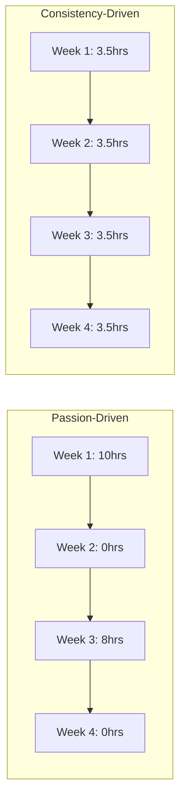

# R05: Consistência Vence a Paixão

Motivação te faz começar, consistência te leva até o fim. Um desenvolvedor que programa 30 minutos por dia vai deixar para trás quem faz maratonas de 10 horas uma vez por mês. Habilidade se constrói por repetição e prática diária, não por rajadas ocasionais de energia.
{: .lesson-intro }

## O Efeito Composto

Pequenas melhorias diárias se somam exponencialmente. Apenas 1% de melhora por dia significa que você está 37 vezes melhor depois de um ano. Mas 1% de piora te leva quase a zero. A matemática dos hábitos diários é poderosa.

## Construindo um Hábito de Prática

Comece pequeno. Comprometa-se com 20 minutos por dia, não 4 horas. Atrele a programação a um hábito existente (depois do café da manhã, antes do jantar). Conte sua sequência - o medo de quebrá-la vira motivação.

## Quando a Motivação Some

A paixão oscila. Sistemas permanecem. Não confie em se sentir motivado. Em vez disso, construa um sistema: mesmo horário, mesmo lugar, mesmo compromisso mínimo. Em dias ruins, só apareça e escreva uma linha de código. Isso conta.

<h2>Pontos-chave</h2>
<ul>
<li>Prática diária vence sessões maratonas ocasionais</li>
<li>Pequenas melhorias consistentes se acumulam em resultados enormes ao longo do tempo</li>
<li>Construa sistemas, não metas - mesmo horário, mesmo lugar, compromisso mínimo</li>
<li>Em dias ruins, só apareça - uma linha de código ainda conta</li>
</ul>

