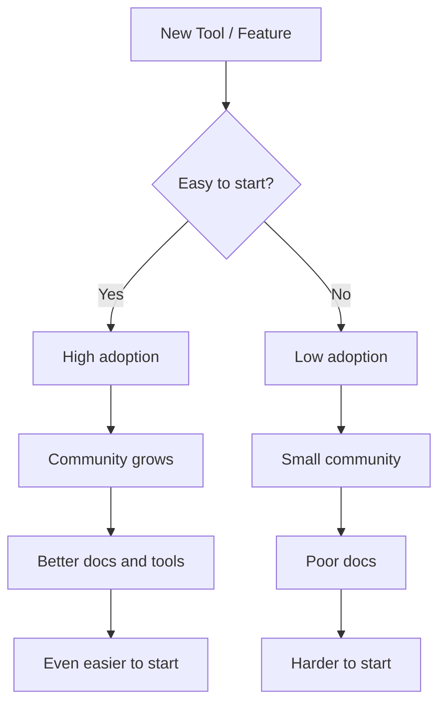

# R06: 最も抵抗の少ない道

人もシステムも自然と最も簡単な道を選びます。水は下に流れます。ユーザーは最もシンプルな選択肢を選びます。コードは最も良いドキュメントのあるフレームワークで書かれます。この原則を理解すれば、人が実際に使うシステムを設計し、摩擦を減らすツールを選べます。 {.lesson-intro}

## ユーザー体験において

サインアップに10項目必要なら、ユーザーは離脱します。ワンクリック(Googleでサインイン)なら留まります。余分なステップは全てユーザーが諦める機会です。摩擦を減らして採用率を上げましょう。

## 開発において

開発者は始めやすいツールを採用します。Node.jsはJavaScriptが既に知られていたから勝ちました。Reactはコンポーネントが理にかなっていたから勝ちました。参入障壁が最も低い技術が最も多く採用されます。

## 学習において

学習を自分にとって簡単にしましょう。開発環境を常に準備しておきます。数秒で開けるプロジェクトを持ちましょう。あなたと練習の間の障害を取り除きます。セットアップに30分かかるなら、疲れた夜には練習しないでしょう。

<h2>まとめ</h2>
<ul>
<li>採用は最も抵抗の少ない道に従います。あらゆる場所で摩擦を減らしましょう</li>
<li>プロセスの余分なステップは全てユーザーが離脱する機会です</li>
<li>参入障壁が低いツールとフレームワークを選びましょう</li>
<li>練習を簡単にしましょう。あなたとコードの間の障害を取り除きます</li>
</ul>

