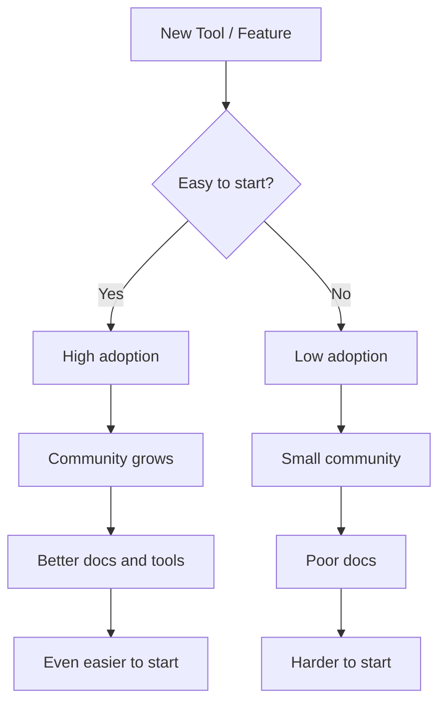

# R06: Path of Least Resistance

People and systems naturally follow the easiest path. Water flows downhill. Users choose the simplest option. Code gets written in the framework with the best docs. Understanding this principle helps you design systems people will actually use and choose tools that reduce friction. {.lesson-intro}

## In User Experience

If signing up requires 10 fields, users leave. If it requires one click (sign in with Google), they stay. Every extra step is a chance for the user to give up. Reduce friction to increase adoption.

## In Development

Developers adopt tools that are easy to start with. Node.js won because JavaScript was already known. React won because components made sense. The technology with the lowest barrier to entry gets the most adoption.

## In Learning

Make learning easy for yourself. Keep your development environment ready. Have a project you can open in seconds. Remove obstacles between you and practice. If setup takes 30 minutes, you will not practice on a tired evening.

<h2>Key Takeaways</h2>
<ul>
<li>Adoption follows the path of least resistance - reduce friction everywhere</li>
<li>Every extra step in a process is a chance for users to drop off</li>
<li>Choose tools and frameworks with low barriers to entry</li>
<li>Make it easy to practice - remove obstacles between you and your code</li>
</ul>

