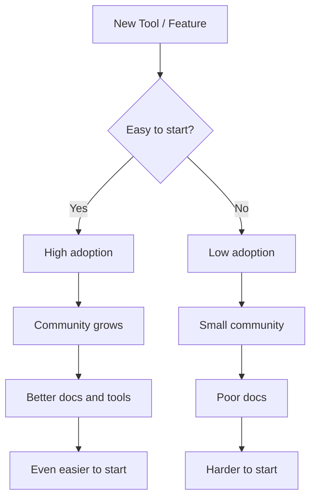

# R06: O Caminho de Menor Resistência

Pessoas e sistemas naturalmente seguem o caminho mais fácil. A água corre ladeira abaixo. Usuários escolhem a opção mais simples. Código é escrito no framework com a melhor documentação. Entender esse princípio ajuda a projetar sistemas que as pessoas vão realmente usar e a escolher ferramentas que reduzem atrito.
{: .lesson-intro }

## Em Experiência do Usuário

Se o cadastro pede 10 campos, os usuários desistem. Se pede um clique (entrar com o Google), eles ficam. Cada passo extra é uma chance do usuário desistir. Reduza atrito para aumentar adoção.

## Em Desenvolvimento

Desenvolvedores adotam ferramentas que são fáceis de começar. Node.js venceu porque JavaScript já era conhecido. React venceu porque componentes fazem sentido. A tecnologia com a menor barreira de entrada consegue a maior adoção.

## No Aprendizado

Torne o aprendizado fácil para você. Deixe seu ambiente de desenvolvimento pronto. Tenha um projeto que você pode abrir em segundos. Remova obstáculos entre você e a prática. Se a preparação leva 30 minutos, você não vai praticar numa noite cansada.

<h2>Pontos-chave</h2>
<ul>
<li>Adoção segue o caminho de menor resistência - reduza atrito em todo lugar</li>
<li>Cada passo extra num processo é uma chance dos usuários abandonarem</li>
<li>Escolha ferramentas e frameworks com barreiras de entrada baixas</li>
<li>Facilite a prática - remova obstáculos entre você e seu código</li>
</ul>

