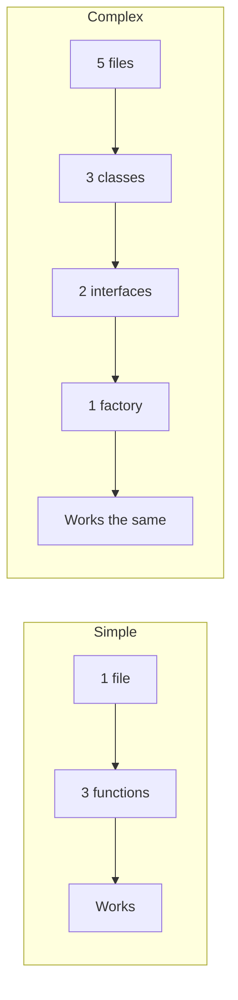

# R07: とにかくシンプルに

複雑さは信頼性の敵です。書いた全てのコード行は壊れ得る行です。最良のコードは書く必要がなかったコードです。シンプルな解決策は理解、デバッグ、テスト、保守が容易です。迷ったらシンプルなアプローチを選びましょう。 {.lesson-intro}

## 不必要な複雑さの兆候

ファイル構造を説明するのに図が必要なら、複雑すぎます。新しい開発者が10分でコードを理解できないなら、複雑すぎます。機能より抽象化レイヤーの方が多いなら、複雑すぎます。

## 実践におけるシンプルさ

```
// Complex: over-engineered
class UserServiceFactory {
    createService(type) {
        return new UserServiceAdapter(new UserRepository(type));
    }
}

// Simple: just a function
function getUser(id) {
    return db.users.find(u => u.id === id);
}
```

## 複雑さを加えるタイミング

シンプルな解決策が実際の要件で失敗した時だけ複雑さを加えます。想像上の将来の要件ではありません。今日の問題を今日解決し、必要なら明日リファクタリングしましょう。



<div class="takeaways">
<h2>まとめ</h2>
<ul>
<li>最良のコードは書く必要がなかったコードです</li>
<li>シンプルな解決策は理解、デバッグ、保守が容易です</li>
<li>実際の要件でシンプルな解決策が失敗した時だけ複雑さを加えましょう</li>
<li>新しい開発者が10分で理解できないなら、シンプルにしましょう</li>
</ul>
</div>
