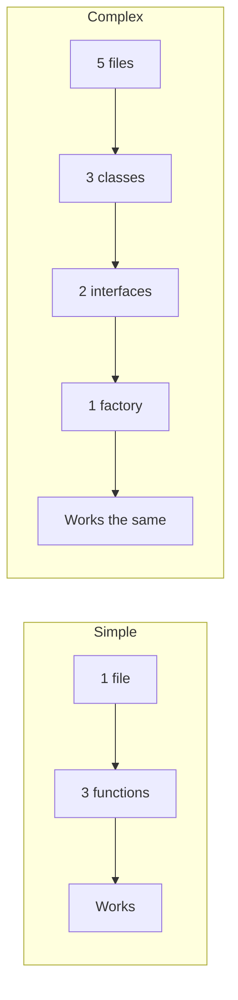

# R07: Keep Things Super Simple

Complexity is the enemy of reliability. Every line of code you write is a line that can break. The best code is code you did not have to write. Simple solutions are easier to understand, debug, test, and maintain. When in doubt, choose the simpler approach.
{: .lesson-intro }

## Signs of Unnecessary Complexity

If you need a diagram to explain your file structure, it is too complex. If a new developer cannot understand your code in 10 minutes, it is too complex. If you have more abstraction layers than features, it is too complex.

## Simplicity in Practice

```
// Complex: over-engineered
class UserServiceFactory {
    createService(type) {
        return new UserServiceAdapter(new UserRepository(type));
    }
}

// Simple: just a function
function getUser(id) {
    return db.users.find(u => u.id === id);
}
```

## When to Add Complexity

Add complexity only when the simple solution fails under real requirements. Not imagined future requirements. Solve today's problem today. Refactor tomorrow if needed.



<div class="takeaways">
<h2>Key Takeaways</h2>
<ul>
<li>The best code is code you did not have to write</li>
<li>Simple solutions are easier to understand, debug, and maintain</li>
<li>Add complexity only when simple solutions fail under real requirements</li>
<li>If a new developer cannot understand it in 10 minutes, simplify</li>
</ul>
</div>
