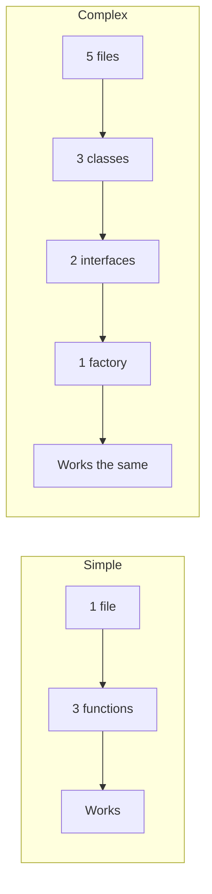

# R07: Mantenha Tudo Super Simples

Complexidade é inimiga da confiabilidade. Cada linha de código que você escreve é uma linha que pode quebrar. O melhor código é o código que você não precisou escrever. Soluções simples são mais fáceis de entender, depurar, testar e manter. Na dúvida, escolha a abordagem mais simples.
{: .lesson-intro }

## Sinais de Complexidade Desnecessária

Se você precisa de um diagrama para explicar sua estrutura de arquivos, está complexo demais. Se um desenvolvedor novo não entende seu código em 10 minutos, está complexo demais. Se você tem mais camadas de abstração do que features, está complexo demais.

## Simplicidade na Prática

```
// Complex: over-engineered
class UserServiceFactory {
    createService(type) {
        return new UserServiceAdapter(new UserRepository(type));
    }
}

// Simple: just a function
function getUser(id) {
    return db.users.find(u => u.id === id);
}
```

## Quando Adicionar Complexidade

Adicione complexidade só quando a solução simples falhar diante de requisitos reais. Não requisitos imaginários do futuro. Resolva o problema de hoje hoje. Refatore amanhã se precisar.



<div class="takeaways">
<h2>Pontos-chave</h2>
<ul>
<li>O melhor código é o código que você não precisou escrever</li>
<li>Soluções simples são mais fáceis de entender, depurar e manter</li>
<li>Adicione complexidade só quando soluções simples falham diante de requisitos reais</li>
<li>Se um desenvolvedor novo não entende em 10 minutos, simplifique</li>
</ul>
</div>
