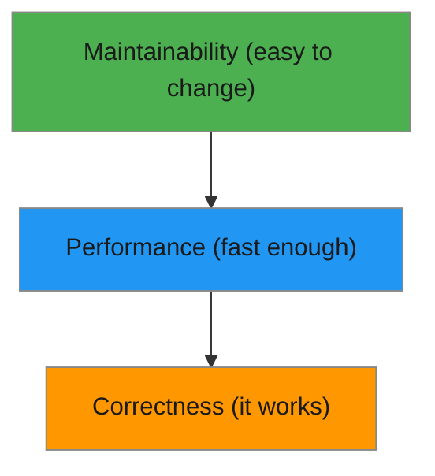

# R08: コード品質

良いコードには3つのレベルがあります: 正しく動く、十分に速い、変更しやすい。多くの初心者はレベル1で止まります。プロフェッショナルは3つ全てを目指します。ピラミッドと考えてください。正確性が土台、パフォーマンスが中間、保守性が頂上です。 {.lesson-intro}

## レベル1: 動く

コードが全ての期待される入力に対して正しい出力を生成します。エッジケースとエラーを適切に処理します。これは最低限の要件です。動かないコードはコードではありません。

## レベル2: 速い

コードがそのユースケースに十分なパフォーマンスを発揮します。10アイテムに10秒かかる関数は個人のTodoアプリには問題ありませんが、検索エンジンには許容できません。コンテキストが「十分に速い」の意味を決定します。

## レベル3: 変更しやすい

これが最も難しいレベルです。コードは書かれるよりも遥かに多く読まれます。明確な名前、小さな関数、一貫したスタイル、良い構造が、他の人(そして将来の自分)が理解し修正できるコードを作ります。

```
// Hard to change
function p(d) { return d.filter(x => x.a > 5).map(x => x.b * 2); }

// Easy to change
function getExpensiveItemPrices(products) {
    const expensive = products.filter(product => product.price > 5);
    return expensive.map(product => product.price * 2);
}
```



<div class="takeaways">
<h2>まとめ</h2>
<ul>
<li>コード品質には3つのレベルがあります: 正しい、十分に速い、変更しやすい</li>
<li>正確性は譲れません。動かないコードには価値がありません</li>
<li>パフォーマンスはコンテキスト次第です。実際のユースケースに最適化しましょう</li>
<li>保守性は最も難しいですが、長寿命のコードにとって最も価値ある品質です</li>
</ul>
</div>
