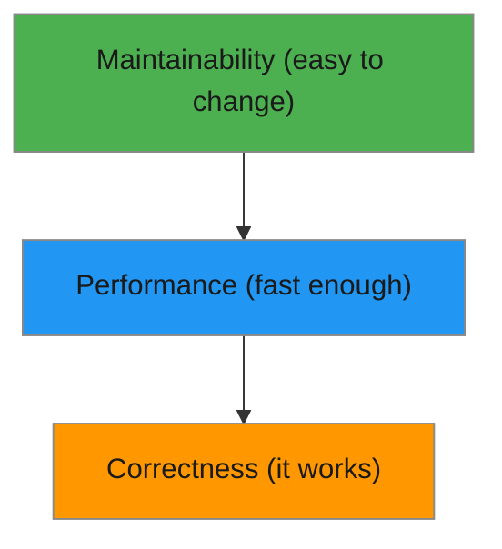

# R08: Code Quality

Good code has three levels: it runs correctly, it runs fast enough, and it is easy to change. Most beginners stop at level one. Professionals aim for all three. Think of it as a pyramid - correctness at the base, performance in the middle, and maintainability at the top. {.lesson-intro}

## Level 1: It Runs

The code produces correct output for all expected inputs. It handles edge cases and errors gracefully. This is the minimum requirement - code that does not work is not code.

## Level 2: It is Fast

The code performs well enough for its use case. A function that takes 10 seconds for 10 items is fine for a personal todo app but unacceptable for a search engine. Context determines what "fast enough" means.

## Level 3: It is Easy to Change

This is the hardest level. Code is read far more often than it is written. Clear names, small functions, consistent style, and good structure make code that others (and future you) can understand and modify.

```
// Hard to change
function p(d) { return d.filter(x => x.a > 5).map(x => x.b * 2); }

// Easy to change
function getExpensiveItemPrices(products) {
    const expensive = products.filter(product => product.price > 5);
    return expensive.map(product => product.price * 2);
}
```



<div class="takeaways">
<h2>Key Takeaways</h2>
<ul>
<li>Code quality has three levels: correct, fast enough, easy to change</li>
<li>Correctness is non-negotiable - code that does not work has no value</li>
<li>Performance depends on context - optimize for your actual use case</li>
<li>Maintainability is the hardest but most valuable quality for long-lived code</li>
</ul>
</div>
