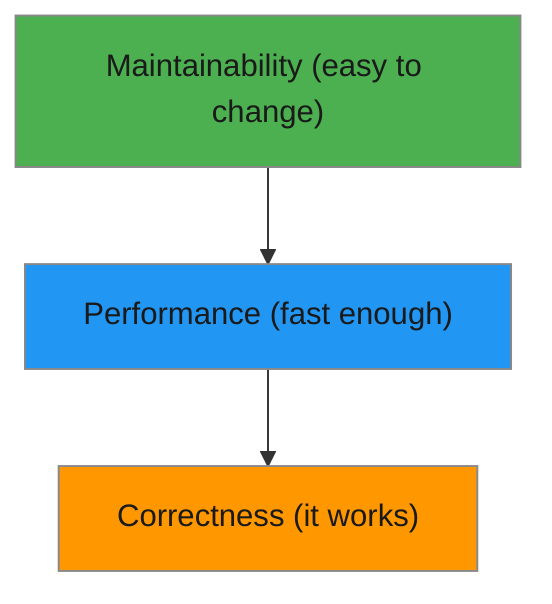

# R08: Qualidade de Código

Bom código tem três níveis: executa corretamente, executa rápido o suficiente e é fácil de mudar. A maioria dos iniciantes para no nível um. Profissionais miram nos três. Pense como uma pirâmide - correção na base, performance no meio e manutenibilidade no topo.
{: .lesson-intro }

## Nível 1: Funciona

O código produz saída correta para todas as entradas esperadas. Lida com casos de borda e erros com elegância. Esse é o requisito mínimo - código que não funciona não é código.

## Nível 2: É Rápido

O código tem performance boa o suficiente para o seu uso. Uma função que leva 10 segundos para 10 itens é aceitável num app pessoal de tarefas, mas inaceitável num motor de busca. O contexto determina o que "rápido o suficiente" significa.

## Nível 3: É Fácil de Mudar

Esse é o nível mais difícil. Código é lido muito mais vezes do que é escrito. Nomes claros, funções pequenas, estilo consistente e boa estrutura produzem código que outros (e você mesmo no futuro) conseguem entender e modificar.

```
// Hard to change
function p(d) { return d.filter(x => x.a > 5).map(x => x.b * 2); }

// Easy to change
function getExpensiveItemPrices(products) {
    const expensive = products.filter(product => product.price > 5);
    return expensive.map(product => product.price * 2);
}
```



<div class="takeaways">
<h2>Key Takeaways</h2>
<ul>
<li>Qualidade de código tem três níveis: correto, rápido o suficiente, fácil de mudar</li>
<li>Correção não é negociável - código que não funciona não tem valor</li>
<li>Performance depende do contexto - otimize para o seu uso real</li>
<li>Manutenibilidade é a qualidade mais difícil mas mais valiosa em código de vida longa</li>
</ul>
</div>
