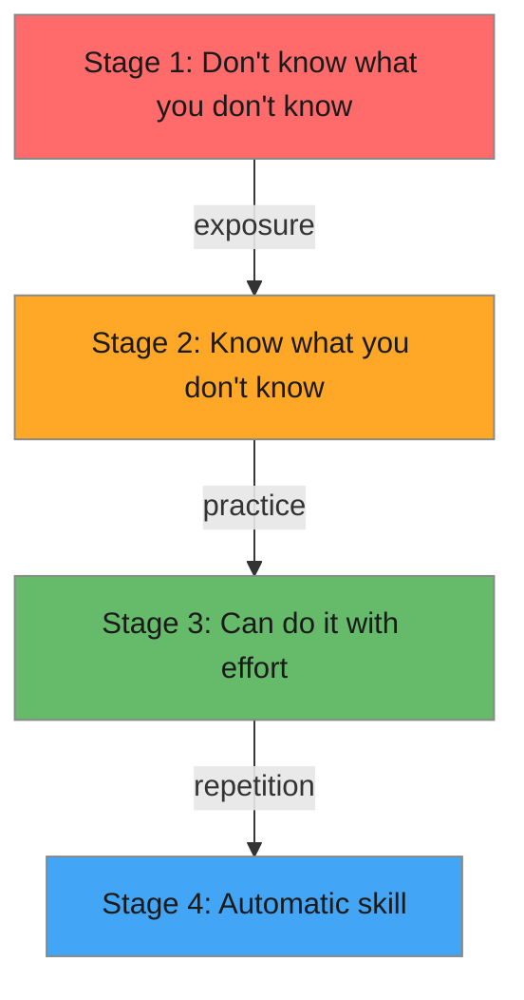

# R09: 学び方

スキルの学習には予測可能な段階があります。最初は知らないことを知らない(無意識の無能)。次に知らないことの多さに気づく(意識的な無能)。次に努力すればできる(意識的な有能)。最後に自動的にできる(無意識の有能)。自分がどこにいるか理解すれば、より効果的に学べます。 {.lesson-intro}

## 4つの段階

**段階1 - 無意識の無能:** HTMLの存在を知りません。見たことのないものは見逃せません。

**段階2 - 意識的な無能:** HTMLの存在は知っていますが上手く書けません。この段階はフラストレーションを感じますが、実際には前進しています。

**段階3 - 意識的な有能:** 各ステップを考えながらHTMLを書けます。動きますが集中が必要です。

**段階4 - 無意識の有能:** 考えずにHTMLを書けます。手が自然に正しいタグを打ちます。

## 学習戦略

チュートリアルではなくプロジェクトを作りましょう。水泳について読んでも泳げるようにはなりません。毎日コードを書きましょう。学んだことを誰かに説明しましょう。教えることは理解を固める最良の方法です。

<h2>まとめ</h2>
<ul>
<li>学習は無意識の無能から無意識の有能まで4段階で進みます</li>
<li>フラストレーションを感じる段階2(知らないことを知る)は実際には進歩の証です</li>
<li>チュートリアルだけでなく実際のプロジェクトを作りましょう</li>
<li>他の人に教えることが自分の理解を深める最も効果的な方法です</li>
</ul>

