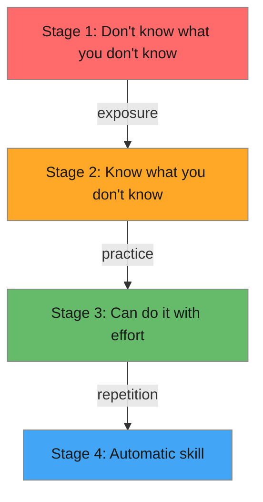

# R09: How to Learn

Learning a skill goes through predictable stages. First you do not know what you do not know (unconscious incompetence). Then you realize how much you do not know (conscious incompetence). Then you can do it with effort (conscious competence). Finally, it becomes automatic (unconscious competence). Understanding where you are helps you learn more effectively. {.lesson-intro}

## The Four Stages

**Stage 1 - Unconscious Incompetence:** You do not know HTML exists. You cannot miss what you have never seen.

**Stage 2 - Conscious Incompetence:** You know HTML exists but cannot write it well. This stage feels frustrating but is actually progress.

**Stage 3 - Conscious Competence:** You can write HTML by thinking through each step. It works but requires concentration.

**Stage 4 - Unconscious Competence:** You write HTML without thinking about it. Your hands just type the right tags.

## Learning Strategies

Build projects, not tutorials. Reading about swimming does not make you a swimmer. Write code every day. Explain what you learned to someone else - teaching is the best way to solidify understanding.

<h2>Key Takeaways</h2>
<ul>
<li>Learning progresses through four stages from unconscious incompetence to unconscious competence</li>
<li>The frustrating Stage 2 (knowing what you do not know) is actually a sign of progress</li>
<li>Build real projects instead of only following tutorials</li>
<li>Teaching others is the most effective way to deepen your own understanding</li>
</ul>

