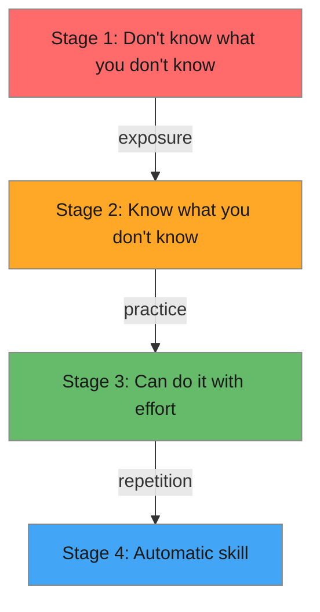

# R09: Como Aprender

Aprender uma habilidade passa por estágios previsíveis. Primeiro você não sabe o que não sabe (incompetência inconsciente). Depois percebe quanta coisa não sabe (incompetência consciente). Então consegue fazer com esforço (competência consciente). Por fim, vira automático (competência inconsciente). Entender onde você está ajuda a aprender com mais eficiência.
{: .lesson-intro }

## Os Quatro Estágios

**Estágio 1 - Incompetência Inconsciente:** Você não sabe que HTML existe. Não pode sentir falta do que nunca viu.

**Estágio 2 - Incompetência Consciente:** Você sabe que HTML existe mas não consegue escrevê-lo bem. Esse estágio é frustrante mas na verdade é progresso.

**Estágio 3 - Competência Consciente:** Você consegue escrever HTML pensando cada passo. Funciona, mas exige concentração.

**Estágio 4 - Competência Inconsciente:** Você escreve HTML sem pensar. Suas mãos simplesmente digitam as tags certas.

## Estratégias de Aprendizado

Construa projetos, não tutoriais. Ler sobre natação não te faz nadador. Escreva código todo dia. Explique o que aprendeu para outra pessoa - ensinar é a melhor forma de consolidar o entendimento.

<h2>Key Takeaways</h2>
<ul>
<li>O aprendizado progride por quatro estágios, da incompetência inconsciente à competência inconsciente</li>
<li>O frustrante Estágio 2 (saber o que você não sabe) é na verdade sinal de progresso</li>
<li>Construa projetos reais em vez de apenas seguir tutoriais</li>
<li>Ensinar outras pessoas é a forma mais eficaz de aprofundar o próprio entendimento</li>
</ul>

