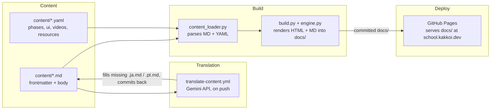

# R10: KakkoiSchool ケーススタディ

ソフトウェアアーキテクチャを学ぶ最良の方法は、実物を読むことです。これは、今あなたが読んでいるサイトそのものの構造で、**school.kakkoi.dev** で稼働中です。4つの部品が4つの仕事をする。その分離があるからこそ、3言語60本のレッスンが編集しやすいまま保たれます。
{: .lesson-intro }

## 4つの部品



コンテンツはディスク上のテキスト。翻訳は欠けている言語の兄弟ファイルを埋める。ビルドはHTMLと並列のMarkdown出力を `docs/` に書き出す。GitHub Pages が `docs/` をそのまま配信する。

## パート1: コンテンツ

すべてのレッスンは3つの兄弟ファイルです: `content/tech/t01.md`、`t01.ja.md`、`t01.pt.md`。英語ファイルが完全なメタデータを持つ。翻訳ファイルは訳された文字列のみ。本文はプレーンなMarkdownで、3つの抜け道: `{: .lesson-intro }` でCSSクラス適用、```` ```mermaid ```` のフェンスはインタラクティブ図に、生の `<div class="takeaways">` はそのまま通過。

レッスン本文に属さない構造化データはYAMLへ。`phases.yaml` に11のフェーズ、`ui.yaml` にナビ/ヒーロー/ボタンの文言、`videos.yaml` と `resources.yaml` にギャラリーとリソース。各レコードは `_en`、`_ja`、`_pt` を並べて持つ。

現状: 技術39本、理論21本、3言語、すべてテキスト。

## パート2: 翻訳

`translate-content.yml` が `content/` を触るpushを監視します。ルールは「存在するならスキップ」: 兄弟ファイルが存在し空でなければ、永久に放置される。この一つの性質から4つの挙動がタダで生まれる:

- 最初の英語pushは両方の翻訳を作る
- 手書き翻訳は空でない限り生き残る
- 古い機械翻訳を更新するにはファイルを削除するだけ。次のpushでその一つが再生成される
- 4つ目の言語追加は `TARGETS` に1行、ビルドの言語リストに1行

「人間が書いた、触るな」フラグはなし。ファイルの存在が信号。状態はディスク上、誰にでも見える。

## パート3: ビルド

`content_loader.py` はfrontmatterとMarkdownをパースし、```` ```mermaid ```` のフェンスを `<div class="mermaid">` に変え、外部リンクに `target="_blank" rel="noopener"` を付けます。`build.py` は**ページごとに2ファイル**を書き出す: 描画済みHTMLと並列のMarkdown。レッスンMarkdownはソースのそのままコピー。インデックス/一覧Markdownは、HTMLテンプレートと同じデータから生成。

```
docs/
├── index.html + index.md
├── tech-lessons.html + tech-lessons.md
├── theory-lessons.html + theory-lessons.md
├── videos.html + videos.md
├── resources.html + resources.md
├── lessons/t*.html + t*.md, r*.html + r*.md
├── ja/ (同じ構造)
└── pt/ (同じ構造)
```

二重出力はR21の技術的エントロピー防衛の実践。HTMLのチェーンが腐っても、すべてのレッスンはMarkdownファイルとして読める。HTMLは磨き、Markdownが本体。

タイトル欠落や本文空はEN フォールバック。初日のポルトガル語が翻訳ゼロで動いたのもこれ。

## パート4: デプロイ

GitHub Pages は `master` の `docs/` をそのまま配信。`make build`、コミット、push。1つの `CNAME` ファイルがドメインを **school.kakkoi.dev** に向ける。デプロイワークフローなし。

ビルド済み `docs/` をコミットするのは意図的なトレードオフ。push前にローカルビルドが必要になる代わりに、各コミットがソース+成果物の自己完結スナップショットになる。差分が見え、1操作で巻き戻せる。誰かがリビルドを忘れても、Pagesは最後のコミット状態を配信し続ける。

## なぜこの形か

- **コンテンツはコードではない。**レッスンを書くのは文書を書く感覚であるべき。
- **ビルドはソースの関数。**`content/` ツリーに対して正しい `docs/` はちょうど一つ。ローカル、決定的、1コマンド。
- **機械は隙間を埋め、人間は上書きする。**パイプラインは人間の仕事を絶対に上書きしない。
- **各部品は差し替え可能。**Markdownライブラリ、テンプレートエンジン、翻訳API、デプロイ先は4つの独立した選択。
- **プレーンテキストはアプリより長生き。**すべてのページがMarkdownの双子を出荷する。描画を捨ててもディスク上には読めるコースが残る。

4つのソースファイル([リポジトリ](https://github.com/KakkoiDev/izumo-io))- `content_loader.py`、`build.py`、`translate_content.py`、`translate-content.yml` - はどれも一息で読める短さ。それが設計目標でした。

<div class="takeaways">
<h2>まとめ</h2>
<ul>
<li>4つの部品: Markdown+YAMLのコンテンツ、隙間を埋める翻訳ワークフロー、ローカルビルド、GitHub Pages</li>
<li>翻訳は冪等。ファイルの存在が状態、人間が常に勝つ</li>
<li>すべてのページがHTMLと並列Markdownを出荷。HTMLは磨き、Markdownはエントロピー(R21)を生き延びる</li>
<li>docs/ はコミット対象: 各コミットが自己完結スナップショット、デプロイ状態を追う必要なし</li>
<li>1つのCNAMEファイルでschool.kakkoi.devに配信</li>
</ul>
</div>
