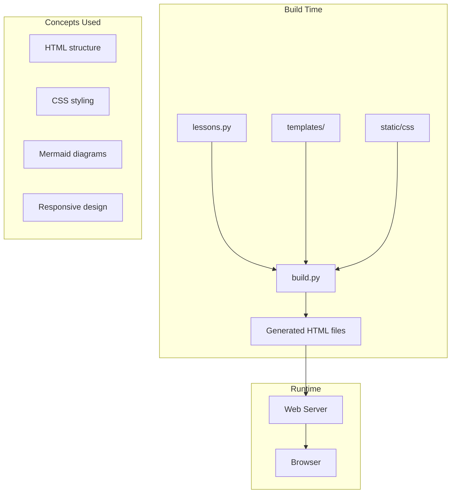

# R10: KakkoiSchoolケーススタディ

Web開発を理解する最良の方法は実際のプロジェクトを分析することです。KakkoiSchool、つまりあなたが受講しているこのコース自体がフルスタックWebアプリケーションです。学んだ全てのコンセプトがどう適用されているか見てみましょう: 構造のHTML、デザインのCSS、対話性のJavaScript、配信のサーバー、全てを結ぶビルドシステム。 {.lesson-intro}

## コースアーキテクチャ

コースのWebサイトはPythonビルドシステムで構築されており、テンプレートとレッスンコンテンツから静的HTMLページを生成します。このアプローチは静的ファイルのシンプルさとテンプレートエンジンの力を組み合わせています。

## レッスンの配信方法

レッスンコンテンツはPythonデータ構造として格納されています(まさに今読んでいるこのファイルです)。ビルドスクリプトが各レッスンを処理し、ナビゲーションとスタイリングを含むテンプレートで包み、静的HTMLファイルを出力します。実行時にサーバーは不要で、どのWebホストでもファイルを配信するだけです。

## 設計上の決定

動的サーバーではなく静的サイト生成を選んだ理由: より簡単なホスティング(どのファイルサーバーでも動く)、より速い読み込み(サーバー処理なし)、より高い信頼性(クラッシュするサーバーなし)。これは20/80ルールとKISSの原則の実践です。

<h2>まとめ</h2>
<ul>
<li>実際のプロジェクトは複数のコンセプトを組み合わせます。HTML、CSS、JS、ビルドツール</li>
<li>静的サイト生成はシンプルさ、速度、信頼性を提供します</li>
<li>アーキテクチャの決定は学んだ原則(KISS、20/80)に従うべきです</li>
<li>既存プロジェクトの分析は理解を深める最良の方法の一つです</li>
</ul>

