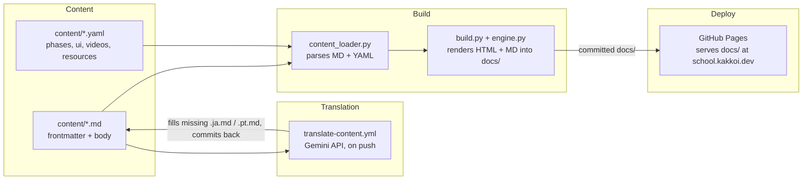
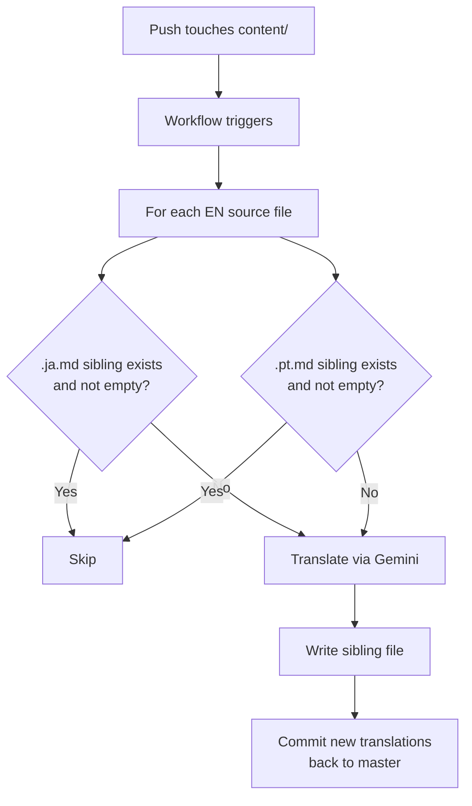

# R10: KakkoiSchool ケーススタディ

ソフトウェアアーキテクチャを学ぶ最良の方法は、実物を読むことです。このレッスンは、今あなたが読んでいるサイトそのものの構造です。おもちゃの例でも移行話でもなく、**school.kakkoi.dev** で現に稼働している中身です。4つの可動部品が4つの別々の仕事をする。その分離があるからこそ、3言語60本のレッスンが編集しやすいまま保たれ、技術的エントロピー(R21)を数年単位で生き延びる目が出るのです。
{: .lesson-intro }

## 4つの部品



コンテンツはディスク上のテキスト。翻訳は欠けている言語の兄弟ファイルを埋めて、リポジトリに戻す。ビルドはそれら全部をHTMLと並列のMarkdown出力にして `docs/` に書き出す。GitHub Pages が `docs/` をそのまま配信する。どの箱も他の箱を触らずに差し替えられます。

## パート1: コンテンツ

すべてのレッスンは兄弟Markdownファイルのフォルダです: `content/tech/t01.md`、`content/tech/t01.ja.md`、`content/tech/t01.pt.md`。英語ファイルが真実の源であり、完全なメタデータを持ちます。翻訳ファイルは訳された文字列のみを持ちます。

```
---
id: T01
phase: 1
status: available
title: Environment Setup
desc: Install VS Code, Node.js, Git, and a browser...
---

Every craftsman sets up the workbench before the first cut.
{: .lesson-intro }

## What You Are Installing

- **Visual Studio Code** - the editor...

```mermaid
flowchart LR
    A[VS Code] --> B[Disk]
    B --> C[Browser]
``` ``` (末尾の閉じバッククォートは読みやすさのため省略)
```

本文はプレーンなMarkdownで、3つの抜け道があります: `{: .lesson-intro }` はCSSクラスを適用し、```` ```mermaid ```` のフェンスブロックはインタラクティブな図になり、生の `<div class="takeaways">` はそのまま通り抜けます。それ以外に特殊なものはありません。

レッスン本文に属さない構造化データはYAMLに置きます。`phases.yaml` は11のフェーズ定義(タイトル、サブタイトル、アナロジーを言語別に)を保持します。`ui.yaml` はナビのラベル、ヒーロー、ボタンといったUIテキストすべてを保持します。`videos.yaml` と `resources.yaml` はギャラリーとリソースカードを保持します。各YAMLレコードは `_en`、`_ja`、`_pt` フィールドを並べて持ちます。

現状: 技術レッスン39本 (T01-T39)、理論レッスン21本 (R01-R21)、3言語、すべてテキスト。

## パート2: 翻訳

GitHub Actionsワークフロー (`translate-content.yml`) は `content/**/*.md` または `content/*.yaml` を触るmasterへのpushを監視します。やることは一つだけ: 隙間を埋める。



ルールは「存在するならスキップ」。兄弟ファイルが存在し空でなければ、永久に放置されます。この一つの性質から、4つの挙動がタダで生まれます:

- **最初の英語push**は両方の翻訳を作る。
- **手書きの翻訳**はファイルが空でない限り、以後のすべての実行で生き残る。
- **古い機械翻訳を更新したい**ならファイルを削除する。次のpushでその一つだけが再生成される。
- **4つ目の言語を足す**には、`scripts/translate_content.py` の `TARGETS` リストに1行、ビルドの言語リストに1行、それだけ。

「人間が書いた、触るな」というフラグはありません。ファイルの存在こそが信号です。状態はディスク上、誰からも見える場所にあります。

## パート3: ビルド

`website/content_loader.py` はコンテンツツリーを読み、構造化データを再構築します: IDをキーとする `LESSONS` 辞書、`TECH_LESSONS` リスト、`THEORY_LESSONS` リスト、そしてYAMLデータはそのまま。frontmatterを pyyaml で、Markdownを python-markdown で描画し、出力を後処理して ```` ```mermaid ```` のフェンスを `<div class="mermaid">` に変え、外部リンクに `target="_blank" rel="noopener"` を付けます。

`website/build.py` はそのデータを受け取り、言語を選び、**ページごとに2つのファイル**を書き出します: レンダリング済みのHTMLと、並列のMarkdownファイル。レッスンページのMarkdownはソースファイルをそのままコピー。インデックスと一覧ページのMarkdownは、HTMLテンプレートが使うのと同じUI/データ辞書から生成します。3言語 = 3つの並列出力ツリー:

```
docs/
├── index.html + index.md
├── tech-lessons.html + tech-lessons.md
├── theory-lessons.html + theory-lessons.md
├── videos.html + videos.md
├── resources.html + resources.md
├── lessons/
│   ├── t01.html + t01.md
│   ├── ...
│   └── r21.html + r21.md
├── ja/ (同じ構造)
└── pt/ (同じ構造)
```

この二重出力こそ、R21の技術的エントロピー防衛の実践です。HTMLのチェーンが腐っても - テンプレートエンジンが壊れ、mermaid.jsが消え、CSSが404になっても - すべてのレッスン、すべてのインデックスは、どのマシンのどのエディタでも開ける読めるMarkdownファイルとして残ります。HTMLは磨き。Markdownが本体。

レッスンのfrontmatterにタイトルが無かったり、ある言語の本文が空だったりすると、ビルドは英語にフォールバックします。初日のポルトガル語が翻訳ゼロで動いたのもこれ: ツリーは存在し、中身はパイプラインが埋めるまで英語コピーだっただけ。

## パート4: デプロイ

GitHub Pages は `master` ブランチの `docs/` フォルダを配信するよう設定されています。デプロイワークフローなし、アーティファクトの受け渡しもなし。`make build` を走らせ、`docs/` ツリーをコミットしmasterにpushすれば、1分以内にPagesが新しいファイルを拾います。`docs/` の中にある1つの `CNAME` ファイルがドメインを **school.kakkoi.dev** に向けます。

ビルド済みの `docs/` をコミットするのは意図的なトレードオフです。ええ、push前にローカルでビルドする手順が必要になります。代わりにコミット一つが自己完結したスナップショットになる: ソースとビルド成果物を揃えて、差分が見え、一つの操作で巻き戻せ、本番と一致することが保証される。別のデプロイ状態を追う必要なし。ビルドが何かを壊したら、ソース変更と同じPRで描画結果が見えます。

誰かがリビルドを忘れても、最悪のケースは次のリビルド+pushまで `docs/` が古いだけ。Pagesは最後にコミットされた状態を配信し続けます。失敗モードは目に見えて、回復できます。

## なぜこの形か

5つの原則がすべてを形作っています:

- **コンテンツはコードではない。**レッスンを書くのはソースファイルを編集する感覚ではなく、文書を書く感覚であるべき。Markdown + frontmatter は、構造を保ちつつ最も摩擦の少ない形式です。
- **ビルドはソースの関数。**今の `content/` ツリーに対して、正しい `docs/` ツリーはちょうど一つ。リビルドは決定的、ローカル、1コマンド。2つがずれたらビルドを再実行する。
- **機械は隙間を埋め、人間は上書きする。**翻訳は良いデフォルトですが、人間のほうが優れています。パイプラインは人間の書いたものを決して上書きしません。機械翻訳の更新は明示的な行為(ファイル削除)です。
- **各部品は差し替え可能。**Markdownライブラリ、テンプレートエンジン、翻訳API、デプロイ先は、4つの独立した選択です。どれを差し替えても、全体書き直しではなく局所的な仕事で済みます。
- **プレーンテキストはアプリより長生きする。**すべてのページがHTMLの隣にMarkdownの双子を出荷します。描画パイプラインを全部捨てても、ディスク上には読めるコースが残ります。

## コードを自分で読む

すべては公開リポジトリ [github.com/KakkoiDev/izumo-io](https://github.com/KakkoiDev/izumo-io) にあります。最初に開く価値がある4つのファイル:

- `website/content_loader.py` - 約200行。コンテンツを読み、データを組み立てる。
- `website/build.py` - 約400行。全ページのHTMLとMarkdownを描画する。
- `scripts/translate_content.py` - 冪等な翻訳スクリプト。
- `.github/workflows/translate-content.yml` - 翻訳を自動補完する唯一のワークフロー。

どれも一息で読める短さです。それが設計目標でした。

<div class="takeaways">
<h2>まとめ</h2>
<ul>
<li>KakkoiSchoolは4つの別々の部品で成る: ディスク上のコンテンツ、翻訳パイプライン、ビルド、デプロイのワークフロー。各々が一つのことをする</li>
<li>コンテンツはMarkdown + YAML。技術39本、理論21本、3言語、すべてプレーンテキスト</li>
<li>翻訳パイプラインは冪等。欠けている言語の兄弟ファイルを埋め、既存を絶対に上書きしない。ファイルの存在が状態</li>
<li>ビルドはコンテンツツリーの純関数。ローカルで実行し、描画済みdocs/をコミットしてpush。GitHub Pagesがそのファイルを直接配信する</li>
<li>すべてのページがHTMLと並列のMarkdownを出荷する。HTMLは磨き、Markdownは技術的エントロピー(R21)を生き延びる耐久アーティファクト</li>
<li>school.kakkoi.dev にGitHub Pagesでデプロイ。1枚のCNAMEファイルがドメインを配信アーティファクトに向ける</li>
</ul>
</div>
