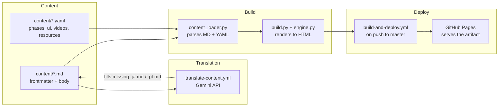
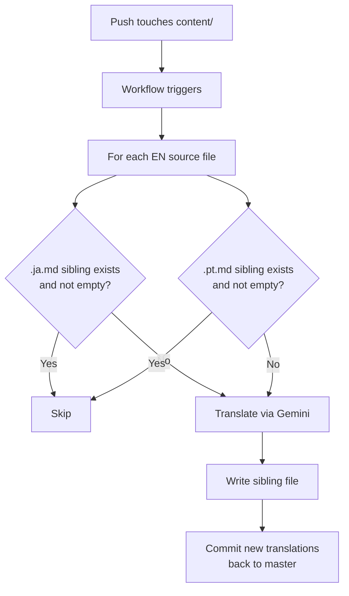

# R10: KakkoiSchoolケーススタディ

ソフトウェアアーキテクチャを学ぶ一番の方法は、実在するものを読むことです。このレッスンは今あなたが読んでいるサイトのアーキテクチャそのものです。おもちゃの例でも、移行物語でもなく、実際に本番で動いているものです。4つの部品が4つの別々の仕事をしています。その分離こそが、60のレッスンを3言語で編集しやすく保つ鍵です。
{: .lesson-intro }

## 4つの部品



コンテンツはディスク上のテキスト。翻訳は欠けている言語の兄弟ファイルを埋める。ビルドはHTMLに変換。デプロイがそのHTMLをインターネットに上げる。各ボックスは他に触れずに交換できます。

## 第1部: コンテンツ

全てのレッスンは兄弟マークダウンファイルのフォルダです: `content/tech/t01.md`、`content/tech/t01.ja.md`、`content/tech/t01.pt.md`。英語ファイルが真実の源で、全メタデータを持ちます。翻訳は翻訳された文字列のみを持ちます。

```
---
id: T01
phase: 1
status: available
title: Environment Setup
desc: Install VS Code, Node.js, Git, and a browser...
---

Every craftsman sets up the workbench before the first cut.
{: .lesson-intro }

## What You Are Installing

- **Visual Studio Code** - the editor...
```

本文は3つの非常口付きの素のマークダウンです: `{: .lesson-intro }`がCSSクラスを適用、```` ```mermaid ````フェンスブロックがインタラクティブ図になり、生の`<div class="takeaways">`はそのまま通ります。それ以外は特別扱いなし。

レッスン本文に属さない構造化データはYAMLに住みます。`phases.yaml`は11フェーズの定義(言語ごとのタイトル、サブタイトル、アナロジー)を保持。`ui.yaml`はUIテキスト全て(ナビラベル、ヒーロー、ボタン)。`videos.yaml`と`resources.yaml`はギャラリーとリソースカードを保持。各YAMLレコードには`_en`、`_ja`、`_pt`フィールドが並びます。

## 第2部: 翻訳

GitHub Actionsワークフロー(`translate-content.yml`)が`content/**/*.md`または`content/*.yaml`へのpushを監視します。1つだけやる仕事: ギャップを埋める。



ルールはskip-if-exists。存在して空でない兄弟ファイルは永遠に放置されます。その1つの性質から4つの挙動が無料で現れます:

- **最初の英語push**が両方の翻訳を作成。
- **手書き翻訳**はファイルが空でないため、未来の全実行を生き残ります。
- **古い機械翻訳の更新**は削除すればOK。次のpushでそのファイルだけ再生成。
- **4つ目の言語追加**は`scripts/translate_content.py`の`TARGETS`リストに1エントリ + ビルドの言語リストに1エントリ。

「人間が書いたから触るな」というフラグはありません。ファイルの存在が合図です。状態は誰もが見えるディスク上に住みます。

## 第3部: ビルド

`website/content_loader.py`はコンテンツツリーを読み、構造化データを再構築します: IDをキーとする`LESSONS`辞書、`TECH_LESSONS`リスト、`THEORY_LESSONS`リスト、YAMLデータはそのまま。pyyamlでフロントマターをパースし、python-markdownでマークダウンをレンダリング、出力を後処理して```` ```mermaid ````フェンスブロックを`<div class="mermaid">`に変換、外部リンクに`target="_blank" rel="noopener"`を追加します。

`website/build.py`はそのデータを取り、言語を選び、各レッスンとページをテンプレートエンジン(`engine.py`)に通し、結果を`docs/`に書きます。3言語は3つの並列出力ツリー: `docs/`(英語)、`docs/ja/`、`docs/pt/`。各レッスンは3つのURL。ナビの各ページは3つのURL。ヘッダーの言語スイッチャーが直接切り替えます。

どのレッスンのフロントマターからタイトルが欠けていても、どの言語の本文が空でも、ビルドは英語にフォールバックします。これがポルトガル語が翻訳0の初日に動いた仕組みです - ツリーは存在し、パイプラインが埋めるまで内容は英語のコピーでした。

## 第4部: デプロイ

`build-and-deploy.yml`はmasterへの全pushで実行します。`requirements.txt`からPython依存をインストールし、`python website/build.py`を走らせ、`docs/`出力をGitHub Pagesへ`actions/upload-pages-artifact`と`actions/deploy-pages`アクション経由で渡します。GitHub Pagesは「Actions」モードに設定され、最新ワークフローアーティファクトが指示するものを配信します。

`docs/`はgitで追跡していません。全デプロイはソースからの新鮮な再ビルドです。「コミット前に再ビルドした?」はありません。コミットするものがないからです - ライブサイトは常に現在のソースの関数です。

ビルドが壊れるとCIが赤になりPagesは最後の成功デプロイを配信し続けます。それが失敗モード: 修復されるまで最後の良い状態のまま。

## なぜこう見えるのか

4つの原則が各部品を形作ります:

- **コンテンツはコードではない。**レッスンを書くのはドキュメントを書くように感じるべきで、ソースファイルの編集ではない。マークダウン+フロントマターは構造を運べる最小摩擦形式。
- **ビルドはソースの関数。**現在の`content/`ツリーに対して正しいサイトは1つ。ビルド状態はコミットしない。コンテンツ編集とデプロイの間に手動ステップは不要。
- **機械はギャップを埋め、人間が上書きする。**翻訳は良いデフォルトだが人間の方が良い。パイプラインは人間が書いたものを決して上書きしない。機械翻訳のリフレッシュは明示的な行為(ファイル削除)。
- **各部品が交換可能。**マークダウンライブラリ、テンプレートエンジン、翻訳API、デプロイ先は4つの独立した選択。どれか1つの差し替えは局所的な作業、書き直しではない。

## コードを自分で読む

全ては公開リポジトリ[github.com/KakkoiDev/izumo-io](https://github.com/KakkoiDev/izumo-io)にあります。最初に開く価値のある4ファイル:

- `website/content_loader.py` - 150行。コンテンツをロード、データを組み立てる。
- `website/build.py` - 300行。ページをレンダリング。
- `scripts/translate_content.py` - 冪等な翻訳ツール。
- `.github/workflows/build-and-deploy.yml`と`translate-content.yml` - 2つのワークフロー。

4つとも一度に読めるほど短い。それが設計目標でした。

<div class="takeaways">
<h2>まとめ</h2>
<ul>
<li>KakkoiSchoolは4つの別々の部品を持つ: ディスク上のコンテンツ、翻訳パイプライン、ビルド、デプロイワークフロー。各々が1つの仕事</li>
<li>コンテンツはマークダウン+YAML。フロントマターがメタデータを運び、本文が散文を運び、いくつかのHTML非常口がエッジケースをカバー</li>
<li>翻訳パイプラインは冪等 - 欠けている言語兄弟を埋め、既存のものを決して上書きしない。ファイルの存在が状態</li>
<li>ビルドはコンテンツツリーの純粋関数。ビルド成果物はコミットされない。ライブサイトは常に新鮮な再ビルド</li>
<li>全部品は他に触れず交換可能。それが小規模での「関心の分離」が報いるもの</li>
</ul>
</div>
