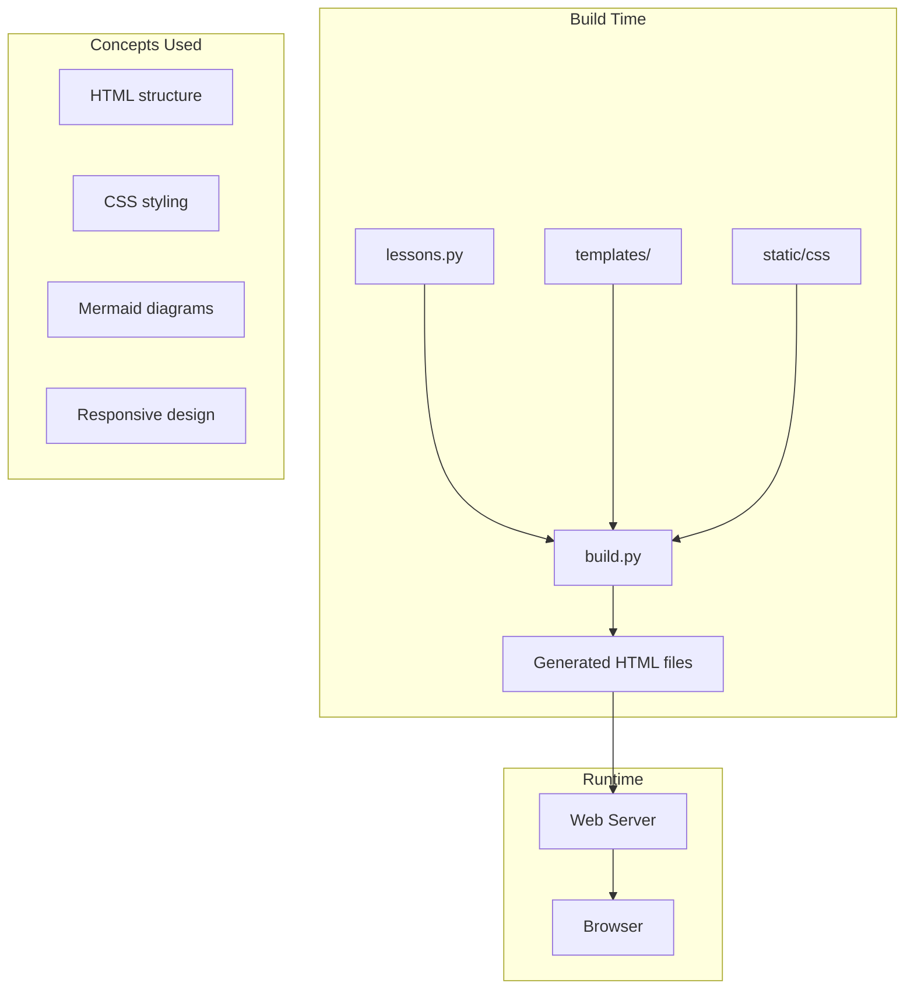

# R10: KakkoiSchool Case Study

The best way to understand web development is to analyze a real project. KakkoiSchool - the very course you are taking - is itself a full-stack web application. Let us examine how it applies every concept you have learned: HTML for structure, CSS for design, JavaScript for interactivity, a server for delivery, and a build system to tie it all together.
{: .lesson-intro }

## Course Architecture

The course website is built with a Python build system that generates static HTML pages from templates and lesson content. This approach combines the simplicity of static files with the power of a templating engine.

## How Lessons Are Delivered

Lesson content is stored as Python data structures (the file you are reading about right now). A build script processes each lesson, wraps it in a template with navigation and styling, and outputs static HTML files. No server needed at runtime - just files served by any web host.

## Design Decisions

Static site generation was chosen over a dynamic server because: simpler hosting (any file server works), faster load times (no server processing), and better reliability (no server to crash). This is the 20/80 rule and KISS principle in action.

<h2>Key Takeaways</h2>
<ul>
<li>Real projects apply multiple concepts together - HTML, CSS, JS, build tools</li>
<li>Static site generation offers simplicity, speed, and reliability</li>
<li>Architecture decisions should follow the principles you have learned (KISS, 20/80)</li>
<li>Analyzing existing projects is one of the best ways to deepen your understanding</li>
</ul>

