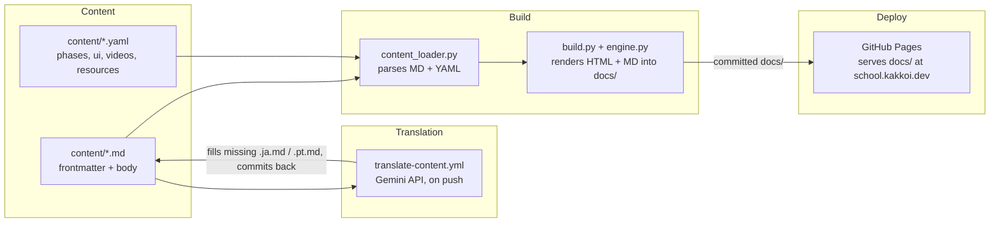

# R10: KakkoiSchool Case Study

The best way to learn software architecture is to read one. This is the architecture of the site you are reading right now, running in production at **school.kakkoi.dev**. Four parts, four jobs. That separation is what keeps sixty lessons in three languages easy to edit.
{: .lesson-intro }

## The Four Parts



Content is text on disk. Translation fills missing language siblings. Build renders HTML and a parallel markdown export into `docs/`. GitHub Pages serves `docs/` directly.

## Part 1: Content

Every lesson is three sibling files: `content/tech/t01.md`, `t01.ja.md`, `t01.pt.md`. The English file carries the full frontmatter metadata. Translations carry only translated strings. Body is plain markdown with three escape hatches: `{: .lesson-intro }` for a CSS class, ```` ```mermaid ```` blocks become interactive diagrams, raw `<div class="takeaways">` passes through untouched.

Structured data that does not belong in a lesson body lives in YAML. `phases.yaml` for the 11 phases. `ui.yaml` for nav labels, hero, buttons. `videos.yaml` and `resources.yaml` for gallery and resources. Each record has `_en`, `_ja`, `_pt` fields side by side.

Current shape: 39 tech lessons, 21 theory lessons, three languages, all text.

## Part 2: Translation

`translate-content.yml` watches for pushes that touch `content/`. The rule is skip-if-exists: a sibling file that is present and non-empty is left alone forever. That single property gives four behaviors for free:

- First English push creates both translations.
- Hand-written translations survive every future run.
- To refresh a stale machine translation, delete it - the next push regenerates just that one.
- Adding a fourth language is one entry in `TARGETS` plus one in the build's language list.

No "human wrote this, do not touch" flag. File presence is the signal. State lives on disk where everyone can see it.

## Part 3: Build

`content_loader.py` parses frontmatter and markdown, converts ```` ```mermaid ```` fences into `<div class="mermaid">`, and adds `target="_blank" rel="noopener"` to external links. `build.py` writes **two files per page**: rendered HTML and a parallel markdown file. Lesson markdown is the source copied verbatim. Index and listing markdown is generated from the same data the HTML templates use.

```
docs/
├── index.html + index.md
├── tech-lessons.html + tech-lessons.md
├── theory-lessons.html + theory-lessons.md
├── videos.html + videos.md
├── resources.html + resources.md
├── lessons/t*.html + t*.md, r*.html + r*.md
├── ja/ (same structure)
└── pt/ (same structure)
```

The dual emission is R21 tech-entropy defence in practice. If the HTML chain rots, every lesson is still a readable markdown file. HTML is polish. Markdown is the artifact.

Missing titles or empty bodies fall back to English - that is how Portuguese worked on day one with no translations yet.

## Part 4: Deploy

GitHub Pages serves `docs/` on `master` directly. Run `make build`, commit, push. A single `CNAME` points the domain at **school.kakkoi.dev**. No deploy workflow.

Committing the built `docs/` is an intentional trade. Rebuild must happen locally before push. In exchange every commit is a self-contained snapshot of source + artifact, diffable and revertible in one operation. If someone forgets to rebuild, Pages keeps serving the last committed state.

## Why It Looks Like This

- **Content is not code.** Writing a lesson should feel like writing a document.
- **Build is a function of source.** One correct `docs/` tree per `content/` tree. Local, deterministic, one command.
- **Machine fills gaps, humans override.** The pipeline never overwrites human work.
- **Each piece replaceable.** Markdown lib, template engine, translation API, deploy target - four independent choices.
- **Plain text outlives the app.** Every page ships a markdown twin. Drop the rendering and you still have a readable course.

All four source files ([repo](https://github.com/KakkoiDev/izumo-io)) - `content_loader.py`, `build.py`, `translate_content.py`, `translate-content.yml` - are short enough to read in one sitting. That was a design goal.

<div class="takeaways">
<h2>Key Takeaways</h2>
<ul>
<li>Four parts: content in markdown + YAML, a gap-filling translation workflow, a local build, GitHub Pages</li>
<li>Translation is idempotent - file presence is the state, humans always win</li>
<li>Every page ships HTML plus parallel markdown - HTML is polish, markdown survives entropy (R21)</li>
<li>docs/ is committed: every commit is a self-contained snapshot, no deploy state to chase</li>
<li>Deployed at school.kakkoi.dev via a single CNAME file</li>
</ul>
</div>
