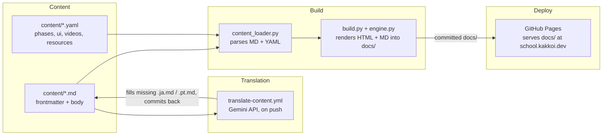
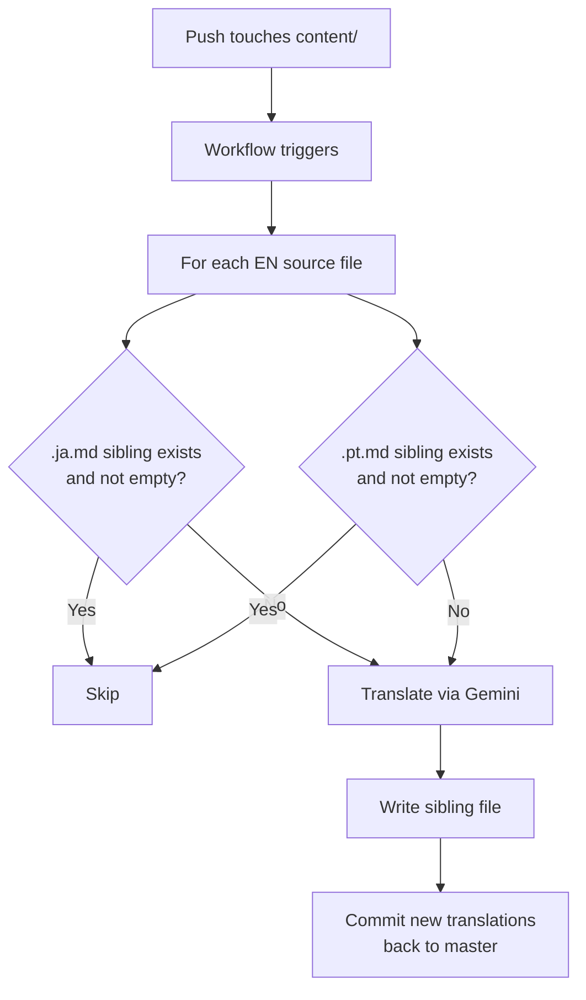

# R10: KakkoiSchool Case Study

The best way to learn software architecture is to read one. This lesson is the architecture of the site you are reading right now. Not a toy example, not a migration story, just what is actually running in production at **school.kakkoi.dev**. Four moving parts do four separate jobs. That separation is what lets sixty lessons in three languages stay easy to edit, and what gives the whole site its shot at surviving tech entropy (R21) for more than a couple of years.
{: .lesson-intro }

## The Four Parts



Content is text on disk. Translation fills in missing language siblings and commits them back. Build turns everything into HTML and a parallel markdown export under `docs/`. GitHub Pages serves `docs/` directly. Each box can be replaced without touching the others.

## Part 1: Content

Every lesson is a folder of sibling markdown files: `content/tech/t01.md`, `content/tech/t01.ja.md`, `content/tech/t01.pt.md`. The English file is the source of truth and carries the full metadata. The translations carry only translated strings.

```
---
id: T01
phase: 1
status: available
title: Environment Setup
desc: Install VS Code, Node.js, Git, and a browser...
---

Every craftsman sets up the workbench before the first cut.
{: .lesson-intro }

## What You Are Installing

- **Visual Studio Code** - the editor...

```mermaid
flowchart LR
    A[VS Code] --> B[Disk]
    B --> C[Browser]
``` ``` (trailing closer omitted for readability)
```

The body is plain markdown with three escape hatches: `{: .lesson-intro }` applies a CSS class, ```` ```mermaid ```` fenced blocks become interactive diagrams, and raw `<div class="takeaways">` passes through untouched. Nothing else is special.

Structured data that does not belong in a lesson body lives in YAML. `phases.yaml` holds the 11 phase definitions with titles, subtitles, and analogies per language. `ui.yaml` holds every piece of chrome text (nav labels, hero, buttons). `videos.yaml` and `resources.yaml` hold the gallery and resource cards. Each YAML record has `_en`, `_ja`, `_pt` fields side by side.

Current shape: 39 tech lessons (T01-T39), 21 theory lessons (R01-R21), three languages, all text.

## Part 2: Translation

A GitHub Actions workflow (`translate-content.yml`) watches for pushes that touch `content/**/*.md` or `content/*.yaml`. It does one thing: fill gaps.



The rule is skip-if-exists. A sibling file that is present and non-empty is left alone forever. That one property makes four behaviors emerge for free:

- **First English push** creates both translations.
- **Hand-written translation** survives every future run because the file is non-empty.
- **Refresh a stale machine translation** by deleting it. The next push regenerates just that file.
- **Adding a fourth language** is one entry in `scripts/translate_content.py`'s `TARGETS` list plus one entry in the build's language list.

There is no flag saying "human wrote this, do not touch". The presence of the file is the signal. State lives on disk where everyone can see it.

## Part 3: Build

`website/content_loader.py` reads the content tree and reconstructs structured data: a `LESSONS` dict keyed by ID, a `TECH_LESSONS` list, a `THEORY_LESSONS` list, and the YAML data as-is. It parses frontmatter with pyyaml, renders markdown with python-markdown, and post-processes the output to convert ```` ```mermaid ```` fenced blocks into `<div class="mermaid">` and to add `target="_blank" rel="noopener"` to external links.

`website/build.py` takes that data, picks a language, and writes **two files per page**: the rendered HTML and a parallel markdown file. For lesson pages the markdown is the source file copied verbatim. For index and listing pages the markdown is generated from the same UI and data dicts the HTML templates use. Three languages means three parallel output trees:

```
docs/
├── index.html + index.md
├── tech-lessons.html + tech-lessons.md
├── theory-lessons.html + theory-lessons.md
├── videos.html + videos.md
├── resources.html + resources.md
├── lessons/
│   ├── t01.html + t01.md
│   ├── ...
│   └── r21.html + r21.md
├── ja/ (same structure)
└── pt/ (same structure)
```

This dual emission is the R21 tech-entropy defence in practice. If the HTML chain rots - the template engine breaks, mermaid.js disappears, the CSS 404s - every lesson and every index page is still a readable markdown file that any editor on any machine can open. The HTML is the polish. The markdown is the artifact.

When any lesson's frontmatter is missing a title or any language body is empty, the build falls back to English. This is how Portuguese worked on day one with no translations yet: the tree existed, the content was just the English copy until the pipeline filled it in.

## Part 4: Deploy

GitHub Pages is configured to serve the `docs/` folder on the `master` branch. No deploy workflow, no artifact juggling. You run `make build`, commit the `docs/` tree, push to master, and Pages picks up the new files within a minute. A single `CNAME` file in `docs/` points the domain at **school.kakkoi.dev**.

Committing the built `docs/` output is an intentional trade. Yes it means the rebuild step must happen locally before push. In exchange every commit is a self-contained snapshot: source + built artifact together, diffable, revertible in one operation, and guaranteed to match whatever is live. No separate deploy state to chase. If a build breaks nothing, you see the rendered output in the same PR as the source change.

If somebody forgets to rebuild, the worst case is stale `docs/` until the next rebuild+push. Pages keeps serving the last committed state. The failure mode is visible and recoverable.

## Why It Looks Like This

Five principles shape every piece:

- **Content is not code.** Writing a lesson should feel like writing a document, not editing a source file. Markdown + frontmatter is the lowest-friction format that can still carry structure.
- **Build is a function of source.** Given the current `content/` tree, there is exactly one correct site. No build state is committed. No manual steps are required between a content edit and a deploy.
- **Machine work fills gaps, humans override.** Translations are a good default but a human is better. The pipeline never overwrites what a human wrote. Refreshing a machine translation is an explicit act (delete the file).
- **Each piece replaceable.** The markdown library, the template engine, the translation API, and the deploy target are four independent choices. Swapping any one out is localized work, not a rewrite.
- **Plain text outlives the app.** Every page ships a markdown twin next to the HTML. Drop the rendering pipeline entirely and you still have a readable course on disk.

## Reading the Code Yourself

Everything is in the public repo at [github.com/KakkoiDev/izumo-io](https://github.com/KakkoiDev/izumo-io). The four files worth opening first:

- `website/content_loader.py` - ~200 lines. Load content, assemble data.
- `website/build.py` - ~400 lines. Render HTML and markdown for every page.
- `scripts/translate_content.py` - idempotent translator.
- `.github/workflows/build-and-deploy.yml` and `translate-content.yml` - the two workflows.

All four are short enough to read in one sitting. That was a design goal.

<div class="takeaways">
<h2>Key Takeaways</h2>
<ul>
<li>KakkoiSchool has four separate parts: content on disk, a translation pipeline, a build, and a deploy workflow. Each does one thing</li>
<li>Content is markdown + YAML. 39 tech lessons, 21 theory lessons, three languages, all plain text</li>
<li>The translation pipeline is idempotent - it fills missing language siblings and never overwrites existing ones. File presence is the state</li>
<li>The build is a pure function of the content tree. No build artifact is committed. The live site is always a fresh rebuild</li>
<li>Every page ships HTML plus a parallel markdown file. The HTML is polish, the markdown is the durable artifact that survives tech entropy (R21)</li>
<li>Deployed to school.kakkoi.dev via GitHub Pages. A single CNAME file points the domain at the serving artifact</li>
</ul>
</div>
