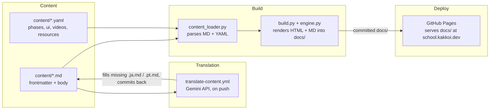
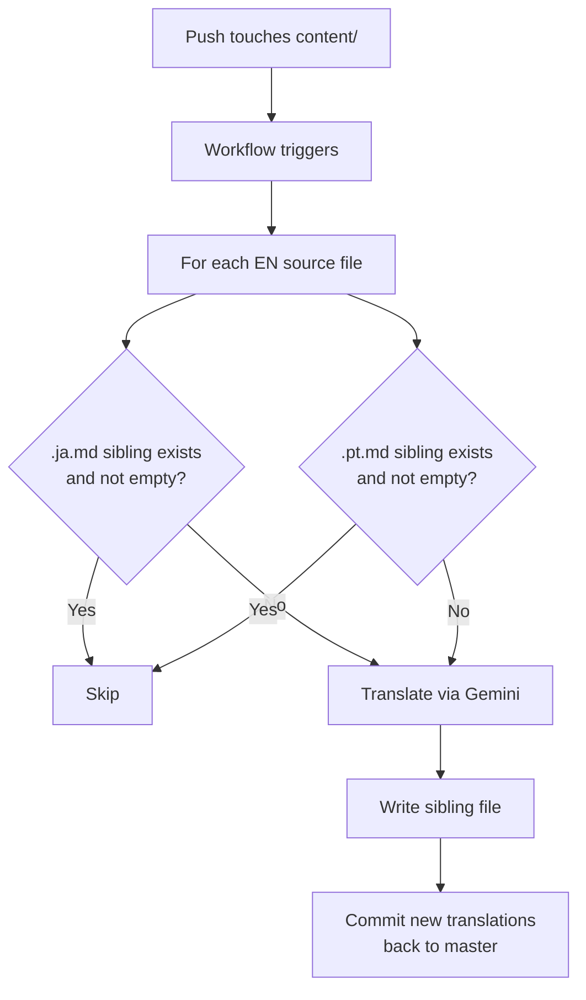

# R10: Estudo de Caso: KakkoiSchool

A melhor forma de aprender arquitetura de software é ler uma. Esta aula é a arquitetura do próprio site que você está lendo agora. Não é um exemplo de brinquedo, nem uma história de migração, é o que está rodando de verdade em produção em **school.kakkoi.dev**. Quatro peças móveis fazem quatro trabalhos separados. É essa separação que mantém sessenta aulas em três idiomas fáceis de editar, e que dá ao site uma chance real de sobreviver à entropia técnica (R21) por mais do que alguns anos.
{: .lesson-intro }

## As Quatro Partes



Conteúdo é texto em disco. A tradução preenche os arquivos-irmãos de idiomas que faltam e devolve o commit. O build transforma tudo em HTML e uma exportação Markdown paralela dentro de `docs/`. O GitHub Pages serve `docs/` direto. Cada caixa pode ser trocada sem tocar nas outras.

## Parte 1: Conteúdo

Cada aula é uma pasta de arquivos Markdown irmãos: `content/tech/t01.md`, `content/tech/t01.ja.md`, `content/tech/t01.pt.md`. O arquivo em inglês é a fonte de verdade e carrega os metadados completos. As traduções carregam apenas as strings traduzidas.

```
---
id: T01
phase: 1
status: available
title: Environment Setup
desc: Install VS Code, Node.js, Git, and a browser...
---

Every craftsman sets up the workbench before the first cut.
{: .lesson-intro }

## What You Are Installing

- **Visual Studio Code** - the editor...

```mermaid
flowchart LR
    A[VS Code] --> B[Disk]
    B --> C[Browser]
``` ``` (fechamento final omitido para facilitar a leitura)
```

O corpo é Markdown puro com três saídas de emergência: `{: .lesson-intro }` aplica uma classe CSS, blocos cercados ```` ```mermaid ```` viram diagramas interativos, e `<div class="takeaways">` cru passa sem ser tocado. Nada mais é especial.

Dados estruturados que não cabem no corpo de uma aula ficam em YAML. `phases.yaml` guarda as 11 definições de fase com título, subtítulo e analogia por idioma. `ui.yaml` guarda todo o texto de interface (labels de nav, herói, botões). `videos.yaml` e `resources.yaml` guardam a galeria e os cards de recursos. Cada registro YAML tem campos `_en`, `_ja`, `_pt` lado a lado.

Estado atual: 39 aulas técnicas (T01-T39), 21 aulas teóricas (R01-R21), três idiomas, tudo texto.

## Parte 2: Tradução

Um workflow do GitHub Actions (`translate-content.yml`) vigia pushes para master que tocam em `content/**/*.md` ou `content/*.yaml`. Faz só uma coisa: preencher lacunas.



A regra é pula-se-existir. Um arquivo-irmão presente e não vazio é deixado em paz para sempre. Essa única propriedade faz emergir quatro comportamentos de graça:

- **Primeiro push em inglês** cria as duas traduções.
- **Tradução escrita à mão** sobrevive a toda execução futura porque o arquivo não está vazio.
- **Atualizar uma tradução de máquina envelhecida**: apague o arquivo. O próximo push regenera só aquele.
- **Adicionar um quarto idioma** é uma entrada na lista `TARGETS` de `scripts/translate_content.py` mais uma entrada na lista de idiomas do build.

Não existe flag dizendo "humano escreveu, não toque". A presença do arquivo é o sinal. O estado mora no disco, visível a todos.

## Parte 3: Build

`website/content_loader.py` lê a árvore de conteúdo e reconstrói dados estruturados: um dicionário `LESSONS` indexado por ID, uma lista `TECH_LESSONS`, uma `THEORY_LESSONS`, e os YAMLs como estão. Faz parse de frontmatter com pyyaml, renderiza Markdown com python-markdown, e pós-processa para converter blocos cercados ```` ```mermaid ```` em `<div class="mermaid">` e adicionar `target="_blank" rel="noopener"` a links externos.

`website/build.py` pega esses dados, escolhe um idioma, e escreve **dois arquivos por página**: o HTML renderizado e um arquivo Markdown paralelo. Para páginas de aula, o Markdown é o arquivo fonte copiado verbatim. Para páginas de índice e listagem, o Markdown é gerado a partir dos mesmos dicionários de UI/dados que os templates HTML usam. Três idiomas significa três árvores de saída paralelas:

```
docs/
├── index.html + index.md
├── tech-lessons.html + tech-lessons.md
├── theory-lessons.html + theory-lessons.md
├── videos.html + videos.md
├── resources.html + resources.md
├── lessons/
│   ├── t01.html + t01.md
│   ├── ...
│   └── r21.html + r21.md
├── ja/ (mesma estrutura)
└── pt/ (mesma estrutura)
```

Essa emissão dupla é a defesa contra entropia técnica de R21 posta em prática. Se a cadeia HTML apodrecer - o template engine quebra, o mermaid.js some, o CSS dá 404 - toda aula e toda página de índice continua sendo um Markdown legível que qualquer editor em qualquer máquina abre. O HTML é o polimento. O Markdown é o artefato.

Quando o frontmatter de alguma aula não tem título, ou o corpo em algum idioma está vazio, o build faz fallback para inglês. Foi assim que português funcionou no primeiro dia sem tradução alguma: a árvore existia, o conteúdo era só a cópia em inglês até a pipeline preencher.

## Parte 4: Deploy

O GitHub Pages está configurado para servir a pasta `docs/` da branch `master`. Sem workflow de deploy, sem malabarismo com artefatos. Você roda `make build`, comita a árvore `docs/`, dá push para master, e em até um minuto o Pages pega os novos arquivos. Um único arquivo `CNAME` dentro de `docs/` aponta o domínio para **school.kakkoi.dev**.

Comitar a `docs/` já construída é um trade-off intencional. Sim, significa que o rebuild local precisa acontecer antes do push. Em troca, cada commit vira um snapshot autocontido: fonte + artefato construído juntos, diffável, revertível em uma operação, e garantido de bater com o que está no ar. Sem estado separado de deploy para caçar. Se um build quebrar alguma coisa, você vê o resultado renderizado no mesmo PR da mudança de fonte.

Se alguém esquecer de reconstruir, o pior caso é `docs/` defasada até o próximo rebuild+push. O Pages segue servindo o último estado comitado. O modo de falha é visível e recuperável.

## Por Que Tem Essa Cara

Cinco princípios moldam cada peça:

- **Conteúdo não é código.** Escrever uma aula deveria parecer escrever um documento, não editar um arquivo fonte. Markdown + frontmatter é o formato de menor atrito que ainda consegue carregar estrutura.
- **Build é função da fonte.** Dada a árvore `content/` atual, existe exatamente uma árvore `docs/` correta. Rebuild é determinístico, local, um comando. Se as duas divergirem, rode o build de novo.
- **Máquina preenche lacunas, humano sobrepõe.** Traduções são um default bom, mas um humano é melhor. A pipeline nunca sobrescreve o que um humano escreveu. Atualizar tradução de máquina é um ato explícito (apagar o arquivo).
- **Cada peça substituível.** A biblioteca de Markdown, o template engine, a API de tradução e o alvo de deploy são quatro escolhas independentes. Trocar qualquer uma é trabalho localizado, não uma reescrita.
- **Texto puro sobrevive à aplicação.** Cada página sai com um irmão Markdown do lado do HTML. Jogue fora a pipeline de renderização inteira e você ainda tem um curso legível no disco.

## Lendo o Código Você Mesmo

Tudo está no repo público em [github.com/KakkoiDev/izumo-io](https://github.com/KakkoiDev/izumo-io). Os quatro arquivos que vale abrir primeiro:

- `website/content_loader.py` - ~200 linhas. Carrega conteúdo, monta dados.
- `website/build.py` - ~400 linhas. Renderiza HTML e Markdown de toda página.
- `scripts/translate_content.py` - tradutor idempotente.
- `.github/workflows/translate-content.yml` - o único workflow que preenche traduções automaticamente.

Todos curtos o bastante para ler numa sentada. Foi meta de design.

<div class="takeaways">
<h2>Pontos-chave</h2>
<ul>
<li>KakkoiSchool tem quatro partes separadas: conteúdo em disco, pipeline de tradução, build e workflow de deploy. Cada uma faz uma coisa</li>
<li>Conteúdo é Markdown + YAML. 39 aulas técnicas, 21 teóricas, três idiomas, tudo texto puro</li>
<li>A pipeline de tradução é idempotente - preenche irmãos de idioma faltantes e nunca sobrescreve existentes. Presença do arquivo é o estado</li>
<li>O build é função pura da árvore de conteúdo. Rode local, comite docs/ renderizada, dá push. O GitHub Pages serve esses arquivos diretamente</li>
<li>Toda página sai com HTML mais um Markdown paralelo. HTML é polimento, Markdown é o artefato durável que sobrevive à entropia técnica (R21)</li>
<li>Deploy em school.kakkoi.dev via GitHub Pages. Um único CNAME aponta o domínio para o artefato servido</li>
</ul>
</div>
