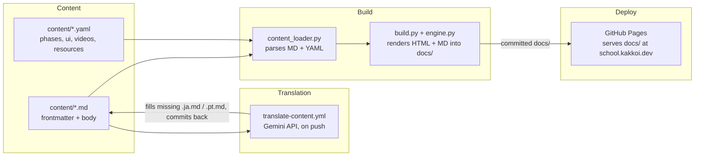

# R10: Estudo de Caso: KakkoiSchool

A melhor forma de aprender arquitetura de software é ler uma. Esta é a arquitetura do próprio site que você está lendo agora, rodando em **school.kakkoi.dev**. Quatro partes, quatro trabalhos. Essa separação mantém sessenta aulas em três idiomas fáceis de editar.
{: .lesson-intro }

## As Quatro Partes



Conteúdo é texto em disco. Tradução preenche irmãos de idioma faltantes. Build renderiza HTML e um Markdown paralelo em `docs/`. GitHub Pages serve `docs/` direto.

## Parte 1: Conteúdo

Cada aula são três arquivos irmãos: `content/tech/t01.md`, `t01.ja.md`, `t01.pt.md`. O arquivo em inglês carrega o frontmatter completo. As traduções carregam só strings traduzidas. Corpo é Markdown puro com três saídas de emergência: `{: .lesson-intro }` para classe CSS, blocos ```` ```mermaid ```` viram diagramas interativos, `<div class="takeaways">` cru passa sem ser tocado.

Dados estruturados que não cabem no corpo de uma aula vão para YAML. `phases.yaml` para as 11 fases. `ui.yaml` para nav, herói, botões. `videos.yaml` e `resources.yaml` para galeria e recursos. Cada registro tem campos `_en`, `_ja`, `_pt` lado a lado.

Estado atual: 39 técnicas, 21 teóricas, três idiomas, tudo texto.

## Parte 2: Tradução

`translate-content.yml` vigia pushes que tocam em `content/`. A regra é pula-se-existir: um irmão presente e não vazio fica intocado para sempre. Essa única propriedade dá quatro comportamentos de graça:

- Primeiro push em inglês cria as duas traduções
- Traduções à mão sobrevivem a toda execução futura
- Para atualizar tradução de máquina envelhecida, apague o arquivo - o próximo push regenera só aquele
- Adicionar um quarto idioma é uma linha em `TARGETS` e uma na lista de idiomas do build

Sem flag "humano escreveu, não toque". Presença do arquivo é o sinal. Estado mora em disco, visível a todos.

## Parte 3: Build

`content_loader.py` faz parse de frontmatter e Markdown, converte blocos ```` ```mermaid ```` em `<div class="mermaid">` e adiciona `target="_blank" rel="noopener"` em links externos. `build.py` escreve **dois arquivos por página**: HTML renderizado e um Markdown paralelo. Markdown de aula é a fonte copiada verbatim. Markdown de índice/listagem é gerado dos mesmos dados que os templates HTML usam.

```
docs/
├── index.html + index.md
├── tech-lessons.html + tech-lessons.md
├── theory-lessons.html + theory-lessons.md
├── videos.html + videos.md
├── resources.html + resources.md
├── lessons/t*.html + t*.md, r*.html + r*.md
├── ja/ (mesma estrutura)
└── pt/ (mesma estrutura)
```

A emissão dupla é a defesa contra entropia técnica de R21 na prática. Se a cadeia HTML apodrecer, toda aula continua sendo um Markdown legível. HTML é polimento. Markdown é o artefato.

Título faltante ou corpo vazio cai para inglês - foi assim que português rodou no primeiro dia sem tradução alguma.

## Parte 4: Deploy

GitHub Pages serve `docs/` no `master` direto. Rode `make build`, comite, push. Um único `CNAME` aponta o domínio para **school.kakkoi.dev**. Sem workflow de deploy.

Comitar a `docs/` construída é um trade-off intencional. Rebuild precisa acontecer local antes do push. Em troca, cada commit é um snapshot autocontido de fonte + artefato, diffável e revertível numa operação. Se alguém esquecer de reconstruir, o Pages segue servindo o último estado comitado.

## Por Que Tem Essa Cara

- **Conteúdo não é código.** Escrever uma aula deveria parecer escrever um documento.
- **Build é função da fonte.** Uma `docs/` correta por `content/`. Local, determinístico, um comando.
- **Máquina preenche lacunas, humano sobrepõe.** A pipeline nunca sobrescreve trabalho humano.
- **Cada peça substituível.** Lib de Markdown, template engine, API de tradução, alvo de deploy - quatro escolhas independentes.
- **Texto puro sobrevive ao app.** Cada página sai com um Markdown irmão. Jogue fora a renderização e ainda tem um curso legível no disco.

Os quatro arquivos ([repo](https://github.com/KakkoiDev/izumo-io)) - `content_loader.py`, `build.py`, `translate_content.py`, `translate-content.yml` - cabem numa sentada. Meta de design.

<div class="takeaways">
<h2>Pontos-chave</h2>
<ul>
<li>Quatro partes: conteúdo em Markdown + YAML, um workflow de tradução que preenche lacunas, um build local, GitHub Pages</li>
<li>Tradução é idempotente - presença do arquivo é o estado, humano sempre vence</li>
<li>Toda página sai com HTML mais Markdown paralelo - HTML é polimento, Markdown sobrevive à entropia (R21)</li>
<li>docs/ é comitada: cada commit é um snapshot autocontido, sem estado de deploy para caçar</li>
<li>Deploy em school.kakkoi.dev via um único arquivo CNAME</li>
</ul>
</div>
