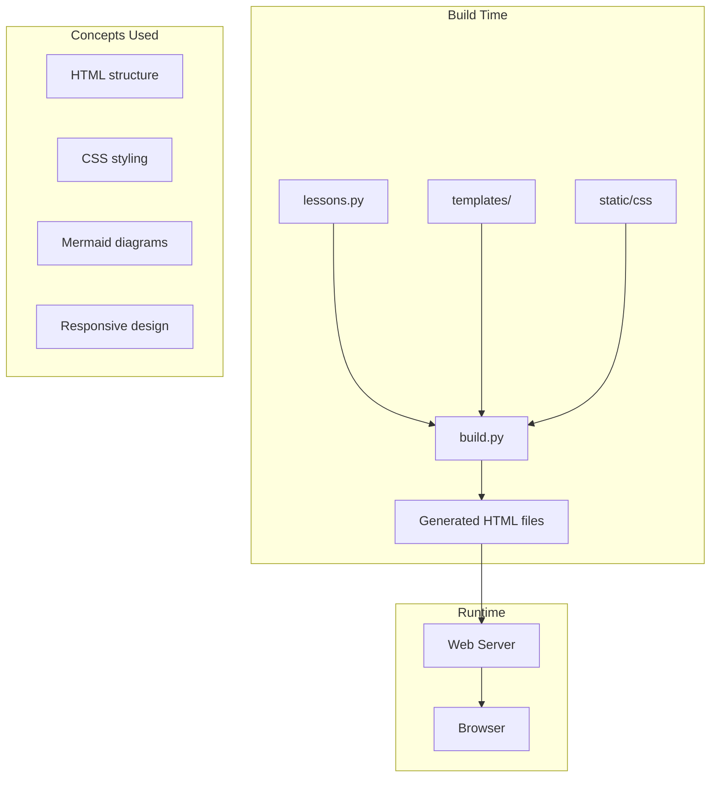

# R10: Estudo de Caso da KakkoiSchool

A melhor forma de entender desenvolvimento web é analisar um projeto real. A KakkoiSchool - o próprio curso que você está fazendo - é em si uma aplicação web full stack. Vamos examinar como ela aplica cada conceito que você aprendeu: HTML para estrutura, CSS para design, JavaScript para interatividade, um servidor para entrega e um sistema de build que costura tudo.
{: .lesson-intro }

## Arquitetura do Curso

O site do curso é construído com um sistema de build em Python que gera páginas HTML estáticas a partir de templates e conteúdo de lição. Essa abordagem combina a simplicidade de arquivos estáticos com o poder de um motor de templates.

## Como as Lições São Entregues

O conteúdo das lições é armazenado como estruturas de dados em Python (o arquivo sobre o qual você está lendo agora mesmo). Um script de build processa cada lição, envelopa num template com navegação e estilo e gera arquivos HTML estáticos. Nenhum servidor é necessário em tempo de execução - apenas arquivos servidos por qualquer hospedagem web.

## Decisões de Design

Geração de site estático foi escolhida em vez de um servidor dinâmico porque: hospedagem mais simples (qualquer servidor de arquivos funciona), carregamento mais rápido (sem processamento no servidor) e melhor confiabilidade (sem servidor para cair). É a regra 20/80 e o princípio KISS em ação.

<h2>Key Takeaways</h2>
<ul>
<li>Projetos reais aplicam vários conceitos juntos - HTML, CSS, JS, ferramentas de build</li>
<li>Geração de sites estáticos oferece simplicidade, velocidade e confiabilidade</li>
<li>Decisões de arquitetura devem seguir os princípios que você aprendeu (KISS, 20/80)</li>
<li>Analisar projetos existentes é uma das melhores formas de aprofundar seu entendimento</li>
</ul>

