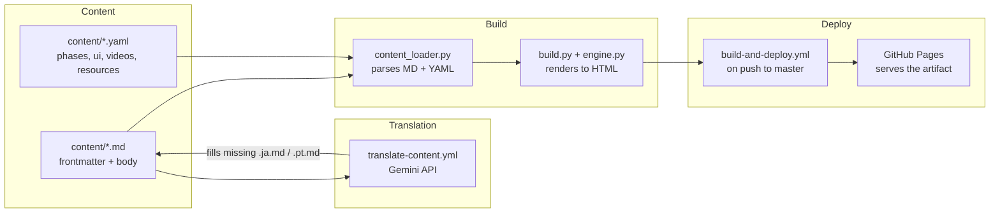
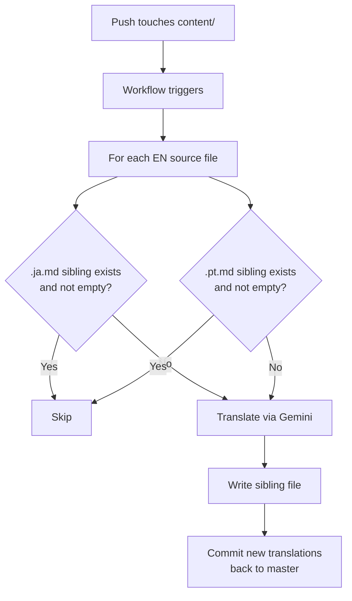

# R10: Estudo de Caso da KakkoiSchool

A melhor forma de aprender arquitetura de software é ler uma. Esta aula é a arquitetura do site que você está lendo agora mesmo. Não é exemplo de brinquedo, nem história de migração - é exatamente o que está rodando em produção. Quatro partes móveis fazem quatro trabalhos separados. Essa separação é o que mantém sessenta aulas em três idiomas fáceis de editar.
{: .lesson-intro }

## As Quatro Partes



Conteúdo é texto em disco. Tradução preenche os irmãos de idioma que faltam. Build transforma em HTML. Deploy coloca esse HTML na internet. Cada caixa pode ser substituída sem mexer nas outras.

## Parte 1: Conteúdo

Toda aula é uma pasta de arquivos markdown irmãos: `content/tech/t01.md`, `content/tech/t01.ja.md`, `content/tech/t01.pt.md`. O arquivo em inglês é a fonte da verdade e carrega a metadata completa. As traduções carregam só as strings traduzidas.

```
---
id: T01
phase: 1
status: available
title: Environment Setup
desc: Install VS Code, Node.js, Git, and a browser...
---

Every craftsman sets up the workbench before the first cut.
{: .lesson-intro }

## What You Are Installing

- **Visual Studio Code** - the editor...
```

O corpo é markdown puro com três escapes: `{: .lesson-intro }` aplica uma classe CSS, blocos com cerca ```` ```mermaid ```` viram diagramas interativos, e `<div class="takeaways">` puro passa intocado. Nada além disso é especial.

Dados estruturados que não pertencem a um corpo de aula moram em YAML. `phases.yaml` guarda as 11 fases com títulos, subtítulos e analogias por idioma. `ui.yaml` guarda todo texto de cromo (labels de nav, hero, botões). `videos.yaml` e `resources.yaml` guardam a galeria e os cards de recursos. Cada registro YAML tem campos `_en`, `_ja`, `_pt` lado a lado.

## Parte 2: Tradução

Um workflow do GitHub Actions (`translate-content.yml`) observa pushes que mexem em `content/**/*.md` ou `content/*.yaml`. Ele faz uma coisa só: preencher buracos.



A regra é skip-if-exists. Um arquivo irmão que está presente e não vazio é deixado em paz para sempre. Essa única propriedade gera quatro comportamentos de graça:

- **Primeiro push em inglês** cria as duas traduções.
- **Tradução escrita à mão** sobrevive a toda execução futura porque o arquivo não está vazio.
- **Atualizar uma tradução automática velha** é só deletar. O próximo push regenera só aquele arquivo.
- **Adicionar um quarto idioma** é uma entrada na lista `TARGETS` do `scripts/translate_content.py` mais uma entrada na lista de idiomas do build.

Não existe flag dizendo "humano escreveu isso, não toque". A presença do arquivo é o sinal. O estado vive em disco onde todo mundo vê.

## Parte 3: Build

`website/content_loader.py` lê a árvore de conteúdo e reconstrói dados estruturados: um dict `LESSONS` por ID, uma lista `TECH_LESSONS`, uma `THEORY_LESSONS`, e os YAMLs como estão. Parseia frontmatter com pyyaml, renderiza markdown com python-markdown e pós-processa a saída para converter blocos ```` ```mermaid ```` em `<div class="mermaid">` e adicionar `target="_blank" rel="noopener"` aos links externos.

`website/build.py` pega esses dados, escolhe um idioma, passa cada aula e cada página pelo motor de templates (`engine.py`) e escreve o resultado em `docs/`. Três idiomas significam três árvores de saída paralelas: `docs/` (inglês), `docs/ja/`, `docs/pt/`. Cada aula tem três URLs. Cada página na nav tem três URLs. O seletor de idioma no header linka direto entre elas.

Quando a frontmatter de uma aula não tem título ou qualquer corpo em algum idioma está vazio, o build cai de volta para o inglês. É assim que o português funcionou no primeiro dia com zero traduções - a árvore existia, o conteúdo era só a cópia em inglês até a pipeline preencher.

## Parte 4: Deploy

`build-and-deploy.yml` roda em todo push para master. Instala dependências Python do `requirements.txt`, roda `python website/build.py` e entrega a saída `docs/` ao GitHub Pages via as actions `actions/upload-pages-artifact` e `actions/deploy-pages`. O GitHub Pages está configurado no modo "Actions", servindo o que o último artefato de workflow mandar servir.

`docs/` não é rastreado no git. Todo deploy é um rebuild novo a partir da fonte. Não existe "lembrou de rebuildar antes de commitar?" porque não tem nada para commitar - o site ao vivo é sempre uma função do código-fonte atual.

Se o build quebra, o CI fica vermelho e o Pages continua servindo o último deploy com sucesso. Esse é o modo de falha: o site fica no último estado bom até o conserto chegar.

## Por Que Parece Assim

Quatro princípios moldam cada peça:

- **Conteúdo não é código.** Escrever uma aula deve parecer escrever um documento, não editar código-fonte. Markdown + frontmatter é o formato com menos atrito que ainda carrega estrutura.
- **Build é função da fonte.** Dada a árvore `content/` atual, existe exatamente um site correto. Nenhum estado de build é commitado. Nenhuma etapa manual é necessária entre uma edição de conteúdo e um deploy.
- **Máquina preenche buracos, humanos sobrescrevem.** Traduções são um bom padrão, mas humano é melhor. A pipeline nunca sobrescreve o que um humano escreveu. Atualizar uma tradução automática é um ato explícito (deletar o arquivo).
- **Cada peça substituível.** A biblioteca de markdown, o motor de templates, a API de tradução e o alvo de deploy são quatro escolhas independentes. Trocar qualquer uma é trabalho localizado, não reescrita.

## Lendo o Código Você Mesmo

Tudo está no repo público em [github.com/KakkoiDev/izumo-io](https://github.com/KakkoiDev/izumo-io). Os quatro arquivos que valem abrir primeiro:

- `website/content_loader.py` - 150 linhas. Carrega conteúdo, monta os dados.
- `website/build.py` - 300 linhas. Renderiza páginas.
- `scripts/translate_content.py` - tradutor idempotente.
- `.github/workflows/build-and-deploy.yml` e `translate-content.yml` - os dois workflows.

Os quatro são curtos o suficiente para ler de uma sentada. Foi meta de design.

<div class="takeaways">
<h2>Pontos-chave</h2>
<ul>
<li>A KakkoiSchool tem quatro partes separadas: conteúdo em disco, pipeline de tradução, build e workflow de deploy. Cada uma faz uma coisa</li>
<li>Conteúdo é markdown + YAML. Frontmatter carrega metadata, corpo carrega prosa, alguns escapes HTML cobrem casos de borda</li>
<li>A pipeline de tradução é idempotente - preenche irmãos de idioma faltantes e nunca sobrescreve os existentes. A presença do arquivo é o estado</li>
<li>O build é uma função pura da árvore de conteúdo. Nenhum artefato de build é commitado. O site ao vivo é sempre um rebuild fresco</li>
<li>Cada peça é substituível sem tocar nas outras. É isso que "separação de responsabilidades" rende em pequena escala</li>
</ul>
</div>
